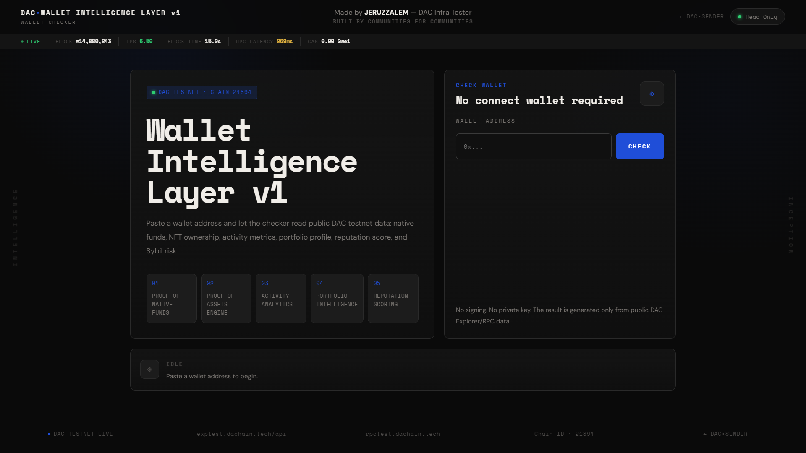
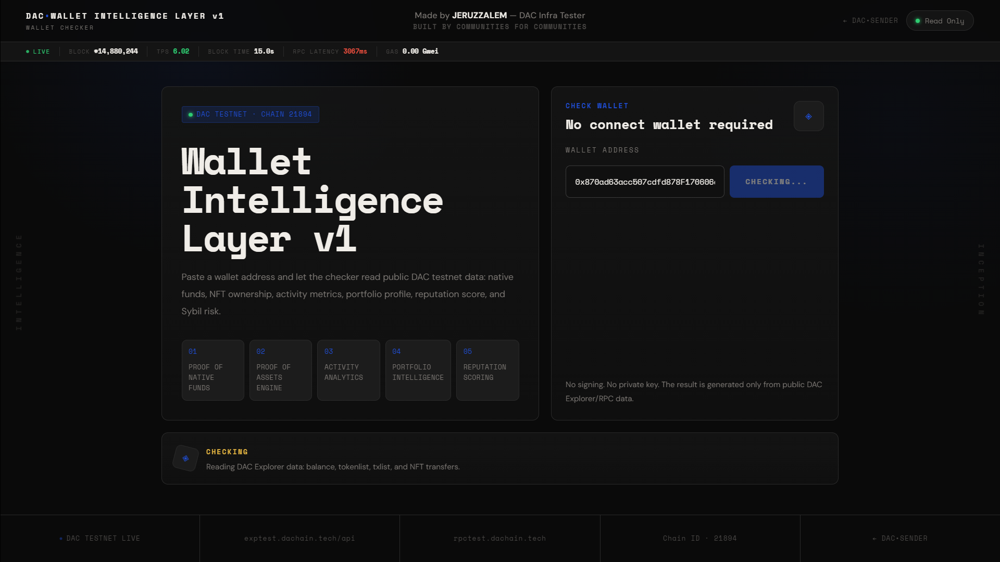
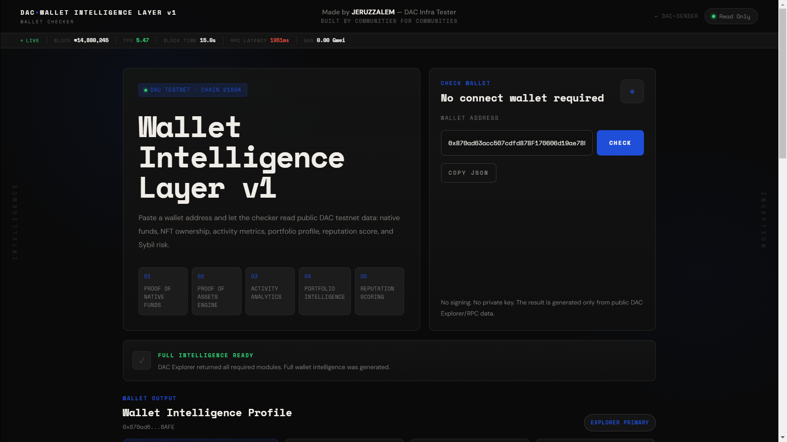
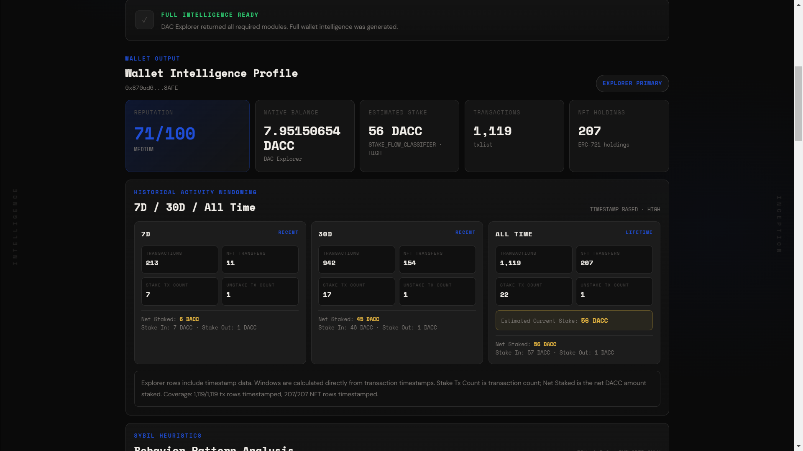
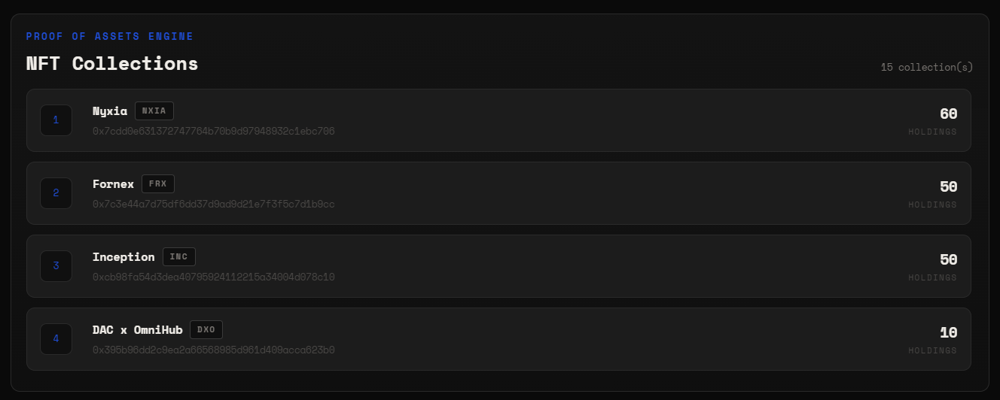
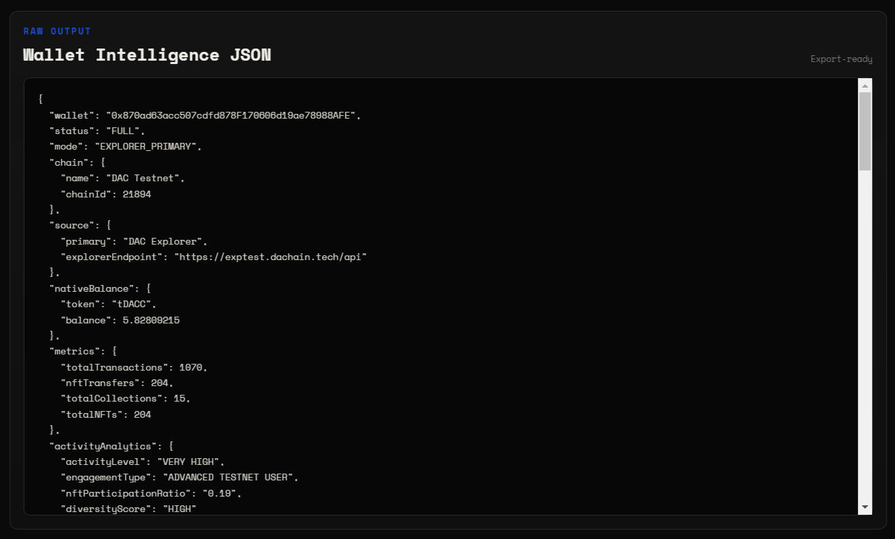

# DAC Wallet Intelligence Layer v1.3.3 — Community Wallet Checker

A client-side wallet intelligence interface for the DAC Quantum Chain Testnet.

This tool allows users to paste a wallet address and generate a read-only wallet profile from public DAC testnet data: native funds, DACC staking flow, NFT ownership, official DAC Inception Rank signal, activity metrics, portfolio behavior, reputation scoring, and Sybil-risk estimation.

> **Important:** This is a community-built checker by **JERUZZALEM — DAC Infra Tester**.  
> It is **not an official DAC checker**, not an official Sybil detector, and not an official reputation system.  
> The naming, scoring labels, thresholds, and interpretation logic are experimental community-defined heuristics created for testnet observation, reporting, and infrastructure research.

**Live:**  
- [DAC•Wallet Intelligence Layer](https://EdLWEISS186.github.io/dac-dual-node-cgnat-setup/DAC-Contributions/dac-wallet-intelligence-layer/wallet-intelligence-layer-v1/)


---

## Latest Version

### v1.3.3 — Stake Flow Classifier

This release improves the DACC stake signal by replacing simple wallet-to-contract value estimation with a stake/unstake transaction-flow classifier.

The purpose of this update is to separate real stake position changes from reward or fee transfers returned by the staking contract.

This version introduces:

- **Stake selector detection:** `0x3a4b66f1`
- **Unstake selector detection:** `0x2e17de78`
- **Stake-in detection:** wallet → staking contract, value > 0
- **Unstake-out decoding:** unstake amount decoded from calldata
- **Reward/fee separation:** contract → wallet internal transfers are tracked separately and are not automatically subtracted from stake
- **Estimated current stake:** `totalStakeIn - totalUnstakeOut`
- **Stake confidence metadata:** `VERY_HIGH`, `HIGH`, or `MEDIUM_HIGH`
- **Stake-flow metadata in Raw JSON**

Current scoring policy:

```text
Policy ID      : WIL-2026-05-v1.3.3
Policy Version : WIL-v1.3.3
Status         : LOCKED
Engine         : stake-flow-classifier-scoring-v1.3.3
Max Score      : 100
```

---

## Table of Contents

- [Overview](#overview)
- [Why This Exists](#why-this-exists)
- [Community Disclaimer](#community-disclaimer)
- [Interface Overview](#interface-overview)
- [Architecture](#architecture)
- [Official Participation Signals](#official-participation-signals)
- [Stake Flow Classifier](#stake-flow-classifier)
- [Scoring and Label Definitions](#scoring-and-label-definitions)
- [Transparent Scoring UI](#transparent-scoring-ui)
- [Versioned Scoring Policy](#versioned-scoring-policy)
- [Failure Handling Policy](#failure-handling-policy)
- [Network Configuration](#network-configuration)
- [Features](#features)
- [Local Usage](#local-usage)
- [Technical Notes](#technical-notes)
- [Security](#security)
- [Future Work](#future-work)
- [Changelog](#changelog)
- [License](#license)
- [Repository Context](#repository-context)

---

## Overview

The DAC Testnet is not only a transaction environment; it is also a behavioral data environment.

Transaction generators such as `DAC•SENDER` help create activity.  
This tool takes the opposite side of that workflow: it reads public activity and turns it into a structured wallet profile.

In simple terms:

```text
DAC•SENDER
→ helps create testnet activity

DAC Wallet Intelligence Layer
→ helps observe, classify, and document wallet activity
```

The checker is designed for community-level testnet analysis. It reads public explorer data, processes it in the browser, and presents a structured view of a wallet's activity and asset footprint.

No backend is used. No wallet connection is required. No private key is requested.

---

## Why This Exists

The idea behind this tool comes from ongoing DAC infrastructure contributions and from the function-task concept developed for the DAC / Truebit Etherscan API task library.

The related contribution introduced a `dac_wallet_intelligence` function task that takes pre-fetched wallet metrics and converts them into:

- wallet activity analytics
- NFT portfolio intelligence
- reputation scoring
- Sybil-risk estimation
- DAC testnet wallet profiling

This web interface extends that idea into a user-facing client-side checker.

The purpose is not to create an official ranking system.  
The purpose is to make wallet behavior easier to observe, explain, and document during testnet participation.

---

## Community Disclaimer

This project is a **community-built experimental checker**.

It is not:

- an official DAC product
- an official DAC reputation system
- an official DAC Sybil detector
- an eligibility checker for rewards, airdrops, incentives, or allowlists
- a final authority on wallet quality

All labels such as:

```text
VERY HIGH
ADVANCED TESTNET USER
VERIFIED INCEPTION PARTICIPANT
ADVANCED TESTNET PARTICIPANT
NFT HEAVY
ELITE
LOW SYBIL RISK
```

are **community-defined interpretation labels** created by **JERUZZALEM — DAC Infra Tester**.

The same applies to the thresholds used to generate those labels.  
They are not official DAC thresholds.

This tool should be understood as an experimental observation layer for testnet analytics, not as a formal identity, ranking, reward, or Sybil-verification mechanism.

---

## Interface Overview

Screenshots are stored in the local `assets/` folder.

### Initial Interface

The default interface when the page is first opened.



### Check Pending

The state after a user enters a wallet address and presses the check button.



### Full Intelligence Ready

The state after the DAC Explorer returns all required wallet data and the full profile is generated.



### Wallet Output

The main wallet output panel containing balance, estimated stake, transaction metrics, activity analytics, portfolio intelligence, reputation scoring, scoring breakdown, and versioned scoring policy metadata.



### Proof of Assets Engine

The NFT ownership panel generated from DAC Explorer `tokenlist` data.



### Raw Output

The raw JSON output generated by the checker.



---

## Architecture

The tool follows a modular client-side architecture.  
The current web implementation is shipped as static files, but the internal logic is organized around the following conceptual modules.

```text
┌──────────────────────────────────────────────────────────────┐
│ wallet-intelligence.html                                     │
│ UI input wallet address + result dashboard                   │
└──────────────────────────────────────────────────────────────┘
                              │
                              ▼
┌──────────────────────────────────────────────────────────────┐
│ wallet-intelligence.js                                       │
│ orchestration layer                                          │
│ coordinates explorer reads, fallback handling, and rendering │
└──────────────────────────────────────────────────────────────┘
                              │
                              ▼
┌──────────────────────────────────────────────────────────────┐
│ proof-native-funds.js                                        │
│ eth_getBalance / native DACC balance                         │
└──────────────────────────────────────────────────────────────┘
                              │
                              ▼
┌──────────────────────────────────────────────────────────────┐
│ stake-flow-classifier.js                                     │
│ DACC stake-in / unstake-out / reward-flow estimation         │
└──────────────────────────────────────────────────────────────┘
                              │
                              ▼
┌──────────────────────────────────────────────────────────────┐
│ proof-assets-engine.js                                       │
│ NFT ownership / collections / assets                         │
└──────────────────────────────────────────────────────────────┘
                              │
                              ▼
┌──────────────────────────────────────────────────────────────┐
│ known-collection-registry.js                                 │
│ DAC Inception Rank / known official collection signal        │
└──────────────────────────────────────────────────────────────┘
                              │
                              ▼
┌──────────────────────────────────────────────────────────────┐
│ activity-analytics.js                                        │
│ transaction count + NFT transfer behavior                    │
└──────────────────────────────────────────────────────────────┘
                              │
                              ▼
┌──────────────────────────────────────────────────────────────┐
│ portfolio-intelligence.js                                    │
│ collection diversity + NFT concentration                     │
└──────────────────────────────────────────────────────────────┘
                              │
                              ▼
┌──────────────────────────────────────────────────────────────┐
│ reputation-scoring.js                                        │
│ score + level + Sybil risk                                   │
└──────────────────────────────────────────────────────────────┘
                              │
                              ▼
┌──────────────────────────────────────────────────────────────┐
│ Wallet Intelligence Layer                                    │
│ final wallet profile + raw JSON output                       │
└──────────────────────────────────────────────────────────────┘
```

### Data Flow

```text
User pastes wallet address
        │
        ▼
wallet-intelligence.html
        │
        ▼
wallet-intelligence.js
        │
        ├── DAC Explorer API
        │   ├── balance
        │   ├── tokenlist
        │   ├── txlist
        │   ├── txlistinternal
        │   └── tokennfttx
        │
        ├── DAC RPC
        │   ├── eth_getBalance
        │   ├── eth_getTransactionCount
        │   └── eth_call fallback attempt
        │
        ├── Proof of Native Funds
        ├── Stake Flow Classifier
        ├── Proof of Assets Engine
        ├── Known Collection Registry
        ├── Activity Analytics v1
        ├── Portfolio Intelligence v1
        └── Reputation Scoring v1.3.3
        │
        ▼
Wallet Intelligence Layer output
```

---

## Official Participation Signals

Version `v1.3.x` introduces official participation signal awareness.

The checker treats the following signals as more meaningful than ordinary NFT or transaction count alone:

### DAC Inception Rank

```text
Collection : DAC Inception Rank
Symbol     : RANK
Standard   : DRC-721
Contract   : 0xB36ab4c2Bd6aCfC36e9D6c53F39F4301901Bd647
Role       : Progress badge / rank NFT
```

Since users can mint a new RANK badge when they reach a new progress threshold, the checker uses the **number of RANK badges held** as an inferred rank signal.

### DACC Stake Signal

```text
Contract : 0x3691A78bE270dB1f3b1a86177A8f23F89A8Cef24
Role     : DACC staking / QE pool interaction
```

The official staking interface is flexible. Users can stake, add more stake, or unstake without a fixed lock duration.  
Because reward or fee transfers may be returned by the contract during stake and unstake activity, v1.3.3 uses a transaction-flow classifier instead of simply subtracting every contract-to-wallet transfer.

---

## Stake Flow Classifier

Version `v1.3.3` classifies stake and unstake activity using transaction selectors and calldata.

### Stake

```text
selector : 0x3a4b66f1
from     : wallet
to       : staking contract
value    : > 0 DACC
```

Stake amount is read from the top-level transaction value.

```text
totalStakeIn += tx.value
```

Any internal transfer from the staking contract back to the wallet during this transaction is treated as reward/fee flow, not as an unstake.

### Unstake

```text
selector : 0x2e17de78
from     : wallet
to       : staking contract
value    : 0 DACC
```

Unstake amount is decoded from the first `uint256` argument in calldata.

```text
totalUnstakeOut += decodedAmountFromInput
```

Internal transfers from the staking contract back to the wallet may include both reward/fee and principal return.  
The principal unstake amount is not inferred by subtracting internal transfers; it is decoded from the unstake calldata.

### Estimated Current Stake

```text
estimatedCurrentStake = totalStakeIn - totalUnstakeOut
```

If the result is below zero, the checker displays `0`.

### Reward / Fee Flow

If internal transaction data is available, the checker also calculates:

```text
rewardReceived
contractOutTotal
rewardTraceAvailable
rewardReadMode
```

This is shown as supporting metadata. It does not directly reduce the estimated current stake unless the unstake amount is decoded from calldata.

### Confidence

The stake signal includes confidence metadata:

| Confidence | Meaning |
|---|---|
| `VERY_HIGH` | Direct contract read matches usable stake data or returns a positive value |
| `HIGH` | Stake-flow classifier works and internal reward trace is available |
| `MEDIUM_HIGH` | Stake-flow classifier works, but internal reward trace is unavailable |

---

## Primary Data Source

```text
https://exptest.dachain.tech/api
```

Used for:

```text
balance         → native DAC testnet balance
tokenlist       → ERC-721 NFT ownership
txlist          → transaction history and stake/unstake classifier
txlistinternal  → reward/fee flow when available
tokennfttx      → NFT transfer activity count
```

### RPC Fallback

```text
https://rpctest.dachain.tech/
```

Used only when explorer modules are unavailable.

RPC fallback can provide:

```text
eth_getBalance          → native balance
eth_getTransactionCount → outgoing transaction count / nonce
eth_call                → optional staking contract read attempt
```

RPC fallback cannot fully replace the explorer because standard RPC does not provide complete NFT inventory, NFT transfer history, or full wallet-level stake-flow history.

---

## Scoring and Label Definitions

The scoring system is intentionally simple and transparent.

It is designed to turn observable testnet metrics into a readable wallet profile.

### Input Metrics

The full score requires verified explorer data for:

| Metric | Source | Description |
|---|---|---|
| Native Balance | `balance` / RPC fallback | Native DAC testnet token balance |
| Estimated Current Stake | `txlist` + selector classifier | Estimated current DACC stake |
| Transaction Count | `txlist` | Number of explorer-indexed transactions |
| NFT Transfers | `tokennfttx` | Number of NFT transfer events involving the wallet |
| Total Collections | `tokenlist` | Number of ERC-721 collections held |
| Total NFT Holdings | `tokenlist` | Total ERC-721 items held across collections |
| RANK Badge Count | `tokenlist` | Number of DAC Inception Rank badges held |

If one or more required explorer modules fail, the full reputation score is not generated.

---

### Activity Level

Activity level is based on total transaction count.

| Condition | Label |
|---|---|
| `txCount >= 1000` | `VERY HIGH` |
| `txCount >= 500` | `HIGH` |
| `txCount >= 100` | `MEDIUM` |
| below `100` | `LOW` |

These labels are not official DAC labels. They are community-defined categories for testnet observation.

---

### NFT Participation

NFT Participation is shown as a percentage.

```text
nftParticipation = nftTransfers / txCount * 100
```

Example:

```text
0.19 ratio → 19.00%
```

If `txCount` is zero, the value is shown as `0.00%`.

---

### Native Funds Score

Native funds are scored using DACC balance tiers.

| Condition | Points |
|---|---:|
| `nativeBalance >= 100` | `15` |
| `nativeBalance >= 75` | `14` |
| `nativeBalance >= 50` | `12` |
| `nativeBalance >= 25` | `9` |
| `nativeBalance >= 10` | `6` |
| `nativeBalance >= 5` | `4` |
| below `5` | `2` |

---

### DACC Stake Score

DACC stake score is based on the estimated current stake.

| Condition | Points |
|---|---:|
| `stakedDacc >= 200` | `20` |
| `stakedDacc >= 150` | `18` |
| `stakedDacc >= 100` | `15` |
| `stakedDacc >= 50` | `11` |
| `stakedDacc >= 20` | `7` |
| `stakedDacc >= 10` | `4` |
| below `10` | `0` |

---

### DAC Inception Rank Score

DAC Inception Rank score is based on the number of RANK badges held.

| Badge Count | Inferred Rank | Points |
|---:|---|---:|
| `13+` | `CROWN` | `25` |
| `12` | `CIPHER` | `24` |
| `11` | `PHANTOM` | `23` |
| `10` | `INTERCEPTOR` | `21` |
| `9` | `ARCHITECT` | `20` |
| `8` | `WARRIOR` | `18` |
| `7` | `SOVEREIGN` | `16` |
| `6` | `SENTINEL` | `14` |
| `5` | `VANGUARD` | `11` |
| `4` | `SHADOW UNIT` | `9` |
| `3` | `SEAL` | `7` |
| `2` | `COMMANDO` | `5` |
| `1` | `CADET` | `3` |
| `0` | `NONE` | `0` |

---

### Reputation Score

Version `v1.3.3` uses six visible score components:

| Component | Max Points |
|---|---:|
| Transaction Score | `20` |
| NFT Diversity Score | `10` |
| NFT Holdings Score | `10` |
| Native Funds Score | `15` |
| DACC Stake Score | `20` |
| DAC Inception Rank Score | `25` |
| **Total** | **100** |

---

### Reputation Level

| Score | Label |
|---|---|
| `>= 90` | `ELITE` |
| `>= 75` | `HIGH` |
| `>= 50` | `MEDIUM` |
| below `50` | `LOW` |

Again, these are community-defined labels for testnet analytics only.

---

### Trust Profile

Trust profile is based on a combination of activity, official rank signal, and stake signal.

| Condition | Label |
|---|---|
| `txCount > 1000`, `totalCollections > 10`, `rankBadgeCount >= 6`, and `stakedDacc >= 100` | `ADVANCED TESTNET PARTICIPANT` |
| `rankBadgeCount >= 6` and `stakedDacc >= 50` | `VERIFIED INCEPTION PARTICIPANT` |
| otherwise | `STANDARD USER` |

This is not an identity verification system. It only summarizes observable activity under the current scoring logic.

---

### Sybil Risk

| Score | Label |
|---|---|
| `>= 90` | `LOW` |
| `>= 70` | `MEDIUM` |
| below `70` | `HIGH` |

This Sybil-risk label is a lightweight heuristic.  
It should not be treated as a definitive Sybil detection result.

The model does not inspect:

- device/IP data
- social identity
- off-chain proof
- official campaign eligibility
- private user data
- centralized backend data

It only uses public wallet metrics available through DAC Explorer/RPC modules.

---

## Transparent Scoring UI

Version `v1.1.0` introduced a transparent scoring panel.  
Version `v1.1.1` improved NFT Participation readability by changing decimal ratio output into percentage format.  
Version `v1.2.0` added a versioned scoring policy layer.  
Version `v1.3.x` added official participation signals.

The UI shows how the reputation score is built from visible components:

```text
Transaction Score          /20
NFT Diversity Score        /10
NFT Holdings Score         /10
Native Funds Score         /15
DACC Stake Score           /20
DAC Inception Rank Score   /25
```

Each component displays:

- points earned
- maximum possible points
- metric value used
- rule/condition matched

This makes the score easier to audit and reduces ambiguity for users reviewing their wallet status.

---

## Versioned Scoring Policy

Version `v1.3.3` uses a locked scoring policy object.

The purpose is to make future scoring changes auditable. If a future version changes thresholds, labels, or point allocation, older outputs can still be interpreted according to the policy version that produced them.

Current policy metadata:

```text
Policy ID      : WIL-2026-05-v1.3.3
Policy Version : WIL-v1.3.3
Status         : LOCKED
Engine         : stake-flow-classifier-scoring-v1.3.3
Max Score      : 100
```

The raw JSON output includes scoring policy metadata, score components, threshold definitions, official rank signal, native funds signal, and official stake signal.

This policy is still a **community-defined heuristic** and should not be interpreted as an official DAC reputation, eligibility, or Sybil system.

---

## Failure Handling Policy

This tool follows a strict fail-safe rule:

```text
No verified data → no score
Partial data     → partial profile only
Full data        → full wallet intelligence
```

### Full Explorer Data

If all required explorer modules return valid data, the tool generates the full wallet intelligence profile.

### Partial Explorer Data

If only some explorer modules return valid data, the UI displays the available fields and marks the output as partial.

The full reputation score is not generated.

### Explorer Down

If the DAC Explorer is unavailable, the tool attempts RPC fallback.

### RPC Fallback

RPC fallback can only generate a limited native proof and outgoing transaction count.

The following are not fully generated in RPC fallback mode:

```text
NFT portfolio
NFT transfer count
full activity analytics
portfolio intelligence
complete stake-flow history
reputation score
Sybil-risk label
```

### Explorer and RPC Down

If both data sources fail, the tool displays an error state and a retry button.

No random score, mock score, or fabricated wallet profile is generated.

---

## Network Configuration

| Parameter | Value |
|---|---|
| Network Name | DAC Testnet |
| Chain ID | `21894` |
| RPC Endpoint | `https://rpctest.dachain.tech/` |
| Explorer | `https://exptest.dachain.tech` |
| Explorer API | `https://exptest.dachain.tech/api` |
| Native Symbol | `DACC` |
| Staking Contract | `0x3691A78bE270dB1f3b1a86177A8f23F89A8Cef24` |
| DAC Inception Rank Contract | `0xB36ab4c2Bd6aCfC36e9D6c53F39F4301901Bd647` |

---

## Features

- **No wallet connection required** — users paste an address only.
- **Read-only design** — no transaction signing, no wallet prompt, no private key access.
- **Proof of Native Funds** — reads native DACC balance from DAC Explorer/RPC.
- **Stake Flow Classifier** — estimates current DACC stake from recognized stake and unstake transaction flow.
- **Proof of Assets Engine** — reads ERC-721 ownership from `tokenlist`.
- **Known Collection Registry** — identifies DAC Inception Rank ownership.
- **Official Rank Signal** — infers rank from RANK badge count.
- **Activity Analytics v1** — generates activity level, engagement type, NFT participation percentage, and diversity score.
- **Portfolio Intelligence v1** — generates portfolio style, wallet archetype, top collection, concentration, and holdings summary.
- **Reputation Scoring v1.3.3** — generates a community-defined score from verified data.
- **Transparent Scoring UI** — displays each score component, matched rule, and earned points.
- **Versioned Scoring Policy** — includes locked policy metadata, policy ID, engine version, and threshold definitions in the raw JSON output.
- **Sybil-risk estimation** — lightweight score-based label, clearly marked as experimental.
- **Raw JSON Output** — export-ready structured profile for reporting.
- **Live Chain Stats** — block height, TPS estimate, block time, RPC latency, and gas price.
- **Retry Handling** — user can retry when explorer/RPC data fails.
- **GitHub Pages Ready** — static HTML/CSS/JS, no build step.

---

## Local Usage

Serve over HTTP. Do not test only through `file://`, because browser behavior can differ.

```bash
# From repository root
python3 -m http.server 8080
```

Then open:

```text
http://localhost:8080/DAC-Contributions/dac-wallet-intelligence-layer/wallet-intelligence-layer-v1/
```

Example test wallet:

```text
0x870ad63acc507cdfd878F170606d19ae78988AFE
```

---

## Technical Notes

- Static client-side application.
- No backend.
- No database.
- No wallet provider required.
- Uses DAC Explorer API as the primary data source.
- Uses DAC RPC only as a limited fallback.
- Does not use random/mock data in production.
- All scoring is performed locally in the browser.
- `Proof of Assets Engine` currently focuses on ERC-721 ownership.
- `Stake Flow Classifier` currently uses known staking selectors:
  - stake: `0x3a4b66f1`
  - unstake: `0x2e17de78`
- Reward/fee flow is tracked separately when internal transaction data is available.
- Estimated current stake is calculated as `totalStakeIn - totalUnstakeOut`.
- Raw JSON includes versioned scoring policy metadata and stake-flow metadata.
- The current implementation is shipped in `index.html`, `wallet-intelligence.css`, and `wallet-intelligence.js`; the module names in the architecture section describe the conceptual separation of logic.

---

## Security

- **No private keys.** The tool never requests or accesses private keys.
- **No wallet connection.** The tool does not call `eth_requestAccounts`.
- **No signing.** The tool does not submit transactions or request signatures.
- **No backend data collection.** The tool is hosted as a static GitHub Pages interface.
- **Public data only.** The profile is built only from public explorer/RPC responses.
- **No official eligibility claim.** The result should not be interpreted as qualification for rewards, incentives, or official recognition.

---

## Future Work

Potential future directions, depending on available explorer data, contract design, and verification requirements.

- **Stake classifier refinement** — improve principal/reward separation if verified ABI, event names, or official staking getter data becomes available.
- **Known collection registry expansion** — add more verified DAC ecosystem collections when appropriate.
- **Historical activity windowing** — classify recent activity separately from lifetime activity.
- **Explorer-only Sybil heuristics** — improve Sybil-risk estimation using logic derived from public explorer data, without depending on a custom backend.
- **Mintable / dynamic intelligence badge** — optional future NFT badge layer based on wallet status, preferably designed as an updateable or evolving badge rather than a static one.
- **Truebit function-task mode** — optionally compare browser output with a verified function-task execution path.

---

## Changelog

### v1.3.3 — Stake Flow Classifier

- Replaced simple staking value estimate with stake/unstake transaction-flow classification.
- Added stake selector detection: `0x3a4b66f1`.
- Added unstake selector detection: `0x2e17de78`.
- Added decoded unstake amount from calldata.
- Added estimated current stake formula: `totalStakeIn - totalUnstakeOut`.
- Added reward/fee flow separation from stake position calculation.
- Added stake confidence metadata.
- Added stake-flow metadata to raw JSON output.
- Updated policy engine to `stake-flow-classifier-scoring-v1.3.3`.

### v1.3.2 — Stake-Aware Scoring

- Added Native Funds Score tiers.
- Added DACC Stake Score tiers.
- Added staking contract signal.
- Added estimated stake field to UI and Wallet Intelligence Profile.
- Updated policy engine to `stake-aware-reputation-scoring-v1.3.2`.

### v1.3.1 — Rank Highlight UI

- Highlighted inferred DAC Inception Rank in the Official Rank Signal panel.
- Added Inception Rank to the Wallet Intelligence Profile panel.

### v1.3.0 — Known Collection Registry + DAC Inception Rank Scoring

- Added Known Collection Registry.
- Added DAC Inception Rank detection.
- Added DAC Inception Rank as a scoring component.
- Added inferred rank from RANK badge count.
- Updated scoring model to include official rank signal.

### v1.2.0 — Versioned Scoring Policy

- Added locked scoring policy metadata.
- Added Policy ID: `WIL-2026-05-v1.2.0`.
- Added policy status: `LOCKED`.
- Added scoring engine label: `versioned-reputation-scoring-v1.2.0`.
- Added versioned component thresholds and label definitions to raw JSON output.
- Added policy metadata panel to the scoring breakdown section.

### v1.1.1 — NFT Participation Percentage Display Fix

- Changed NFT Participation display from decimal ratio to percentage format.
- Example: `0.19` → `19.00%`.
- Updated scoring policy metadata to `WIL-v1.1.1`.

### v1.1.0 — Transparent Scoring UI

- Added visible scoring breakdown panel.
- Added per-category score components.
- Added rule/condition display for each score component.
- Added scoring policy metadata to raw JSON output.

### v1 — Initial Release

Initial release of the community-built DAC Wallet Intelligence Layer.

---

## License

This project is part of the [`dac-dual-node-cgnat-setup`](https://github.com/EdLWEISS186/dac-dual-node-cgnat-setup) repository and is covered by the root repository license.

---

## Repository Context

This tool is part of a broader DAC infrastructure contribution archive.

The `Sender-Web` folder focuses on testnet transaction generation and user-facing interaction tooling.

This folder, under:

```text
DAC-Contributions/dac-wallet-intelligence-layer/wallet-intelligence-layer-v1/
```

is intended as an archive and continuation of DAC contribution work related to wallet intelligence, explorer-based analytics, and the related function-task concept from the DAC / Truebit Etherscan API task library.

---

*Authored by **JERUZZALEM** — DAC Infra Tester*  
