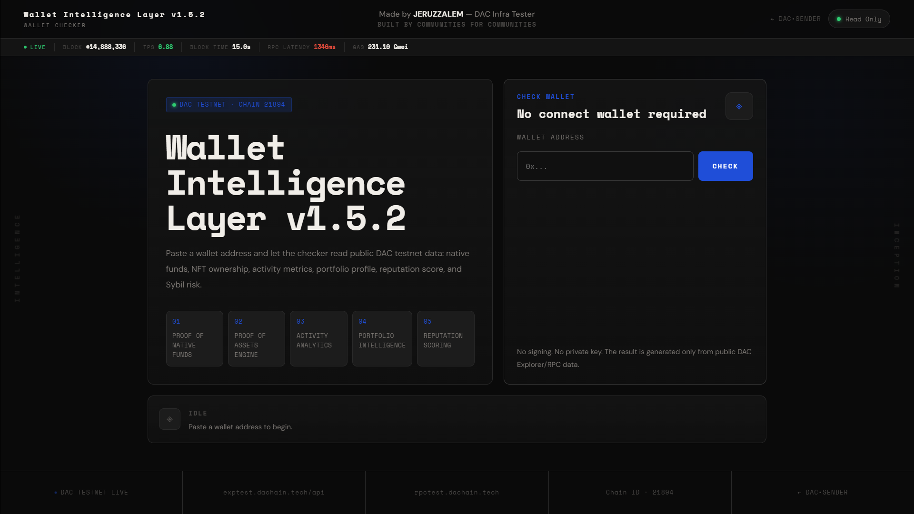
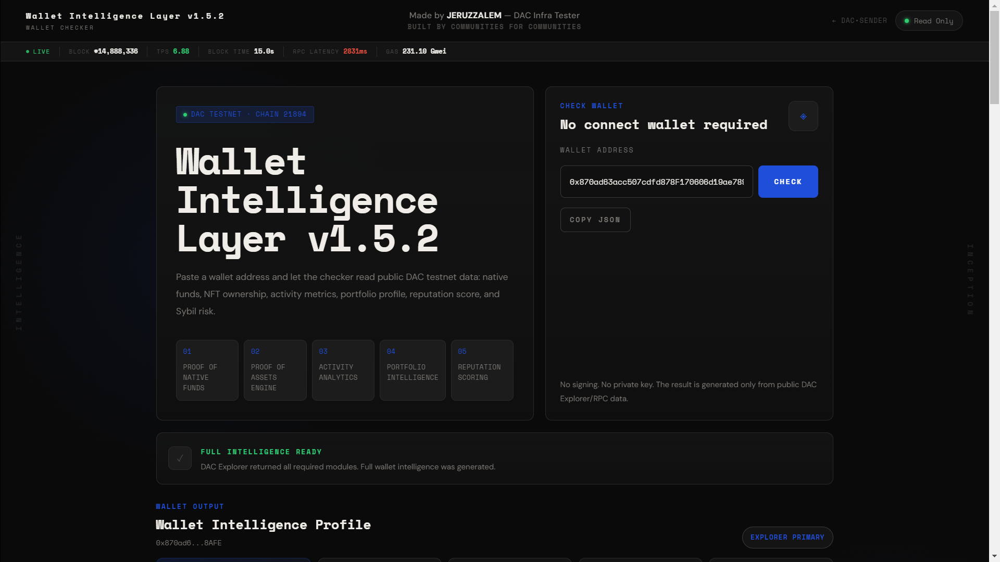
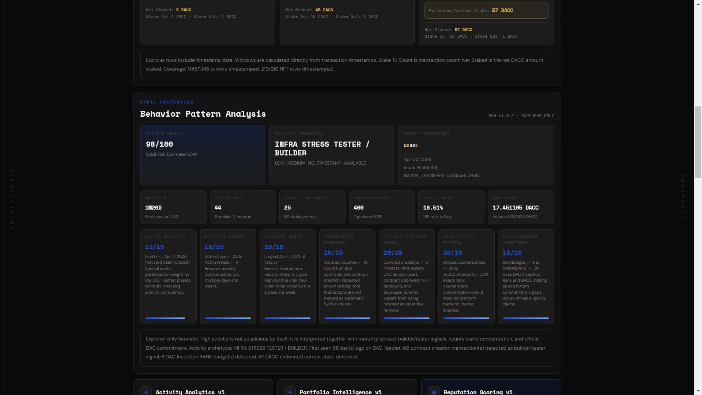
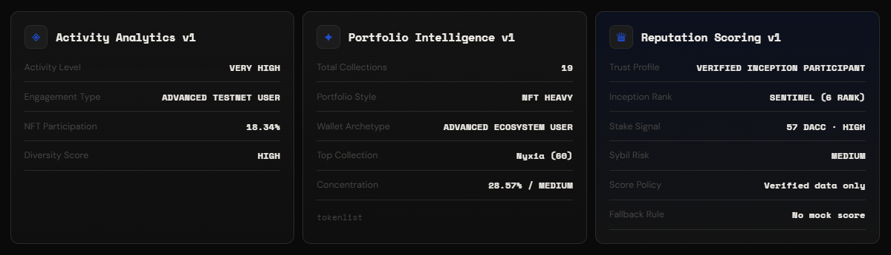
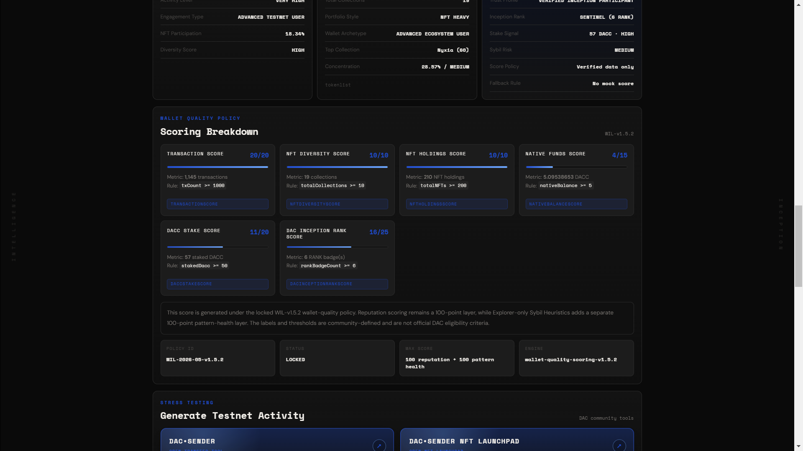
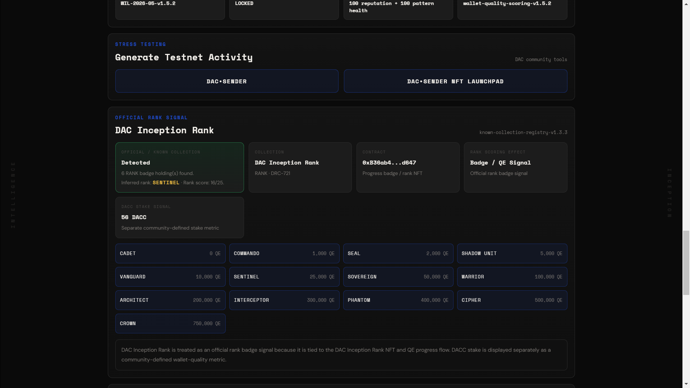
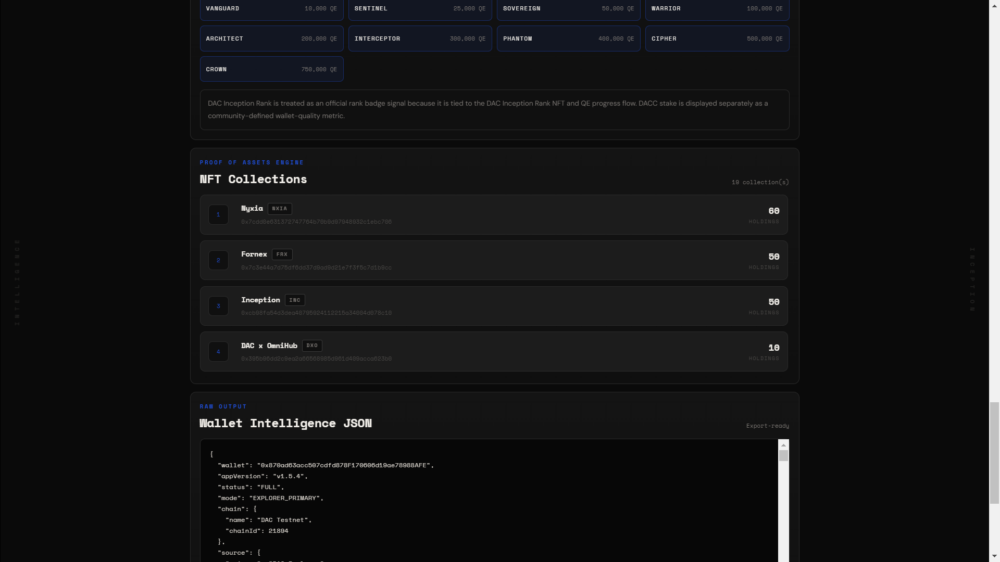
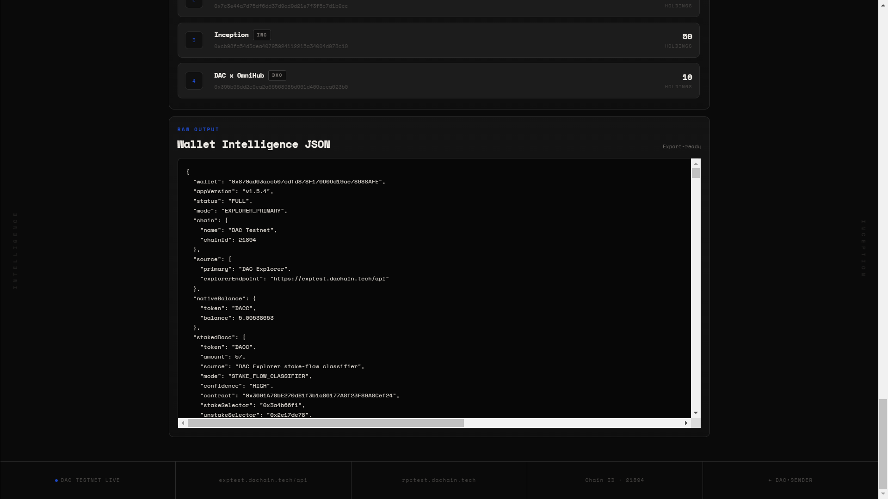

# DAC Wallet Intelligence Layer v1.5.4

Client-side wallet intelligence interface for the **DAC Quantum Chain Testnet**.

The checker reads public DAC testnet data from the explorer and RPC, then converts a pasted wallet address into a structured profile covering native funds, NFT ownership, activity metrics, portfolio profile, reputation scoring, Sybil heuristics, DAC Inception Rank signal, DACC stake signal, stress-testing links, and raw JSON output.

> This is a community-built engineering tool by **JERUZZALEM — DAC Infra Tester**.  
> It is not an official DAC product, not an official eligibility checker, and not a definitive Sybil detection system.

**Live Interface**

- [DAC Wallet Intelligence Layer](https://EdLWEISS186.github.io/dac-dual-node-cgnat-setup/DAC-Contributions/dac-wallet-intelligence-layer/wallet-intelligence-layer-v1/)


---

## Latest Version

### v1.5.4 — GitHub Project Button

Version `v1.5.4` is the current UI version of the Wallet Intelligence Layer.

This release adds a direct GitHub project button below the five pipeline cards in the initial hero interface. The button links users to the project folder so they can review the implementation, README, assets, and repository context.

Current metadata:

```text
App Version     : v1.5.4
Policy Version  : WIL-v1.5.2
Policy ID       : WIL-2026-05-v1.5.2
Policy Engine   : wallet-quality-scoring-v1.5.2
Sybil Engine    : EOH-v1.5.2
Sybil Mode      : EXPLORER_ONLY
Registry Module : known-collection-registry-v1.3.3
```

Key updates in v1.5.4:

- Added **Read Project Details** button below the hero pipeline cards.
- Linked the button to the GitHub project folder.

GitHub project folder:

```text
https://github.com/EdLWEISS186/dac-dual-node-cgnat-setup/tree/main/DAC-Contributions/dac-wallet-intelligence-layer/wallet-intelligence-layer-v1
```

---

## Table of Contents

- [Overview](#overview)
- [Project Context](#project-context)
- [Community and Engineering Disclaimer](#community-and-engineering-disclaimer)
- [Interface Overview](#interface-overview)
- [Architecture](#architecture)
- [Data Sources](#data-sources)
- [Network Configuration](#network-configuration)
- [Wallet Quality Policy](#wallet-quality-policy)
- [Reputation Scoring Layer](#reputation-scoring-layer)
- [Sybil Heuristics](#sybil-heuristics)
- [Historical Activity Windowing](#historical-activity-windowing)
- [DAC Inception Rank Signal](#dac-inception-rank-signal)
- [DACC Stake Signal](#dacc-stake-signal)
- [Project Repository Link](#project-repository-link)
- [Stress Testing Links](#stress-testing-links)
- [Failure Handling](#failure-handling)
- [Security Model](#security-model)
- [Local Usage](#local-usage)
- [Technical Notes](#technical-notes)
- [Future Work](#future-work)
- [Changelog](#changelog)
- [License](#license)
- [Author](#author)

---

## Overview

The DAC Testnet is not only a transaction environment. It is also a public behavioral data environment.

`DAC•SENDER` helps generate testnet activity.  
`DAC Wallet Intelligence Layer` reads public activity and converts it into structured wallet intelligence.

```text
DAC•SENDER
→ creates and routes testnet activity

DAC Wallet Intelligence Layer
→ observes, classifies, and documents wallet activity
```

The interface is read-only. Users paste a wallet address and press `Check`. No wallet connection, signature, private key, backend account, or server-side database is required.

The output is designed for infrastructure testing, testnet participation analysis, wallet behavior review, explorer-based reporting, public-data debugging, and community analytics.

The initial interface also includes a direct GitHub project button so users can inspect the repository folder and read the implementation details.

---

## Project Context

The tool originated from DAC infrastructure testing work and from the function-task concept developed for the DAC / Truebit Etherscan API task library.

The related function task, `dac_wallet_intelligence`, takes wallet metrics and converts them into wallet activity analytics, NFT portfolio intelligence, reputation scoring, Sybil-risk estimation, and DAC testnet wallet profiling.

This web interface extends that idea into a client-side tool that runs directly in the browser.

Project location:

```text
DAC-Contributions/dac-wallet-intelligence-layer/wallet-intelligence-layer-v1/
```

---

## Community and Engineering Disclaimer

This project is a **community-built engineering tool**.

It is not an official DAC product, official DAC eligibility checker, official DAC reputation system, official DAC Sybil detector, reward checker, airdrop checker, or allowlist verification tool.

All score labels, thresholds, interpretations, and policy weights are community-defined.

The checker does not prove whether a wallet is Sybil or non-Sybil. It only evaluates explorer-visible behavior patterns from a single-wallet point of view.

---

## Interface Overview

Screenshots should be stored in the local `assets/` folder.

### Initial Interface

Default interface state before a wallet check is executed. This view includes the five pipeline cards and the GitHub project button.



### Check Pending

State after a wallet address is entered and the check process is running.


### Full Intelligence Ready

State after explorer/RPC modules return usable data and the profile is generated.



### Wallet Output

Main wallet output summary.


### Sybil Heuristics

Behavior pattern analysis, Pattern Health Score, Sybil Risk Estimate, Activity Archetype, First Transaction, Wallet Age, and core heuristic metrics.



### Activity Analytics / Portfolio Intelligence / Reputation Scoring

Activity Analytics v1, Portfolio Intelligence v1, and Reputation Scoring v1 summary panels.



### Wallet Quality Policy

Scoring policy, component breakdown, policy ID, policy status, max score, and active scoring engine.



### Stress Test / Official Rank Signal

Stress testing links and DAC Inception Rank signal panel.



### Proof of Asset Engine

NFT ownership and collection overview from explorer token list data.



### Raw Output

Raw JSON profile generated by the checker.



---

## Architecture

The current implementation is shipped as static frontend files:

```text
index.html
wallet-intelligence.css
wallet-intelligence.js
readme.md
assets/
```

Conceptual module layout:

```text
index.html
└── UI shell, wallet input, result panels, project link, stress-testing links

wallet-intelligence.js
├── explorer / RPC orchestration
├── proof-native-funds
├── stake-flow-classifier
├── historical-activity-windowing
├── proof-assets-engine
├── known-collection-registry-v1.3.3
├── activity-analytics
├── portfolio-intelligence
├── reputation-scoring
└── sybil-heuristics

wallet-intelligence.css
└── visual layout, dashboard styling, responsive behavior
```

---

## Data Sources

### Primary Explorer API

```text
https://exptest.dachain.tech/api
```

Used for:

```text
balance
txlist
txlistinternal
tokenlist
tokennfttx
```

### RPC Fallback

```text
https://rpctest.dachain.tech/
```

Used for:

```text
eth_getBalance
eth_getTransactionCount
eth_getBlockByNumber
eth_call
```

RPC fallback is limited. Standard RPC cannot fully replace explorer-indexed NFT ownership, NFT transfers, internal transactions, or full historical wallet activity.

---

## Network Configuration

| Parameter | Value |
|---|---|
| Network | DAC Testnet |
| Chain ID | `21894` |
| Native Token | `DACC` |
| RPC Endpoint | `https://rpctest.dachain.tech/` |
| Explorer | `https://exptest.dachain.tech` |
| Explorer API | `https://exptest.dachain.tech/api` |
| DACC Staking Contract | `0x3691A78bE270dB1f3b1a86177A8f23F89A8Cef24` |
| DAC Inception Rank Contract | `0xB36ab4c2Bd6aCfC36e9D6c53F39F4301901Bd647` |

---

## Wallet Quality Policy

v1.5.2 uses a locked wallet-quality policy.

```text
Policy Version : WIL-v1.5.2
Policy ID      : WIL-2026-05-v1.5.2
Policy Engine  : wallet-quality-scoring-v1.5.2
Status         : LOCKED
Max Score      : 100 reputation + 100 pattern health
```

The policy contains two separate scoring layers:

```text
Reputation Scoring Layer : 100 points
Sybil Heuristics Layer   : 100 points
```

These layers represent two different views of wallet quality:

- reputation scoring evaluates holdings, activity, rank, funds, and stake
- Sybil heuristics evaluate behavior patterns, maturity, burst, diversity, and local counterparty concentration

---

## Reputation Scoring Layer

The reputation layer is a 100-point score.

| Component | Max Points |
|---|---:|
| Transaction Score | 20 |
| NFT Diversity Score | 10 |
| NFT Holdings Score | 10 |
| Native Funds Score | 15 |
| DACC Stake Score | 20 |
| DAC Inception Rank Score | 25 |
| **Total** | **100** |

### Reputation Level

| Score | Label |
|---:|---|
| `90–100` | `ELITE` |
| `75–89` | `HIGH` |
| `50–74` | `MEDIUM` |
| `< 50` | `LOW` |

### Reputation Sybil Risk Label

| Score | Label |
|---:|---|
| `>= 90` | `LOW` |
| `>= 70` | `MEDIUM` |
| `< 70` | `HIGH` |

This label is not definitive. The deeper behavior analysis is handled by the Sybil Heuristics layer.

---

## Sybil Heuristics

The Sybil Heuristics layer is explorer-only.

```text
Engine : EOH-v1.5.2
Mode   : EXPLORER_ONLY
Score  : Pattern Health Score / 100
```

It does not use backend identity data, IP addresses, devices, off-chain accounts, or private user data.

### Design Principle

High activity is not treated as suspicious by itself.

High activity becomes more suspicious only when combined with low activity spread, low interaction diversity, high counterparty concentration, no builder/tester signal, no DAC ecosystem commitment, short wallet age, and repetitive transfer behavior.

This is important because DAC testnet participants, infra testers, and builders may intentionally create high-volume activity for stress testing.

### Output

| Output | Description |
|---|---|
| Pattern Health | 100-point behavior-health score |
| Sybil Risk Estimate | LOW / MEDIUM / HIGH estimate |
| Activity Archetype | Behavior classification |
| First Transaction | First observed transaction on DAC Testnet |
| Wallet Age | Age from first transaction |
| Active Days | Number of active calendar days |
| Unique Contracts | Distinct contract targets touched |
| Counterparties | Unique wallet counterparties |
| Burst Ratio | Largest single-day share of total transactions |
| Gas Spent | Estimated gas spent by the wallet |

### First Transaction Format

Example output:

```text
First Transaction
1M22D
Apr 02, 2026
Block 14,589,819
NATIVE_TRANSFER · 0x335a81...f8d0
```

Age formatting rules:

```text
1Y2M13D
7M3D
5D
```

Unavailable units are omitted. For example, `7M3D` is used instead of `0Y7M3D`.

In the First Transaction card, numeric values and time units use different colors for readability.

### Pattern Health Components

| Component | Max Points | Role |
|---|---:|---|
| Wallet Maturity | 15 | Early and consistent DAC Testnet participation |
| Activity Spread | 15 | Activity across multiple days and weeks |
| Activity Burst | 10 | Concentration of activity into a short period |
| Interaction Diversity | 15 | Unique contracts and contract creation paths |
| Builder / Tester Signal | 20 | Stress testing, deployment, NFT launch, and builder behavior |
| Counterparty Pattern | 10 | Local counterparty concentration |
| DAC Ecosystem Commitment | 15 | RANK badge and DACC stake signals |
| **Total** | **100** | Pattern Health Score |

### Wallet Maturity Weights

| First Transaction Timing | Points |
|---|---:|
| `FirstTx <= Mar 21, 2026 (Waitlist Phase)` | 9 |
| `FirstTx <= Apr 11, 2026 (Keycard Claim Closed)` | 7 |
| `FirstTx <= Apr 18, 2026 (Inception Live)` | 5 |
| `FirstTx 30+ days ago` | 4 |
| `FirstTx 14+ days ago` | 2 |
| `FirstTx 7+ days ago` | 1 |
| `FirstTx below 7 days ago` | 0 |

The earliest three tiers are intentionally weighted higher to respect early community participation.

### Activity Spread Weights

| Condition | Points |
|---|---:|
| `ActiveDays >= 20 & ActiveWeeks >= 4` | 15 |
| `ActiveDays >= 10 & ActiveWeeks >= 2` | 12 |
| `ActiveDays >= 5` | 8 |
| `ActiveDays >= 2` | 4 |
| `ActiveDays = 1` | 1 |

### Activity Burst Weights

| Condition | Points |
|---|---:|
| `LargestDay <= 25% of TotalTx` | 10 |
| `LargestDay <= 40% of TotalTx` | 7 |
| `LargestDay <= 60% of TotalTx` | 4 |
| `LargestDay > 60% of TotalTx` | 1 |
| `TotalTx < 5` | 5 |

### Interaction Diversity Weights

| Condition | Points |
|---|---:|
| `ContractTouches >= 10` | 15 |
| `ContractTouches >= 5` | 11 |
| `ContractTouches >= 3` | 7 |
| `ContractTouches >= 1` | 3 |
| `No Contract Interaction` | 0 |

### Builder / Tester Signal Weights

| Condition | Points |
|---|---:|
| `ContractCreations >= 5` | 20 |
| `ContractCreations >= 1 & GasSpent > 0` | 15 |
| `UniqueRecipients >= 20 & TotalTx >= 100` | 15 |
| `UniqueContracts >= 5 or GasSpent > 0.01` | 10 |
| `TotalTx >= 50` | 5 |
| `No Builder / Tester Signal` | 0 |

### Counterparty Pattern Weights

| Condition | Points |
|---|---:|
| `UniqueCounterparties >= 20 & TopCounterparty < 25%` | 10 |
| `UniqueCounterparties >= 10 & TopCounterparty < 40%` | 8 |
| `UniqueCounterparties >= 5 & TopCounterparty < 60%` | 5 |
| `UniqueCounterparties >= 2` | 2 |
| `Highly Concentrated or Low Counterparty Diversity` | 1 |
| `NativeTransferTx = 0` | 6 |

### DAC Ecosystem Commitment Weights

| Condition | Points |
|---|---:|
| `RankBadges >= 6 & StakedDACC >= 50` | 15 |
| `RankBadges >= 3 or StakedDACC >= 50` | 12 |
| `RankBadges >= 1 or StakedDACC >= 10` | 8 |
| `StakedDACC > 0` | 5 |
| `No DAC Ecosystem Signal` | 0 |

---

## Historical Activity Windowing

Historical activity is displayed across:

```text
7D
30D
All Time
```

Each window can show transactions, NFT transfers, stake transaction count, unstake transaction count, Net Staked, Stake In, and Stake Out.

### Timestamp Modes

| Mode | Meaning |
|---|---|
| `TIMESTAMP_BASED` | Explorer rows include timestamp data |
| `BLOCK_TIMESTAMP_FALLBACK` | Timestamp resolved from block data through RPC |
| `BLOCK_TIMESTAMP_FALLBACK_LIMITED` | Limited block timestamp resolution to avoid excessive RPC calls |
| `NO_TIMESTAMP_AVAILABLE` | Insufficient timestamp/block data |
| `NO_ACTIVITY_RETURNED` | Explorer returned no usable activity rows |

---

## DAC Inception Rank Signal

The known collection registry detects the DAC Inception Rank NFT.

```text
Collection : DAC Inception Rank
Symbol     : RANK
Standard   : DRC-721
Contract   : 0xB36ab4c2Bd6aCfC36e9D6c53F39F4301901Bd647
Registry   : known-collection-registry-v1.3.3
```

The registry module remains `known-collection-registry-v1.3.3` because its detection logic has not changed since v1.3.3.

The RANK badge is treated as an official rank badge signal because it is tied to the DAC Inception Rank NFT and QE progress flow.

---

## DACC Stake Signal

The DACC staking contract is read as a separate wallet-quality signal.

```text
Contract : 0x3691A78bE270dB1f3b1a86177A8f23F89A8Cef24
```

Stake is estimated through a stake/unstake classifier:

```text
Estimated Current Stake = Total Stake In - Total Unstake Out
```

The stake classifier reads:

```text
Stake selector   : 0x3a4b66f1
Unstake selector : 0x2e17de78
```

Stake is not labeled as an official rank signal. It is displayed as a separate DACC stake metric.

---


## Project Repository Link

Version `v1.5.4` adds a repository navigation button to the initial hero section.

```text
Read Project Details
Open GitHub folder
```

The button points to:

```text
https://github.com/EdLWEISS186/dac-dual-node-cgnat-setup/tree/main/DAC-Contributions/dac-wallet-intelligence-layer/wallet-intelligence-layer-v1
```

Purpose:

- allow users to review the project folder
- provide direct access to the README and static source files
- make the community-built nature of the checker transparent
- help reviewers trace the project context inside the wider DAC contribution repository


---

## Stress Testing Links

The interface includes a Stress Testing panel that links to related DAC testnet activity tools:

| Tool | URL |
|---|---|
| `DAC•SENDER` | `https://edlweiss186.github.io/dac-dual-node-cgnat-setup/Sender-Web/` |
| `DAC•SENDER NFT Launchpad` | `https://edlweiss186.github.io/dac-dual-node-cgnat-setup/Sender-Web/mint.html` |

These tools are used for transaction generation, smart contract interaction, NFT deployment, and stress-testing workflows.

---

## Failure Handling

The checker follows a fail-safe output model:

```text
Verified data      → full profile
Partial data       → partial profile
RPC fallback only  → limited profile
No verified data   → no score
```

No random score, mock score, fabricated profile, or placeholder analytics are generated.

---

## Security Model

- No private keys.
- No wallet connection.
- No transaction signing.
- No backend database.
- No account login.
- No server-side user tracking.
- No IP/device-based scoring.
- Public explorer/RPC data only.

The tool is a static client-side application.

---

## Local Usage

Run from the repository root:

```bash
python3 -m http.server 8080
```

Then open:

```text
http://localhost:8080/DAC-Contributions/dac-wallet-intelligence-layer/wallet-intelligence-layer-v1/
```

Example wallet:

```text
0x870ad63acc507cdfd878F170606d19ae78988AFE
```

---

## Technical Notes

- Static HTML/CSS/JS implementation.
- No build step.
- No backend service.
- GitHub Pages compatible.
- Explorer API is the primary data source.
- RPC is used as fallback and for block timestamp resolution.
- Sybil Heuristics is explorer-only.
- Known collection registry remains `known-collection-registry-v1.3.3`.
- Wallet Quality Policy is `WIL-v1.5.2`.
- Policy engine is `wallet-quality-scoring-v1.5.2`.
- Sybil engine is `EOH-v1.5.2`.
- App UI version is `v1.5.4`.

---

## Future Work

Potential future directions:

- ABI-based staking reads if the verified staking contract ABI becomes available.
- Additional known DAC ecosystem collections if more verified contracts are available.
- More detailed explorer-only counterparty analysis.
- Better distinction between contract deployment, NFT deployment, and normal contract calls.
- Optional Truebit function-task verification path.
- Optional mintable or updateable intelligence badge after the scoring model stabilizes.

---

## Changelog

### v1.5.4 — GitHub Project Button

- Added `Read Project Details` button below the initial hero pipeline cards.
- Linked the button to the GitHub project folder.
- Updated app UI version to `v1.5.4`.

### v1.5.3 — Stress Testing Button Fix

- Improved Stress Testing links so they visually read as action buttons rather than table-like rows.
- Added button-like layout, hover behavior, directional arrow indicator, and clearer button hierarchy.
- Updated app UI version to `v1.5.3`.

### v1.5.2 — Sybil Heuristics Naming & UI Consistency

- Renamed panel heading from `Explorer-only Sybil Heuristics` to `Sybil Heuristics`.
- Updated topbar branding to `Wallet Intelligence Layer v1.5.2`.
- Restored topbar subtext to `Wallet Checker`.
- Normalized Wallet Age display in the Sybil Heuristics metric row.
- Confirmed known collection registry logic is unchanged since v1.3.3.
- Updated policy version to `WIL-v1.5.2`.
- Updated policy engine to `wallet-quality-scoring-v1.5.2`.

### v1.5.1 — UI Policy Refinement & Stress Testing Links

- Refined First Transaction layout.
- Added Stress Testing panel with links to DAC•SENDER and DAC•SENDER NFT Launchpad.
- Replaced `Official Signals` wording in Scoring Breakdown with `Wallet Quality Policy`.
- Separated Official Rank Signal from DACC Stake Signal.
- Reworded rule labels to use cleaner user-facing formatting.
- Bottom-aligned component score bars for visual consistency.

### v1.5.0 — Sybil Heuristics

- Added explorer-only Sybil Heuristics behavior layer.
- Added Pattern Health Score.
- Added Sybil Risk Estimate.
- Added Activity Archetype.
- Added First Transaction output.
- Added Wallet Maturity / Early Signal.
- Added Activity Spread, Activity Burst, Interaction Diversity, Builder / Tester Signal, Counterparty Pattern, and DAC Ecosystem Commitment components.
- Updated policy to `WIL-v1.5.0`.
- Added `EOH-v1.5.0` behavior heuristic engine.

### v1.4.2 — Net Staked Label Polish

- Renamed `Net Stake Delta` to `Net Staked`.
- Updated historical window wording.

### v1.4.1 — Historical Windowing Wording Polish

- Renamed `Stake Events` to `Stake Tx Count`.
- Renamed `Unstake Events` to `Unstake Tx Count`.
- Renamed `Net stake flow` to `Net Stake Delta`.
- Renamed `In / Out` to `Stake In / Stake Out`.

### v1.4.0 — Historical Activity Windowing

- Added 7D / 30D / All Time activity windows.
- Added timestamp-based window calculation.
- Added block timestamp fallback mode.
- Added historical activity metadata to raw JSON output.

### v1.3.3 — Stake Flow Classifier

- Replaced simple staking value estimate with stake/unstake transaction-flow classification.
- Added stake selector detection: `0x3a4b66f1`.
- Added unstake selector detection: `0x2e17de78`.
- Added decoded unstake amount from calldata.
- Added reward/fee flow separation.

### v1.3.2 — Stake-Aware Scoring

- Added Native Funds Score tiers.
- Added DACC Stake Score tiers.
- Added staking contract signal.
- Added estimated stake field to the interface.

### v1.3.1 — Rank Highlight UI

- Highlighted inferred DAC Inception Rank.
- Added Inception Rank to the Wallet Intelligence Profile panel.

### v1.3.0 — Known Collection Registry + DAC Inception Rank Scoring

- Added Known Collection Registry.
- Added DAC Inception Rank detection.
- Added DAC Inception Rank as a scoring component.
- Added inferred rank from RANK badge count.

### v1.2.0 — Versioned Scoring Policy

- Added locked scoring policy metadata.
- Added policy ID.
- Added scoring engine label.
- Added versioned component thresholds and label definitions.

### v1.1.1 — NFT Participation Percentage Display Fix

- Changed NFT Participation display from decimal ratio to percentage format.

### v1.1.0 — Transparent Scoring UI

- Added visible scoring breakdown panel.
- Added per-category score components.
- Added rule/condition display for each score component.

### v1 — Initial Release

- Initial release of the community-built DAC Wallet Intelligence Layer.
- Added no-connect wallet checking.
- Added Proof of Native Funds.
- Added Proof of Assets Engine.
- Added Activity Analytics.
- Added Portfolio Intelligence.
- Added Reputation Scoring.
- Added Raw JSON Output.
- Added live chain stats.

---

## License

This project is part of the [`dac-dual-node-cgnat-setup`](https://github.com/EdLWEISS186/dac-dual-node-cgnat-setup) repository and is covered by the root repository license.

---

## Author

**JERUZZALEM**  
DAC Infra Tester

Built by Communities for Communities.
