# DAC Wallet Intelligence Layer v2.0.2

Client-side wallet intelligence interface and dynamic wallet-bound badge layer for the **DAC Quantum Chain Testnet**.

This project extends the previous [Wallet Intelligence Layer v1](https://github.com/EdLWEISS186/dac-dual-node-cgnat-setup/tree/main/DAC-Contributions/dac-wallet-intelligence-layer/wallet-intelligence-layer-v1) into a dynamic SBT-based wallet status system.

The checker converts a pasted wallet address into a structured DAC Testnet profile, then gives the user an optional path to mint or update a dynamic **Wallet Status SBT**.

> Community-built engineering tool by **JERUZZALEM — DAC Infra Tester**.  
> Not an official DAC product, not an official eligibility checker, not a reward checker, and not a definitive Sybil detection system.

**Live Interface**

- [Wallet Intelligence Layer v2](https://edlweiss186.github.io/dac-dual-node-cgnat-setup/DAC-Contributions/dac-wallet-intelligence-layer/wallet-intelligence-layer-v2/)


---

## Latest Version

### v2.0.2 — Dynamic Wallet Status SBT

Version `v2.0.2` introduces the final dynamic Wallet Status SBT workflow.

The wallet check remains a pasted-address, no-connect flow. Users only interact with a browser wallet when they explicitly choose to mint or update the SBT.

Current active deployment:

| Component | Value |
|---|---|
| Wallet Status SBT | `0xdE02dfbf28563f80733423678477357dF9040b14` |
| Collection Name | `Wallet Status SBT` |
| Symbol | `Status` |
| Token Type | `ERC-5192 locked SBT` |
| Image Mode | `Dynamic SVG` |
| Mint Price | `1 DACC` |
| Update Price | `0.001 DACC` |
| DACNFTRegistry | `0x34CDf37FeEb81877acabAD601AAaA3AE5a5029Ae` |

Key updates:

- Added final Wallet Status SBT contract.
- Added one-wallet-one-badge mint logic.
- Added ERC-5192-style locked / non-transferable behavior.
- Added dynamic `tokenURI()`.
- Added dynamic SVG rendering per wallet.
- Added dynamic badge preview through `dynamicSvgOf(address)`.
- Added DAC Sender NFT Launchpad compatibility.
- Added Launchpad rendering support for dynamic artwork.
- Hid deprecated Wallet Status test entries from Launchpad UI.
- Preserved the wallet checker as a no-connect frontend analysis tool.

---

## Table of Contents

- [Overview](#overview)
- [Design Goals](#design-goals)
- [Interface Overview](#interface-overview)
- [User Flow](#user-flow)
- [Architecture](#architecture)
- [Data Sources](#data-sources)
- [Network Configuration](#network-configuration)
- [Wallet Intelligence Layer](#wallet-intelligence-layer)
- [Wallet Status SBT](#wallet-status-sbt)
- [Contract Interface](#contract-interface)
- [Dynamic SVG Rendering](#dynamic-svg-rendering)
- [Token Metadata](#token-metadata)
- [DAC Sender NFT Launchpad Integration](#dac-sender-nft-launchpad-integration)
- [Deprecated Registry Entries](#deprecated-registry-entries)
- [Security Model](#security-model)
- [Failure Handling](#failure-handling)
- [Repository Structure](#repository-structure)
- [Local Usage](#local-usage)
- [Engineering Notes](#engineering-notes)
- [Future Work](#future-work)
- [Changelog](#changelog)
- [License](#license)
- [Author](#author)

---

## Overview

The DAC Testnet is not only a transaction environment. It is also a public behavioral data environment.

`DAC•SENDER` helps generate activity.  
`Wallet Intelligence Layer` reads public activity.  
`Wallet Status SBT` converts the resulting wallet profile into a dynamic, wallet-bound badge.

```text
DAC•SENDER
→ generates DAC Testnet activity

Wallet Intelligence Layer
→ reads public explorer/RPC data
→ classifies wallet status

Wallet Status SBT
→ represents the wallet profile as one evolving locked badge
```

The interface is designed for testnet analysis, infrastructure testing, wallet behavior review, public-data debugging, and community analytics.

---

## Design Goals

The v2.0.2 design follows a few strict principles:

```text
No backend custody
No private key handling
No account login
No forced wallet connection for checking
No fabricated score output
No transferable status badge
```

Core goals:

- Keep wallet intelligence transparent and client-side.
- Let users inspect wallet status before any transaction.
- Make the badge dynamic and wallet-specific.
- Keep the SBT attached to the wallet that minted it.
- Integrate with the existing DAC Sender NFT Launchpad registry.
- Avoid presenting the result as an official DAC eligibility or reward system.

---

## Interface Overview

Screenshots are stored in the local `assets/` folder.

### Initial Interface

Default interface state before a wallet check is executed. This view includes the five pipeline cards and the GitHub project button.

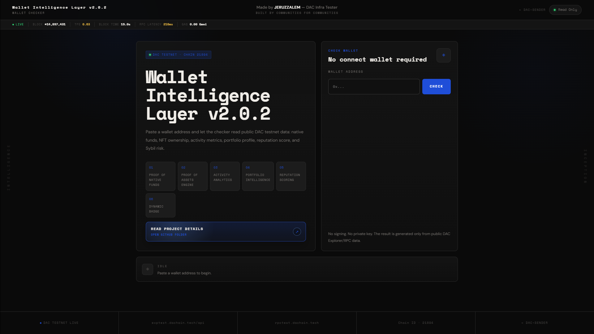

### Check Pending

State after a wallet address is entered and the check process is running.

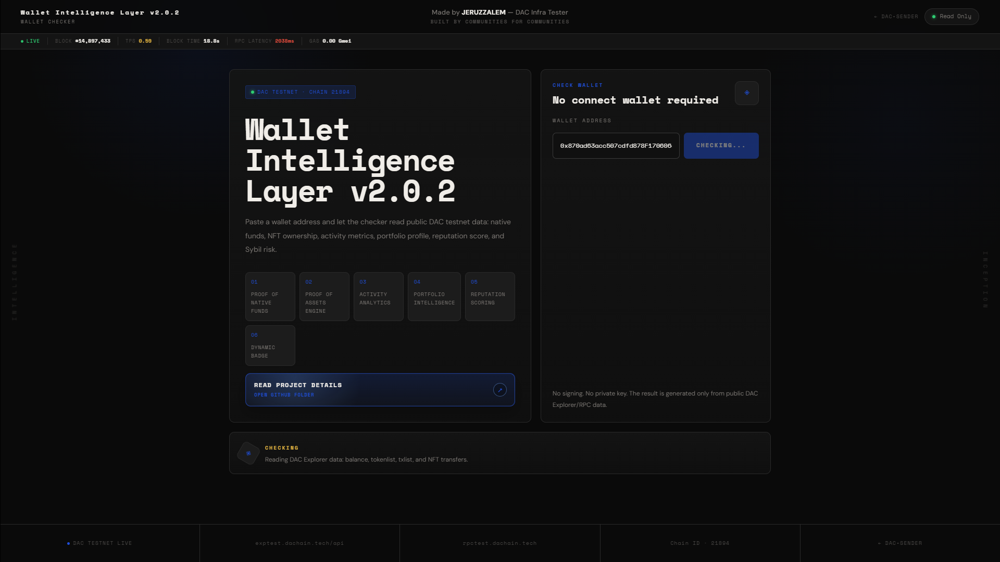

### Full Intelligence Ready

State after explorer/RPC modules return usable data and the profile is generated.

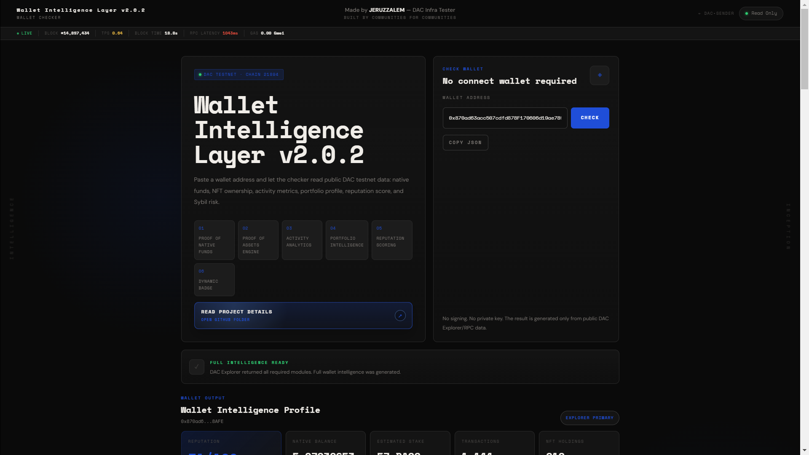

### Wallet Output

Main wallet output summary.

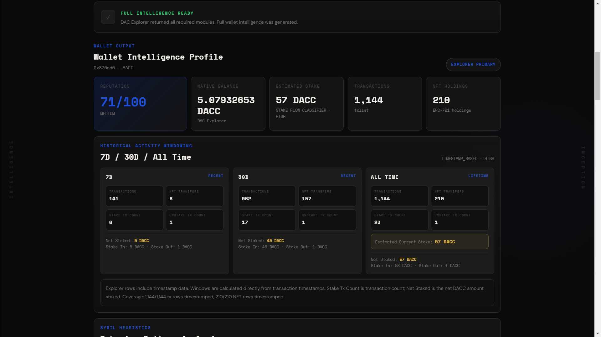

### Sybil Heuristics

Behavior pattern analysis, Pattern Health Score, Sybil Risk Estimate, Activity Archetype, First Transaction, Wallet Age, and core heuristic metrics.

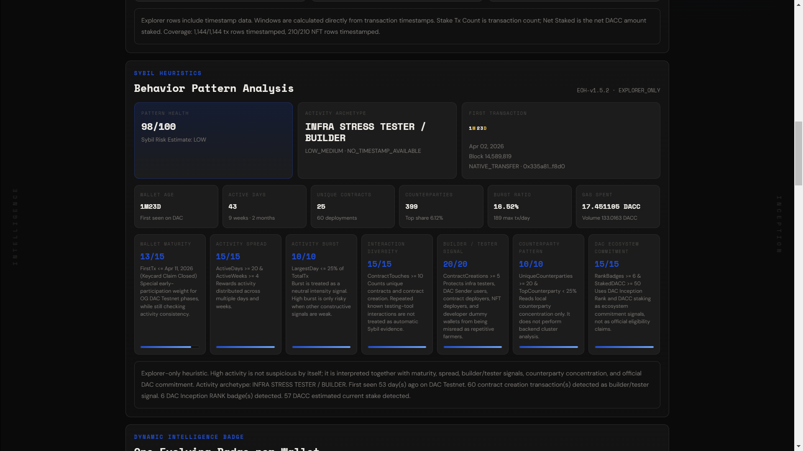

### Dynamic Intelligence Badge

Dynamic Wallet Status SBT preview generated from the checked wallet profile. This panel shows the wallet-bound badge artwork, profile-derived badge status, contract target, mint/update state, and dynamic metadata context before the user triggers a wallet transaction.

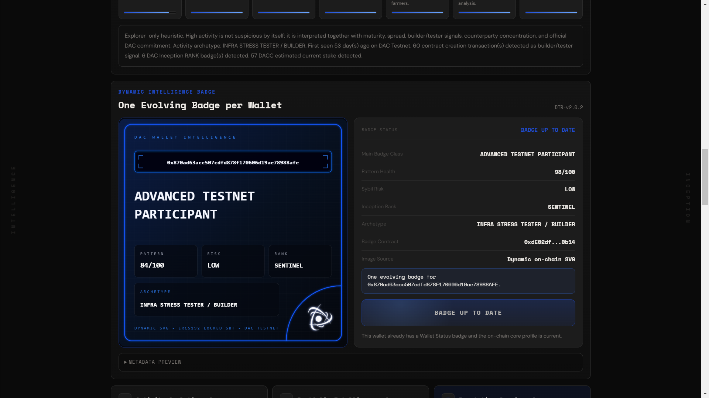

### Activity Analytics / Portfolio Intelligence / Reputation Scoring

Activity Analytics v1, Portfolio Intelligence v1, and Reputation Scoring v1 summary panels.

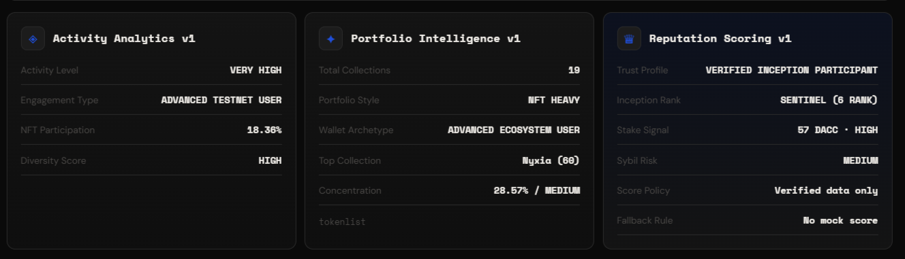

### Wallet Quality Policy

Scoring policy, component breakdown, policy ID, policy status, max score, and active scoring engine.

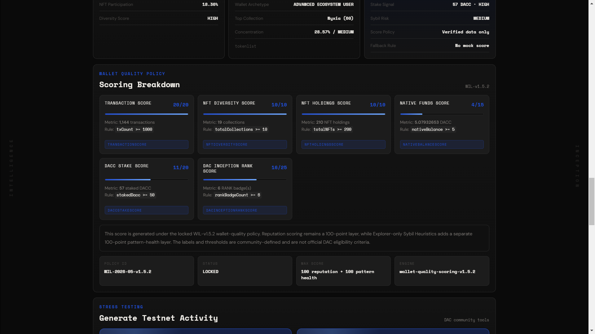

### Stress Test / Official Rank Signal

Stress testing links and DAC Inception Rank signal panel.

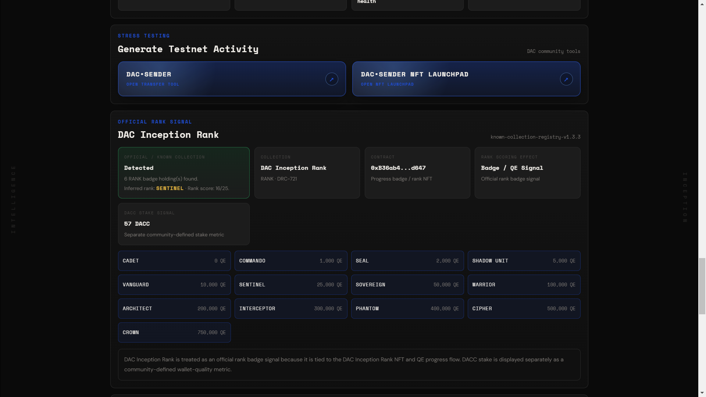

### Proof of Asset Engine

NFT ownership and collection overview from explorer token list data.

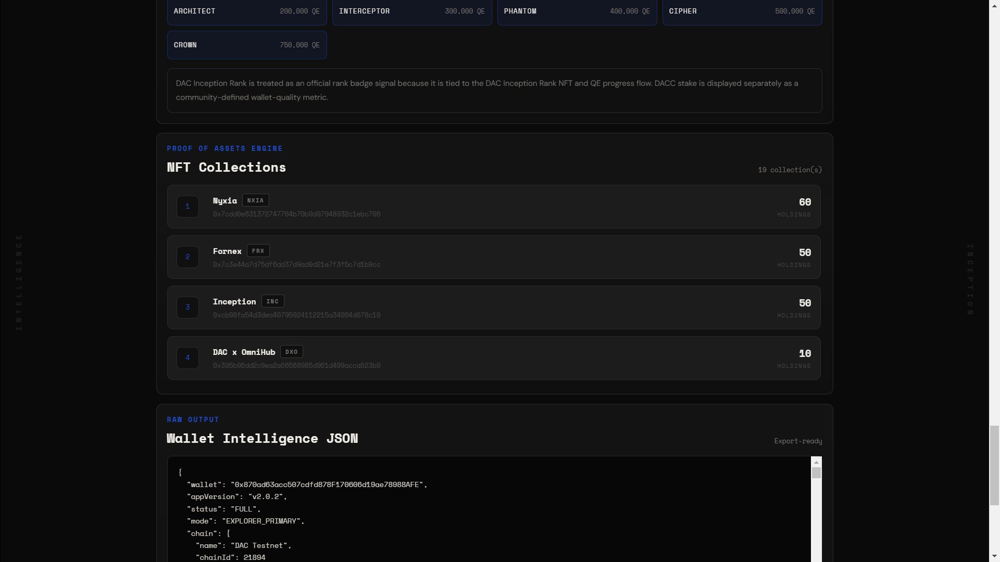

### Raw Output

Raw JSON profile generated by the checker.

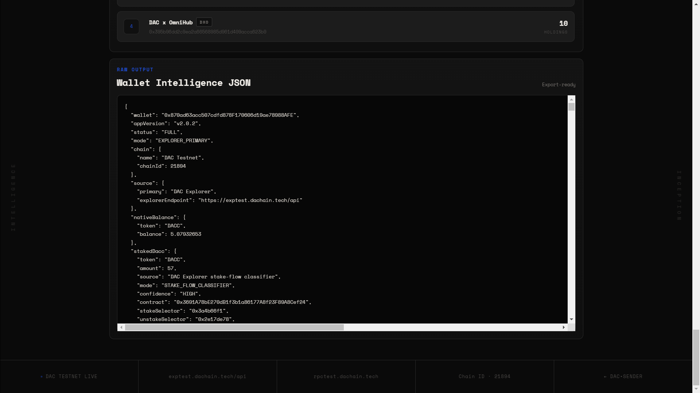

## User Flow

### Wallet Check Flow

The wallet intelligence check does **not** connect to a wallet.

```text
User pastes wallet address
↓
User clicks Check Status
↓
Frontend reads public DAC Testnet data
↓
Wallet profile is generated
↓
Dynamic badge preview appears
```

### Mint / Update Flow

The wallet transaction flow starts only after the user explicitly clicks the mint or update button.

```text
User clicks Mint Badge or Update Badge
↓
Frontend prepares the smart contract call
↓
Browser wallet popup appears
↓
User reviews and signs the transaction
↓
Transaction is submitted to DAC Testnet
↓
Wallet Status SBT becomes visible on-chain
```

Important distinction:

| Action | Wallet Connection Required? | Signature Required? |
|---|---:|---:|
| Check wallet status | No | No |
| Preview badge | No | No |
| Mint SBT | Yes, through wallet popup | Yes |
| Update SBT | Yes, through wallet popup | Yes |

The frontend is only a static interface that prepares calls and displays results. It never receives private keys.

---

## Architecture

Current implementation:

```text
wallet-intelligence-layer-v2/
├── index.html
├── wallet-intelligence.css
├── wallet-intelligence.js
└── README.md
```

Conceptual layout:

```text
index.html
└── UI shell, wallet input, result panels, dynamic badge section

wallet-intelligence.css
└── dashboard layout, responsive styling, badge preview styling

wallet-intelligence.js
├── wallet input validation
├── explorer/RPC reads
├── wallet profile generation
├── dynamic SBT preview rendering
├── Wallet Status SBT contract reads
├── mint/update transaction trigger
└── failure-safe UI states
```

The project is static and GitHub Pages compatible.

No build step, backend server, database, account system, or hosted API layer is required.

---

## Data Sources

### Explorer API

```text
https://exptest.dachain.tech/api
```

Used where explorer-indexed public wallet data is required.

### RPC Endpoint

```text
https://rpctest.dachain.tech/
```

Used for:

```text
eth_getBalance
eth_getTransactionCount
eth_getBlockByNumber
eth_call
contract read calls
```

### Contract Reads

Wallet Status SBT and DAC Inception Rank data are read through contract calls.

---

## Network Configuration

| Parameter | Value |
|---|---|
| Network | DAC Testnet |
| Chain ID | `21894` |
| Native Token | `DACC` |
| RPC Endpoint | `https://rpctest.dachain.tech/` |
| Explorer | `https://exptest.dachain.tech` |
| Explorer API | `https://exptest.dachain.tech/api` |
| DAC Inception Rank Contract | `0xB36ab4c2Bd6aCfC36e9D6c53F39F4301901Bd647` |
| Wallet Status SBT Contract | `0xdE02dfbf28563f80733423678477357dF9040b14` |
| DACNFTRegistry | `0x34CDf37FeEb81877acabAD601AAaA3AE5a5029Ae` |

---

## Wallet Intelligence Layer

Wallet Intelligence Layer v2 continues the profile model from [Wallet Intelligence Layer v1](https://github.com/EdLWEISS186/dac-dual-node-cgnat-setup/tree/main/DAC-Contributions/dac-wallet-intelligence-layer/wallet-intelligence-layer-v1).

The checker can surface wallet-level signals such as:

```text
native DACC balance
transaction activity
NFT-related wallet signals
DAC Inception Rank badge count
pattern health
Sybil risk estimate
inception rank label
wallet archetype
native balance tier
dynamic badge class
```

The output is intended for analysis and review, not final judgment.

---

## Wallet Status SBT

Wallet Status SBT is the dynamic badge layer introduced in v2.

Each wallet can mint only one evolving badge.

```text
1 wallet = 1 badge
```

If the profile changes, the user updates the existing badge instead of minting another token.

The badge is designed to represent:

```text
verified core on-chain status
DAC Inception Rank signal
native DACC balance tier
wallet profile state
```

The contract computes the core badge profile from on-chain state available to the contract. The frontend provides the user-facing intelligence interface, preview, and mint/update trigger.

---

## Contract Interface

Final active contract:

```text
0xdE02dfbf28563f80733423678477357dF9040b14
```

Constructor RankBadge source:

```text
0xB36ab4c2Bd6aCfC36e9D6c53F39F4301901Bd647
```

Launchpad compatibility methods:

```text
name()
symbol()
totalSupply()
maxSupply()
maxMintPerWallet()
mintPrice()
mintedPerWallet(address)
mint(uint256)
```

Dynamic badge methods:

```text
previewProfile(address)
badgeTextOf(address)
dynamicSvgOf(address)
dynamicImageOf(address)
tokenURI(uint256)
needsUpdate(address)
updateBadge()
```

SBT behavior:

```text
locked(uint256) → true
approve() → revert
setApprovalForAll() → revert
transferFrom() → revert
safeTransferFrom() → revert
```

---

## Dynamic SVG Rendering

The final badge image is generated as dynamic SVG.

For web preview, the frontend calls:

```text
dynamicSvgOf(address)
```

and renders the SVG inline. This avoids browser issues that can occur when external IPFS assets are nested inside a `data:image/svg+xml` image context.

The final SVG includes:

```text
wallet address
main badge class
pattern health
Sybil risk
inception rank
wallet archetype
DAC logo
dynamic SBT footer
```

---

## Token Metadata

Final NFT description:

> Wallet Status is a dynamic DAC Testnet badge generated by the DAC Wallet Intelligence Layer v2.  
> Each wallet can hold one evolving badge that reflects its verified core on-chain status,  
> DAC Inception Rank signal, native DACC balance tier, and wallet profile state.

Typical metadata fields:

```text
name
description
image
external_url
attributes
```

Typical attributes:

```text
Main Badge Class
Pattern Health
Sybil Risk
Inception Rank
Archetype
Rank Badge Count
Native Balance Tier
Wallet Address
Version
Token Type
Transferability
Image Mode
Verification Mode
```

IPFS assets:

| Asset | CID |
|---|---|
| DAC logo without background | `bafkreiehizlkhvgeayzghwtppno5wy3ynmxylwd2mtstomjlgtazt5x2xy` |
| Collection cover image | `bafkreihsmz6zxg5lhdtzmljclxyxxsth2p6qgnw2ozfpob3kwva3g5tssa` |
| Collection metadata | `bafkreihphts6njtszzbkg6p3ant7n4qr3vgtm345yzuipsrspmobfrqh2e` |

---

## DAC Sender NFT Launchpad Integration

Wallet Status SBT is registered into the existing DAC Sender NFT Launchpad registry.

```text
DACNFTRegistry:
0x34CDf37FeEb81877acabAD601AAaA3AE5a5029Ae
```

Expected visibility:

```text
Before mint:
Collections → Wallet Status SBT

After mint:
Collections    → Wallet Status SBT
My Collections → Wallet Status SBT
```

The Launchpad was patched to support dynamic artwork for the final Wallet Status SBT contract.

For the final contract, the Launchpad can render:

```text
dynamicSvgOf(connected wallet address)
```

inside:

```text
collection cards
collection detail page
My Collections
```

This keeps the Launchpad compatible with both static NFT collections and the dynamic Wallet Status SBT.

---

## Deprecated Registry Entries

During development, two earlier Wallet Status contracts were registered while the dynamic badge workflow was still being validated. Those versions exposed issues that were only visible after end-to-end testing, including static artwork behavior and dynamic image rendering inconsistencies.

The entries are intentionally hidden from the DAC Sender NFT Launchpad UI:

```text
0xC790a1f6b314267e88F6ef2FcB66537DD2C4e1a2
0x28aA8D67Bb4BeCF5ad6fc5E28f5B971FebB29cFf
```

They are not removed from the on-chain registry because the registry appears append-only from the available frontend interface. Instead, the Launchpad UI filters those known development entries so users only see the finalized Wallet Status SBT implementation.

Final visible version:

```text
0xdE02dfbf28563f80733423678477357dF9040b14
```

---

## Security Model

### Wallet Status Check

- No wallet connection.
- No transaction signing.
- No private key access.
- No backend account.
- No server-side database.
- Public explorer/RPC data only.

### Mint / Update

- Triggered only by explicit user action.
- Browser wallet popup required.
- User manually signs the transaction.
- Frontend does not custody funds.
- Private keys remain inside the user's wallet.

### General

- Static frontend only.
- No backend custody.
- No hidden identity scoring.
- No IP/device-based scoring.
- No official eligibility claim.

---

## Failure Handling

The checker follows a fail-safe output model:

```text
Verified data      → full profile
Partial data       → partial profile
RPC fallback only  → limited profile
No verified data   → no score
```

No random score, mock score, fabricated wallet profile, or placeholder analytics should be generated.

For the SBT layer:

```text
Valid contract state      → render badge preview
Dynamic SVG unavailable   → show fallback UI state
Wallet already has badge  → show update / current state
Wallet has no badge       → show mint state
```

---

## Repository Structure

```text
wallet-intelligence-layer-v2/
├── index.html
├── wallet-intelligence.css
├── wallet-intelligence.js
└── README.md
```

Temporary helper files used for deployment or registry registration should not remain in the production folder after the final workflow is confirmed.

---

## Local Usage

Run from the repository root:

```bash
python3 -m http.server 8080
```

Then open:

```text
http://localhost:8080/DAC-Contributions/dac-wallet-intelligence-layer/wallet-intelligence-layer-v2/
```

Example wallet:

```text
0x870ad63acc507cdfd878F170606d19ae78988AFE
```

---

## Engineering Notes

### Why SBT?

Wallet Status represents a wallet-specific state. It should not be transferable because transferring it would detach the status from the wallet that produced the activity.

### Why dynamic SVG?

A static image cannot accurately represent different wallet profiles. Dynamic SVG allows the token image to follow the wallet-specific profile state.

### Why render inline in the web preview?

The final dynamic SVG references an IPFS-hosted DAC logo. Rendering the SVG inline avoids broken-image behavior caused by external assets inside a `data:image/svg+xml` image context.

### Why keep deprecated entries hidden instead of deleting them?

The existing DACNFTRegistry appears append-only from the available frontend ABI. Since old entries cannot be removed safely from the registry, the Launchpad UI filters known deprecated Wallet Status contracts.

---

## Future Work

Potential future directions:

- Badge evolution history.
- Wallet status update timeline.
- More granular dynamic badge classes.
- Additional DAC ecosystem signal modules.
- Better explorer-side metadata indexing.
- Cleaner native Launchpad support for dynamic token artwork.
- Optional event history panel for status changes.
- More detailed on-chain participation records.

---

## Changelog

### v2.0.2 — Dynamic Wallet Status SBT

- Added final Wallet Status SBT contract.
- Added ERC-5192 locked behavior.
- Added one badge per wallet rule.
- Added dynamic `tokenURI()`.
- Added dynamic SVG badge rendering.
- Added DAC logo IPFS asset support.
- Added Wallet Intelligence Layer dynamic badge preview.
- Added mint/update transaction trigger.
- Added DAC Sender NFT Launchpad registry support.
- Added Launchpad dynamic artwork rendering.
- Added UI filtering for deprecated Wallet Status registry entries.
- Updated project documentation.

### v2.0.1 — Wallet Status Badge Prototype

- Added initial Wallet Status badge interface.
- Added badge preview layout.
- Added preliminary on-chain profile reads.
- Added direct mint/update prototype flow.

### v2.0.0 — Wallet Intelligence Layer v2 Foundation

- Created v2 project folder.
- Extended the v1 wallet intelligence concept.
- Added Dynamic Intelligence Badge section.
- Prepared the SBT-oriented workflow.

---

## License

This project is part of the [`dac-dual-node-cgnat-setup`](https://github.com/EdLWEISS186/dac-dual-node-cgnat-setup) repository and is covered by the root repository license.

---

## Author

**JERUZZALEM**  
DAC Infra Tester

Built by Communities for Communities.
