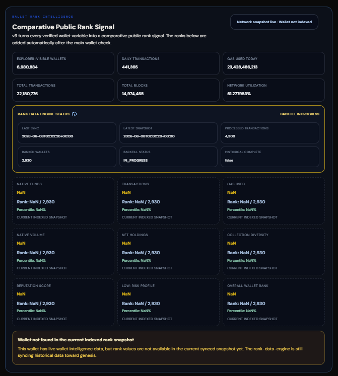

# DAC Wallet Intelligence Layer v3.5.0

Client-side wallet intelligence interface and globally comparative public wallet rank system for the **DAC Quantum Chain Testnet**.

Wallet Intelligence Layer v3.5.0 extends the stable v3 architecture into the Inception Evolved phase with Conviction-aware indexing, Compact V3 public rank delivery, a new Conviction Locked comparative signal, and cutoff-aware live reputation scoring.

The project is community-built by **JERUZZALEM — DAC Infra Tester**.

> Not an official DAC product, not an official eligibility checker, not a reward checker, and not a definitive Sybil detection system.

**Live Interface**

- [Wallet Intelligence Layer v3](https://edlweiss186.github.io/dac-dual-node-cgnat-setup/DAC-Contributions/dac-wallet-intelligence-layer/wallet-intelligence-layer-v3/)


---

## Table of Contents

- [Overview](#overview)
- [v3.5.0 Update Summary](#v350-update-summary)
- [Release Notes](#release-notes)
- [Relationship to Previous Projects](#relationship-to-previous-projects)
- [Architecture Topology](#architecture-topology)
- [Architecture Responsibilities](#architecture-responsibilities)
- [Data Sources](#data-sources)
- [Authoritative SQLite State](#authoritative-sqlite-state)
- [Rank Data Workflow](#rank-data-workflow)
- [Historical Repair Workflow](#historical-repair-workflow)
- [Low-Storage Worker Model](#low-storage-worker-model)
- [Global Rank Builder](#global-rank-builder)
- [Compact Public Rank Schema V3](#compact-public-rank-schema-v3)
- [Conviction Locked Signal](#conviction-locked-signal)
- [Ranking Model](#ranking-model)
- [Official Rank Signal](#official-rank-signal)
- [Dedicated Rank Publisher](#dedicated-rank-publisher)
- [Public Output Files](#public-output-files)
- [UI Architecture](#ui-architecture)
- [Interface Preview](#interface-preview)
- [Rank Data Status Model](#rank-data-status-model)
- [Google Drive Backup Layer](#google-drive-backup-layer)
- [Local Development Workspace](#local-development-workspace)
- [Security and Trust Model](#security-and-trust-model)
- [Repository Role](#repository-role)
- [Validation Status](#validation-status)
- [Changelog](#changelog)
- [License](#license)
- [Author](#author)

---

## Overview

Wallet Intelligence Layer v3.5.0 is a DAC Testnet wallet intelligence and comparative ranking system with post-cutover Conviction awareness.

The interface keeps the no-connect wallet check model from previous Wallet Intelligence Layer versions, then adds a rank intelligence layer that compares a wallet against the complete indexed wallet population.

The core v3 principle remains:

```text
Every verified wallet variable can become a comparative public rank signal.
```

The browser does not calculate a wallet rank from isolated wallet data. The global rank is precomputed from the full indexed population, published as compact rank artifacts, and then retrieved by the UI through an address-prefix shard.

```text
Full indexed population
↓
Global comparative rank calculation
↓
Compact public rank records
↓
Address-prefix shards
↓
Browser wallet lookup
```

The shard is only a delivery format. The comparison population remains global.

---

## v3.5.0 Update Summary

Version `v3.5.0` is the Conviction-aware web, worker, and public rank schema release for the Inception Evolved phase.

The v3.3.0 architecture remains the stable base:

```text
Local RPC nodes
↓
Low-storage worker
↓
Authoritative SQLite state
↓
Global rank builder
↓
Compact public rank artifacts
↓
Static browser lookup
```

The main protocol-context change:

```text
Stake-era active signal
↓
Frozen as Estimated Stake Before Conviction
```

The main new commitment signal:

```text
Conviction Sprint lock transaction
↓
Conviction Locked
```

The main public schema change:

```text
WIL_V3_COMPACT_ARRAY_V2
↓
WIL_V3_COMPACT_ARRAY_V3
```

The main UI change:

```text
Estimated Current Stake
↓
Estimated Stake Before Conviction + Conviction Locked
```

Key updates:

- Added Conviction cutover awareness at block `15021664`.
- Added `conviction_locked` as a public comparative rank metric.
- Renamed the old stake-era rank metric to `estimated_stake_before_conviction`.
- Added `conviction_lock_events` and `conviction_metrics` SQLite state support in the worker layer.
- Updated the compact public shard schema to `WIL_V3_COMPACT_ARRAY_V3`.
- Updated public shard mode to `SHARDED_COMPACT_V3`.
- Updated the public rank publisher validator for Compact V3.
- Kept `rank-engine.js` backward-compatible with Compact V2 snapshots.
- Preserved the original eight-variable Final Composite Rank formula.
- Kept Estimated Stake Before Conviction, Conviction Locked, and Official Testnet Inception NFTs outside the Final Composite Rank formula.
- Updated visible UI labels to `Wallet Intelligence Layer v3.5.0`.
- Updated Dynamic Intelligence Badge label to `DIB-v3.5.0`.
- Completed the Conviction-aware live 100-point reputation model.
- Split live `Native Balance` telemetry from cutoff-aware `Native Funds Before Conviction` scoring.
- Updated DACC Commitment scoring to combine `Estimated Stake Before Conviction` and `Conviction Locked`.
- Added non-blocking Native Funds cutoff source modes for historical RPC, explorer-estimated cutoff balance, and unavailable cutoff state.
- Added monotonic Dynamic Intelligence Badge behavior so update prompts only move to a higher tier.

Conviction cutover metadata:

```text
cutover_block  = 15021664
cutover_utc    = 2026-06-16T07:50:29Z
cutover_local  = 2026-06-16 14:50:29 +07:00
contract       = 0xfc416635E3b7330404766bd8ea9E5227800937C1
selector       = 0x3a4b66f1
```

Operational note:

The backend worker may still be in historical backfill or post-backfill catch-up. During that period, the UI and public rank artifacts must continue to show rank-data readiness status clearly. Conviction rows become available after the worker reaches the post-cutover catch-up range.

---

## Release Notes

Versions `v3.0.0` through `v3.2.0` were experimental/beta releases.

They document the architecture evolution that led to the mature v3 implementation:

```text
v3.0.0
GitHub Actions prototype

v3.1.0
Local node processing

v3.2.0
Externalized state and Google Drive backup

v3.3.0
Stable SQLite-backed production architecture

v3.4.0
Worker Acceleration & Operational Hardening

v3.5.0
Conviction-aware web, worker, and Compact V3 public rank schema
```

The earlier releases remain important because they show why the architecture changed. They are not presented as failed releases; they are development stages that exposed runtime, storage, memory, and publication constraints.

Version `v3.3.0` is the first stable v3 release because the complete pipeline was separated into clear responsibilities:

- local RPC indexing;
- SQLite authoritative state;
- bounded historical repairs;
- external backup;
- global rank calculation;
- compact public publication;
- browser-side shard lookup;
- UI rank rendering.

Version `v3.4.0` hardened the production worker path with counterparty lookup optimization, benchmarked backfill presets, a stable 24/7 worker configuration, Google Drive backup auto-cleanup, and terminal phase monitoring.

Version `v3.5.0` keeps that architecture and adapts it to the post-stake, Conviction-era Inception Evolved phase.

“Production-ready” refers to the completed and validated architecture. Rank completeness still follows the current synchronization phase. During historical backfill or catch-up, the UI must not imply that the full chain population is already finalized.

---

## Relationship to Previous Projects

Wallet Intelligence Layer v3.5.0 is part of a broader DAC tooling progression.

It does not replace earlier projects. It builds on the same testnet tooling path: activity generation, wallet reading, dynamic wallet status representation, and public comparative rank intelligence.

| Project | Version | Role in the Progression | Reference |
|---|---:|---|---|
| DAC Sender | `v1.4.3` | Activity-generation and testnet interaction tool. It helps create visible DAC Testnet wallet behavior. | [DAC Sender](https://github.com/EdLWEISS186/dac-dual-node-cgnat-setup/tree/main/Sender-Web) |
| Wallet Intelligence Layer | `v1.5.4` | First wallet intelligence layer focused on reading and interpreting public DAC wallet activity. | [Wallet Intelligence Layer v1](https://github.com/EdLWEISS186/dac-dual-node-cgnat-setup/tree/main/DAC-Contributions/dac-wallet-intelligence-layer/wallet-intelligence-layer-v1) |
| Wallet Intelligence Layer | `v2.0.2` | Extended wallet intelligence into a dynamic wallet-bound status badge workflow. | [Wallet Intelligence Layer v2](https://github.com/EdLWEISS186/dac-dual-node-cgnat-setup/tree/main/DAC-Contributions/dac-wallet-intelligence-layer/wallet-intelligence-layer-v2) |
| Wallet Intelligence Layer | `v3.5.0` | Global comparative wallet intelligence using local DAC nodes, SQLite state, Compact V3 rank artifacts, Conviction-aware metrics, and public shard lookup. | [Wallet Intelligence Layer v3](https://github.com/EdLWEISS186/dac-dual-node-cgnat-setup/tree/main/DAC-Contributions/dac-wallet-intelligence-layer/wallet-intelligence-layer-v3) |

In short:

```text
DAC Sender
→ creates / supports wallet activity

Wallet Intelligence Layer v1
→ reads wallet activity

Wallet Intelligence Layer v2
→ represents wallet status through a dynamic badge layer

Wallet Intelligence Layer v3
→ compares wallet variables across the indexed population
```

---

## Architecture Topology

Wallet Intelligence Layer v3.5.0 uses the same hybrid local-processing and public-delivery architecture from v3.3.0, with the public artifact layer upgraded to Compact V3 and the state layer expanded for Conviction tracking.

```text
                           ┌──────────────────────────────┐
                           │      DAC Testnet Chain       │
                           └──────────────┬───────────────┘
                                          │
                       ┌──────────────────┴──────────────────┐
                       │                                     │
                       ▼                                     ▼
          ┌────────────────────────┐             ┌────────────────────────┐
          │ Linux DAC Node in WSL  │             │ Windows DAC Node       │
          │ Primary local RPC      │             │ Fallback local RPC     │
          │ 127.0.0.1:8546         │             │ 192.168.100.7:8545     │
          └────────────┬───────────┘             └────────────┬───────────┘
                       │                                      │
                       └──────────────────┬───────────────────┘
                                          ▼
                           ┌──────────────────────────────┐
                           │ Local RPC Rank Worker        │
                           │ Backfill / Catch-up / Sync   │
                           │ Conviction-aware v3.5.0      │
                           └──────────────┬───────────────┘
                                          ▼
                           ┌──────────────────────────────┐
                           │ Authoritative SQLite State   │
                           │ wallet / stake / NFT / sync  │
                           │ conviction lock state        │
                           └───────────┬───────────┬──────┘
                                       │           │
                       ┌───────────────┘           └────────────────┐
                       ▼                                            ▼
          ┌──────────────────────────┐               ┌──────────────────────────┐
          │ Consistent GDrive Backup │               │ Global Rank Builder      │
          │ Drive A / Drive B        │               │ Full population compare  │
          └──────────────────────────┘               └─────────────┬────────────┘
                                                                   ▼
                                                    ┌──────────────────────────┐
                                                    │ Compact V3 Rank Artifacts│
                                                    │ summary / index / shards │
                                                    │ Conviction Locked signal │
                                                    └─────────────┬────────────┘
                                                                   ▼
                                                    ┌──────────────────────────┐
                                                    │ Snapshot Publisher       │
                                                    │ wil-v3-rank-data branch  │
                                                    └─────────────┬────────────┘
                                                                   ▼
                                                    ┌──────────────────────────┐
                                                    │ Static UI / GitHub Pages │
                                                    │ rank-engine.js lookup    │
                                                    │ Compact V2/V3 decoder    │
                                                    └──────────────────────────┘
```

The normal live-wallet interface may also read official DAC Explorer/API data for current public wallet and network context. That live Explorer path is separate from the precomputed global rank path.

---

## Architecture Responsibilities

| Layer | Responsibility |
|---|---|
| DAC Testnet | Canonical blockchain activity source |
| Linux DAC Node | Primary local RPC source |
| Windows DAC Node | Fallback local RPC source |
| Local RPC Worker | Block processing, wallet metrics, stake-era flow, Conviction lock flow, NFT ownership, checkpoints |
| SQLite State | Authoritative heavy local rank state |
| Historical Repair Workers | Fill feature-specific historical gaps without restarting the main backfill |
| Google Drive A/B | Consistent compressed SQLite backup and rollover storage |
| Global Rank Builder | Full-population comparative rank calculation |
| Snapshot Publisher | Compact public artifact validation and publication |
| GitHub `main` | Source code, scripts, UI, lightweight project files |
| `wil-v3-rank-data` | Public summary, index, shards, and snapshot manifest |
| `rank-engine.js` | Summary/index loading, shard lookup, Compact V2/V3 decoding |
| Static UI | User input, rank card rendering, live public context |

---

## Data Sources

The project uses public and node-derived DAC Testnet data.

### Official DAC RPC

```text
https://rpctest.dachain.tech/
```

Used for public RPC reads where applicable.

### Official DAC Explorer

```text
https://exptest.dachain.tech
```

Used as the public DAC Testnet explorer reference.

### Official DAC Explorer API

```text
https://exptest.dachain.tech/api
```

Used where explorer-indexed public wallet, transaction, address, staking-flow, or network data is available.

### Local DAC RPC Nodes

The main rank workflow uses the local node setup.

```text
Primary:
http://127.0.0.1:8546

Fallback:
http://192.168.100.7:8545
```

Expected chain ID:

```text
0x5586
```

The local nodes provide block, transaction, receipt, log, balance, and chain-head data for the worker.

### Conviction Lock Flow

After the cutover block, the worker recognizes Conviction lock transactions sent to:

```text
0xfc416635E3b7330404766bd8ea9E5227800937C1
```

The active lock function selector is:

```text
0x3a4b66f1
```

Successful value-bearing calls to this contract are aggregated as Conviction Locked.

### Generated Public Rank Data

The frontend reads precomputed rank outputs rather than the SQLite database.

```text
data/wallet-rank-summary.json
data/wallet-rank-index.json
data/rank-shards/*.json
```

---

## Authoritative SQLite State

The active heavy state is stored outside GitHub:

```text
~/wil-v3-rank-state/wil-v3-rank-state.sqlite
```

SQLite is the source of truth for the v3.5.0 rank worker.

Principal logical tables include:

```text
wallet_metrics
staking_metrics
conviction_lock_events
conviction_metrics
official_inception_nft_tokens
checkpoint
counters
state_meta
enrichment_queue
official_inception_nft_repair_state
```

### `wallet_metrics`

Preserves wallet intelligence material such as:

- native balance data;
- transaction count;
- gas usage;
- native volume;
- NFT holdings;
- collection diversity;
- success and failure counts;
- unique counterparties;
- contract interaction data;
- first-seen and last-seen information;
- additional rank material used by WIL.

### `staking_metrics`

Stores recognized stake/unstake flow preserved as Estimated Stake Before Conviction.

The stake-era signal is not deleted in v3.5.0. It is retained as historical wallet-quality context before the Conviction cutover.

### `conviction_lock_events`

Stores deduplicated Conviction lock transactions.

Each event is keyed by transaction hash and captures:

- wallet address;
- block number;
- transaction index;
- locked value in wei;
- event timestamp.

### `conviction_metrics`

Stores wallet-level Conviction Locked aggregates.

The table tracks:

- total Conviction Locked value;
- Conviction lock transaction count;
- first Conviction lock block/transaction/time;
- last Conviction lock block/transaction/time;
- source and confidence metadata.

### `official_inception_nft_tokens`

Stores the latest known ownership event for each Official Testnet Inception NFT token.

### `checkpoint`

Stores backfill, catch-up, incremental, and synchronization boundaries.

### `counters`

Stores cumulative worker counters.

### `state_meta`

Stores schema and state metadata.

### `enrichment_queue`

Stores deferred enrichment work.

### `official_inception_nft_repair_state`

Stores the independent, resumable repair checkpoint for the historical NFT feature gap.

### Why SQLite replaced monolithic JSON

The previous JSON architecture required loading and rewriting a large state file.

SQLite allows the worker to:

- retrieve only required records;
- keep a limited active cache;
- batch UPSERT changed rows;
- update checkpoints transactionally;
- avoid loading the full population into memory;
- create consistent backups;
- support indexed queries for the rank builder.

No required wallet intelligence variable was intentionally removed during this change.

---

## Rank Data Workflow

The main worker uses three synchronization phases.

### 1. Historical Backfill

The worker processes historical blocks from the current checkpoint backward toward genesis.

```text
current historical checkpoint
↓
genesis
```

The scan direction is:

```text
higher block → lower block
```

During this phase, lightweight status can be published, but the UI must not imply that the global rank dataset is complete.

### 2. Post-Backfill Catch-Up

After genesis is reached, the worker fills the forward gap created while backfill was running.

```text
historical backfill anchor + 1
↓
current live chain head
```

### 3. Incremental Sync

After catch-up, the worker processes only new blocks.

```text
last processed block + 1
↓
latest block
```

### Worker responsibilities

The worker processes:

- block transactions;
- senders and recipients;
- native-value flow;
- gas usage;
- wallet activity counters;
- NFT activity;
- collection diversity;
- stake and unstake flow before the Conviction cutover;
- Conviction lock transaction flow after the cutover;
- Official Inception NFT `Transfer` logs;
- checkpoint and phase transitions.

### Lightweight status during backfill

The worker does not need to rebuild the complete global rank dataset on every backfill cycle.

Lightweight status may include:

- sync phase;
- last synced block;
- next backfill block;
- latest chain block at sync;
- indexed wallet count;
- total processed transactions;
- state backend;
- feature support flags;
- Conviction support flags;
- public rank readiness.

Global rank generation is handled separately.

---

## Historical Repair Workflow

Feature-specific repair workers were used because Estimated Current Stake and Official NFT tracking were added after the main worker had already processed part of the historical range.

A repair worker:

- uses its own checkpoint;
- processes only the missing feature range;
- does not rewrite the main worker checkpoint;
- can resume after interruption;
- preserves newer events over older events;
- stops when it reaches the main worker boundary.

### Official NFT Repair Worker

```text
rank-data-engine/scripts/repair_official_inception_nft_gap.py
```

The Official NFT repair scans backward from the original anchor toward the current worker boundary.

This direction is intentional: the newest token ownership event is encountered first, and older events cannot overwrite a newer stored event position.

A completed repair remains recorded for audit and recovery, while the main worker continues from its own checkpoint.

### Conviction Cutover Note

Conviction indexing was added directly to the main v3.5.0 worker path.

No temporary Conviction repair worker is required while the worker is still in historical backfill. Conviction lock rows are expected to appear after the worker completes historical backfill and reaches the post-cutover range during post-backfill catch-up.

---

## Low-Storage Worker Model

The project follows an explicit low-storage lifecycle:

```text
input
↓
temporary working area
↓
process and validate
↓
publish or persist output
↓
remove temporary work
```

Temporary work may include:

- a temporary repository clone;
- a consistent source database snapshot;
- a temporary rank-build database;
- a temporary snapshot repository;
- compressed backup work;
- temporary manifests.

This design has two goals:

1. avoid unnecessary permanent storage growth;
2. prevent generated operational data from becoming scattered or accidentally committed.

### Daily worker execution

The low-storage runner can create temporary work, process local RPC data, commit only intended lightweight output where configured, and remove the temporary workspace.

### Rank publication

The rank publisher creates isolated build and snapshot workspaces, validates the result, optionally pushes the public snapshot branch, and then cleans the temporary work.

### Important source-control rule

Only explicitly staged source files should enter `main`.

Operational state, logs, temporary databases, and backup work remain outside the tracked source tree.

---

## Global Rank Builder

The global rank builder is:

```text
scripts/generate_rank_from_sqlite.py
```

It reads a consistent snapshot of the complete SQLite population.

The builder:

1. creates a consistent source snapshot;
2. streams wallet metrics into a temporary rank-build database;
3. joins stake-era metrics as Estimated Stake Before Conviction;
4. joins Conviction Locked aggregates;
5. counts current Official NFT ownership;
6. computes global metric ranks;
7. computes the Final Composite Rank;
8. creates compact records;
9. splits records into prefix shards;
10. writes summary and index metadata;
11. validates the rank-build database;
12. removes temporary builder work.

### Public output

```text
data/wallet-rank-summary.json
data/wallet-rank-index.json
data/rank-shards/00.json
data/rank-shards/01.json
...
data/rank-shards/ff.json
```

### Global comparison guarantee

Rank calculation occurs before sharding.

A wallet stored in `ab.json` is still ranked against the complete indexed population, not only against addresses beginning with `0xab`.

---

## Compact Public Rank Schema V3

v3.5.0 uses:

```text
WIL_V3_COMPACT_ARRAY_V3
SHARDED_COMPACT_V3
```

Each public wallet record contains **23 fields**.

```text
11 metric values
+
12 comparative rank values
```

### Metric value order

1. `native_funds`
2. `estimated_stake_before_conviction`
3. `conviction_locked`
4. `transactions`
5. `native_volume`
6. `gas_used`
7. `nft_holdings`
8. `collection_diversity`
9. `reputation_score`
10. `low_sybil_risk`
11. `official_inception_nfts`

### Comparative rank order

The next twelve fields contain ranks in the same metric order, followed by the final composite rank.

```text
native_funds
estimated_stake_before_conviction
conviction_locked
transactions
native_volume
gas_used
nft_holdings
collection_diversity
reputation_score
low_sybil_risk
official_inception_nfts
overall_rank
```

### Backward compatibility

The reader supports:

```text
WIL_V3_COMPACT_ARRAY_V2
WIL_V3_COMPACT_ARRAY_V3
```

This allows a controlled transition between public snapshot generations. Older Compact V2 snapshots remain readable, while new Compact V3 snapshots expose Conviction Locked.

---

## Conviction Locked Signal

`Conviction Locked` is the post-cutover active commitment signal introduced for the Inception Evolved phase.

Detection rule:

```text
tx.to == 0xfc416635e3b7330404766bd8ea9e5227800937c1
tx.input starts with 0x3a4b66f1
tx.value > 0
receipt.status == success
block_number >= 15021664
```

The metric value is derived from `tx.value`, converted from wei to DACC.

Conviction Locked is published as a comparative rank metric, but it is not merged into the Final Composite Rank formula in v3.5.0.

---

## Ranking Model

WIL v3.5.0 separates two related but different concepts:

```text
Global comparative public rank
→ precomputed from the full indexed wallet population

Live wallet reputation score
→ computed in the browser from the checked wallet's verified data
```

The public rank model compares wallets globally through Compact V3 rank artifacts. The live reputation model explains the checked wallet's wallet-quality score in the UI.

### Ten small comparative cards

Compact V3 exposes ten small comparative rank cards plus the full-width final rank panel:

```text
Native Funds              Estimated Stake Before Conviction   Conviction Locked
Transactions              Native Volume                       Gas Used
NFT Holdings              Collection Diversity                Reputation Score
Low-Risk Profile
```

`Estimated Stake Before Conviction` and `Conviction Locked` are visible comparative cards, but they are not merged into the preserved Final Composite Rank formula in v3.5.0.

### Final Composite Rank

The Final Composite Rank remains the preserved eight-variable global rank formula from the stable v3 architecture.

Final Composite Rank inputs:

1. Native Funds
2. Transactions
3. Gas Used
4. Native Volume
5. NFT Holdings
6. Collection Diversity
7. Reputation Score
8. Low-Risk Profile

The following signals are displayed separately and are not merged into the Final Composite Rank formula:

- Estimated Stake Before Conviction;
- Conviction Locked;
- Official Testnet Inception NFTs.

This preserves backward continuity for global ranking while still exposing new Conviction-era comparative signals.

### Live Reputation Scoring Layer

The live browser reputation layer remains a 100-point wallet-quality score.

| Component | Max Points | v3.5.0 interpretation |
|---|---:|---|
| Transaction Score | 20 | Wallet activity volume |
| NFT Diversity Score | 10 | Number of distinct NFT collections |
| NFT Holdings Score | 10 | Total NFT holdings |
| Native Funds Before Conviction | 15 | Native DACC balance at the Conviction cutoff |
| DACC Commitment Score | 20 | Estimated Stake Before Conviction + Conviction Locked |
| DAC Inception Rank Score | 25 | DAC Inception Rank NFT signal |
| **Total** | **100** | Community-defined wallet-quality score |

### Native Balance vs Native Funds Before Conviction

The top scoreboard `Native Balance` card remains live telemetry. It shows the wallet's current native DACC balance.

The reputation component is different:

```text
Native Balance card
→ live/current wallet telemetry

Native Funds Before Conviction score
→ cutoff-aware reputation input
```

`Native Funds Before Conviction` uses the wallet's native DACC balance at the Conviction cutover block:

```text
cutover_block = 15021664
cutover_utc   = 2026-06-16T07:50:29Z
cutover_local = 2026-06-16 14:50:29 +07:00
```

Source modes:

| Mode | Meaning |
|---|---|
| `HISTORICAL_RPC_CUTOFF_BALANCE` | Historical `eth_getBalance` at the cutoff block succeeded |
| `EXPLORER_CUTOFF_BALANCE_ESTIMATE` | Cutoff balance was reconstructed from current balance and post-cutover external transaction flow |
| `CUTOFF_BALANCE_UNAVAILABLE_NON_BLOCKING` | Cutoff balance could not be verified; the wallet check remains usable |

The conservative rule is:

```text
Current post-cutover Native Balance must not increase Native Funds score.
```

If the cutoff balance cannot be verified, the Native Funds component becomes unavailable/conservative instead of falling back to current liquid balance.

Native Funds Before Conviction tiers:

| Cutoff balance | Points |
|---:|---:|
| `>= 100 DACC` | 15 |
| `>= 75 DACC` | 14 |
| `>= 50 DACC` | 12 |
| `>= 25 DACC` | 9 |
| `>= 10 DACC` | 6 |
| `>= 5 DACC` | 4 |
| `< 5 DACC` | 2 |
| unavailable | 0 |

### DACC Commitment Score

DACC Commitment is capped at 20 points and combines the frozen stake-era signal with the new Conviction-era signal:

```text
DACC Commitment Score
=
Estimated Stake Before Conviction score
+
Conviction Locked score

cap = 20
```

The two sub-signals are:

| Signal | Max Points | Meaning |
|---|---:|---|
| Estimated Stake Before Conviction | 12 | Stake-era commitment frozen before the Conviction cutoff |
| Conviction Locked | 8 | Post-cutover active Conviction Sprint commitment |

`Estimated Stake Before Conviction` is historical. It is calculated from recognized pre-cutoff stake-in minus pre-cutoff decoded unstake-out. Post-cutover unstake does not reduce the frozen stake-era signal.

`Conviction Locked` is active. It is calculated from successful post-cutover value-bearing lock transactions sent to the Conviction contract.

Conviction amount scoring:

| Conviction Locked | Raw Points |
|---:|---:|
| `>= 200 DACC` | 8 |
| `>= 100 DACC` | 7 |
| `>= 50 DACC` | 5 |
| `>= 20 DACC` | 3 |
| `>= 10 DACC` | 2 |
| `> 0 DACC` | 1 |
| `0 DACC` | 0 |

Conviction timeliness multiplier:

| First Conviction lock timing | Multiplier |
|---|---:|
| `<= 24 hours` | `1.25x` |
| `<= 2 days` | `1.20x` |
| `<= 3 days` | `1.15x` |
| `<= 6 days` | `1.10x` |
| `<= 7 days` | `1.05x` |
| `> 7 days` | `1.00x` |

The final Conviction score is capped at 8 points:

```text
conviction_score = min(8, amount_score * timeliness_multiplier)
```

### Reputation Level

| Score | Label |
|---:|---|
| `90–100` | `ELITE` |
| `75–89` | `HIGH` |
| `50–74` | `MEDIUM` |
| `< 50` | `LOW` |

### Reputation Sybil Risk Label

| Score | Label |
|---:|---|
| `>= 90` | `LOW` |
| `>= 70` | `MEDIUM` |
| `< 70` | `HIGH` |

This label is not definitive. The deeper behavior analysis is handled by the explorer-only Sybil Heuristics layer.

### Dynamic Intelligence Badge behavior

The Dynamic Intelligence Badge follows monotonic progression behavior in v3.5.0.

A badge update is offered only when the newly calculated tier is higher than the highest known tier already achieved. If the current calculated wallet tier drops, the badge should preserve the highest tier already earned instead of encouraging a downgrade.

---

## Official Rank Signal

Official Testnet Inception NFT contract:

```text
0xB36ab4c2Bd6aCfC36e9D6c53F39F4301901Bd647
```

The worker tracks ERC-721 `Transfer` logs and stores the latest owner for each token.

The Official Rank Signal is derived from the wallet's current token count.

| NFT Count | Official Rank |
|---:|---|
| 0 | NONE |
| 1 | CADET |
| 2 | COMMANDO |
| 3 | SEAL |
| 4 | SHADOW UNIT |
| 5 | VANGUARD |
| 6 | SENTINEL |
| 7 | SOVEREIGN |
| 8 | WARRIOR |
| 9 | ARCHITECT |
| 10 | INTERCEPTOR |
| 11 | PHANTOM |
| 12 | CIPHER |
| 13 or more | CROWN |

The Official Rank Signal card displays:

- current Official Testnet Inception NFT count;
- Official Rank tier;
- comparative rank;
- percentile;
- rank scope.

The tier is rendered in white with a light-blue glow.

This is an independent official ecosystem signal. It is not merged into the Final Composite Rank formula.

---

## Dedicated Rank Publisher

The publisher is:

```text
scripts/publish_rank_snapshot_branch.sh
```

It:

1. validates its configuration;
2. creates isolated temporary work;
3. runs the global rank builder;
4. validates Compact V3 metadata;
5. validates shard completeness;
6. creates a clean snapshot repository;
7. creates one snapshot commit;
8. optionally pushes the public snapshot branch;
9. removes temporary work.

### Public rank branch

```text
wil-v3-rank-data
```

### Safety rules

The publisher prevents:

- incomplete snapshots from being pushed;
- limited test snapshots from being pushed;
- temporary fixture data from becoming production output.

Local tests use settings such as:

```text
PUSH_TO_GITHUB=0
ALLOW_INCOMPLETE=1
LIMIT=<small test population>
```

Production publication requires a complete valid index.

---

## Public Output Files

Public rank artifacts:

```text
wallet-intelligence-layer-v3/
└── data/
    ├── wallet-rank-summary.json
    ├── wallet-rank-index.json
    └── rank-shards/
        ├── 00.json
        ├── 01.json
        ├── ...
        └── ff.json
```

Operational lightweight worker status may also be represented under:

```text
rank-data-engine/data/
```

| Output | Purpose |
|---|---|
| `wallet-rank-summary.json` | Dataset status, population, schema, and synchronization metadata |
| `wallet-rank-index.json` | Shard directory, Compact schema, metric order, rank order, and Official Rank tiers |
| `rank-shards/*.json` | Compact wallet rank lookup records |
| snapshot manifest | Public snapshot branch metadata and publication state |
| lightweight worker status | Current worker phase and synchronization progress |

The authoritative SQLite database is not published to GitHub.

---

## UI Architecture

The UI version is:

```text
Wallet Intelligence Layer v3.5.0
DIB-v3.5.0
```

### Browser lookup flow

When a user enters:

```text
0xabcdef...
```

the reader:

1. normalizes the address;
2. loads the public rank summary;
3. loads the rank index;
4. derives prefix `ab`;
5. fetches `data/rank-shards/ab.json`;
6. extracts the compact wallet record;
7. decodes metric values and ranks;
8. renders the Wallet Rank Intelligence section.

The browser does not read SQLite and does not download the complete wallet population.

### Rank reader

```text
rank-engine.js
```

### UI renderer

```text
wallet-intelligence.js
```

### UI styles

```text
wallet-intelligence.css
```

### Final rank panel

```text
10 small metric cards
↓
OFFICIAL RANK SIGNAL
Official Testnet Inception NFTs
↓
FINAL COMPOSITE RANK
Overall Wallet Rank
```

The Official Rank Signal appears before the Final Composite Rank.

### Unindexed or incomplete state

A wallet may have live wallet intelligence data while its rank record is unavailable in the currently published snapshot.

The UI distinguishes:

- live public wallet visibility;
- indexed rank availability;
- full rank dataset readiness;
- historical backfill state;
- post-backfill catch-up state;
- incremental sync readiness.

---

## Interface Preview

The Wallet Rank Intelligence section follows the current project interface.



---

## Rank Data Status Model

| State | Meaning |
|---|---|
| `HISTORICAL_BACKFILL_IN_PROGRESS` | The worker is processing historical blocks backward toward genesis. |
| `POST_BACKFILL_CATCH_UP` | Historical backfill reached genesis and the worker is filling the forward gap. |
| `INCREMENTAL` | The worker has caught up and is processing newly produced blocks. |

The UI should only imply a fully synchronized rank dataset after historical backfill and catch-up are complete.

A stable architecture does not mean the historical dataset is already complete. Architecture status and synchronization status are separate.

---

## Google Drive Backup Layer

The heavy SQLite state is backed up locally through `rclone`.

Configured remotes:

```text
gdrive_wil_a:
gdrive_wil_b:
```

### Rollover policy

```text
Drive A usage below 90%
→ upload to Drive A

Drive A usage at or above 90%
→ upload to Drive B
```

### Backup workflow

1. Check the active SQLite database.
2. Read the current sync phase.
3. Choose the phase-specific folder.
4. Check Drive A quota.
5. Select Drive A or Drive B.
6. Create a consistent SQLite snapshot.
7. Run an integrity check.
8. Compress with Zstandard.
9. Generate a SHA-256 checksum.
10. Upload the timestamped snapshot.
11. Update the selected remote's `latest` pointer.
12. Write a local backup manifest.
13. Remove expired local upload work.

### Backup cadence

Current scheduled cadence:

```text
0 */6 * * *
```

### Responsibility boundary

GitHub does not upload the heavy state to Google Drive.

The local environment performs backups. GitHub stores source and public rank artifacts; Google Drive stores external heavy-state recovery snapshots.

---

## Local Development Workspace

The canonical repository is:

```text
https://github.com/EdLWEISS186/dac-dual-node-cgnat-setup
```

The daily working clone is:

```text
~/dac-contribution/DEV-SPACE
```

The WIL project source is:

```text
DAC-Contributions/
└── dac-wallet-intelligence-layer/
    └── wallet-intelligence-layer-v3/
```

Heavy operational state is outside the repository:

```text
~/wil-v3-rank-state/
```

Worker and benchmark logs are outside the repository:

```text
~/wil-v3-worker-logs/
```

This separation keeps daily source work lightweight and reduces the chance of accidentally pushing:

- SQLite databases;
- temporary snapshots;
- worker logs;
- backup work;
- temporary clones;
- compressed heavy-state files.

Explicit file staging is preferred over broad commands such as:

```text
git add .
```

---

## Security and Trust Model

Wallet Intelligence Layer v3.5.0 keeps the same safety principles as earlier versions:

```text
No private key handling
No forced wallet connection for checking
No backend account system
No custody
No hidden eligibility claim
No official reward claim
No fabricated score output
```

The wallet check flow uses public DAC Testnet information and public rank artifacts.

The local worker reads blockchain data and updates local intelligence state. It does not require private keys for wallet checking.

### Community interpretation layer

The following are community-defined engineering logic:

- rank variable modeling;
- wallet metric aggregation;
- Estimated Stake Before Conviction estimation;
- Conviction Locked interpretation;
- Official Rank tier presentation;
- historical repair workflow;
- composite rank presentation;
- shard formatting;
- UI status interpretation.

The system should be treated as a transparent community analytics layer, not an official DAC scoring or eligibility system.

---

## Repository Role

This project is part of:

```text
dac-dual-node-cgnat-setup
```

### `main` branch

Stores:

- WIL source code;
- worker scripts;
- SQLite adapter;
- repair scripts;
- rank builder;
- publisher;
- reader;
- UI;
- lightweight project files.

### Public rank snapshot branch

Stores:

- public summary;
- public index;
- compact rank shards;
- snapshot manifest.

### Local environment

Stores:

- authoritative SQLite state;
- logs;
- temporary worker and publisher work;
- backup upload work.

### Google Drive

Stores:

- compressed consistent SQLite snapshots;
- checksums;
- phase-based backup history;
- latest pointers.

---

## Validation Status

The v3.5.0 web and public-rank schema layer was validated with a synthetic SQLite source database and static syntax checks.

Validated v3.5.0 results:

```text
generator_exit_code=0
summary_version=v3.5.0
summary_compact_schema=WIL_V3_COMPACT_ARRAY_V3
index_mode=SHARDED_COMPACT_V3
index_record_schema=WIL_V3_COMPACT_ARRAY_V3
conviction_signal_key=conviction_locked
sample_record_length=23
```

Syntax checks:

```text
generate_rank_from_sqlite.py compile: OK
publish_rank_snapshot_branch.sh syntax: OK
rank-engine.js syntax: OK
wallet-intelligence.js syntax: OK
```

The live v3.5.0 browser scoring path was additionally validated after the Conviction Sprint cutover:

- `Conviction Locked` renders as a dedicated scoreboard card;
- `Native Balance` remains live/current telemetry;
- `Native Funds Before Conviction` is used for the 15-point Native Funds reputation component;
- current post-cutover native balance no longer increases Native Funds score;
- Native Funds cutoff balance resolves through historical RPC or a non-blocking explorer-based cutoff estimate;
- wallet output remains `Full Intelligence Ready` when core explorer modules are available.

The v3.5.0 backend worker path was also validated with:

- Conviction cutover constants;
- legacy stake guard after block `15021664`;
- Conviction transaction detector;
- SQLite Conviction tables;
- idempotent Conviction event insertion;
- one real main-DB worker cycle during historical backfill;
- low-storage runner status output with Conviction fields.

The v3.3.0 core source was validated before release.

Validated v3.3.0 areas include:

- SQLite migration and integrity;
- main worker state updates;
- one-block local worker smoke test;
- Estimated Current Stake support;
- Official NFT receipt classification;
- resumable Official NFT repair;
- repair/main-worker checkpoint alignment;
- global rank builder;
- Compact V2 output;
- publisher no-push test;
- Compact V1/V2 reader compatibility;
- nine small metric cards;
- Official Rank Signal placement;
- Official Rank tier mapping;
- Final Composite Rank preservation;
- CSS rank highlight;
- temporary workspace cleanup;
- Google Drive consistent snapshot backup;
- clean source commit and remote verification.

At the v3.5.0 implementation validation point, the worker remained in:

```text
HISTORICAL_BACKFILL_IN_PROGRESS
```

The next operational path is:

```text
continue toward genesis
↓
Post-Backfill Catch-Up
↓
Incremental Sync
```

Point-in-time wallet counts, token counts, and block checkpoints are intentionally not presented as permanent README guarantees because they continue changing as the worker runs.

---

## Changelog

### v3.5.0 — Conviction-aware Web Schema

- Added Compact V3 public rank records.
- Added Conviction Locked as a comparative public rank metric.
- Renamed the stake-era metric to Estimated Stake Before Conviction.
- Added Conviction cutover metadata to public rank summary output.
- Added Conviction SQLite event and aggregate state.
- Preserved backward-compatible Compact V2 browser decoding.
- Updated UI and DIB labels to `v3.5.0`.
- Preserved the original eight-variable Final Composite Rank formula.
- Completed Conviction-aware live reputation scoring.
- Froze stake-era commitment as Estimated Stake Before Conviction.
- Added Conviction Locked as the post-cutover active commitment signal.
- Added first-lock timeliness multiplier for Conviction scoring.
- Added a dedicated Conviction Locked scoreboard card.
- Reduced Native Balance display precision to 4 decimals.
- Split live Native Balance telemetry from Native Funds Before Conviction scoring.
- Added non-blocking Native Funds cutoff balance resolution using historical RPC or explorer-estimated cutoff reconstruction.
- Updated Native Funds scoring to use cutoff-aware Native Funds Before Conviction instead of current post-cutover liquid balance.
- Updated Dynamic Intelligence Badge behavior to monotonic tier progression.

### v3.4.0 — Worker Acceleration & Operational Hardening

- Optimized Local RPC worker counterparty tracking.
- Improved historical backfill throughput through sorted counterparty lookup.
- Benchmarked production worker presets from 3000 to 7000 blocks per cycle.
- Selected 5000 blocks, balance enrichment 1000, and 180 seconds sleep as the stable 24/7 default.
- Added backup wrapper cleanup after successful Google Drive upload.
- Preserved cron-based SQLite backup every 6 hours.
- Disabled per-cycle backup to reduce CPU, disk I/O, upload, and calendar overhead.
- Added a terminal worker dashboard for prepare, indexing, push, sleep, and next-cycle visibility.
- Reduced local GDrive upload-work storage growth.
- Documented operational ETA ranges for reaching incremental sync.

### v3.3.0 — Stable

- Introduced the LiteSQLite architecture: SQLite-backed low-storage authoritative state.
- Introduced compact public rank sharding for browser lookup.
- Finalized the global rank builder.
- Finalized the dedicated public snapshot publisher.
- Finalized the Compact V1/V2 reader architecture.
- Added Estimated Current Stake.
- Added Official Testnet Inception NFT ownership tracking.
- Added resumable historical feature repair.
- Added the Official Rank Signal and tier mapping.
- Added nine small comparative rank cards.
- Added separate Official Rank Signal and Final Composite Rank cards.
- Preserved the original eight-variable Final Composite Rank.
- Added consistent compressed SQLite backup to Google Drive A/B.
- Finalized temporary-work cleanup across worker, builder, publisher, and backup flows.
- Updated UI and DIB labels to `v3.3.0`.
- First production-ready v3 release.

### v3.2.0 — Beta

- Introduced the Google Drive storage backend.
- Externalized heavy rank state outside GitHub.
- Added Google Drive A/B rollover behavior.
- Preserved GitHub as source and lightweight public output.
- Documented the limitations of monolithic JSON state.

### v3.1.0 — Beta

- Switched processing to Local Node.
- Added Linux primary and Windows fallback RPC sources.
- Added historical backfill, post-backfill catch-up, and incremental phases.
- Added the low-storage temporary worker model.
- Separated the Overall Wallet Rank into a full-width final composite card.

### v3.0.0 — Beta

- Initial rewrite using GitHub Actions.
- Introduced Wallet Rank Intelligence as the v3 direction.
- Added the global comparative rank concept.
- Added early summary, index, shard, and placeholder output foundations.
- Established GitHub as the first automated processing and public artifact layer.

---

## License

This project is part of the [`dac-dual-node-cgnat-setup`](https://github.com/EdLWEISS186/dac-dual-node-cgnat-setup) repository and is covered by the root repository license.

---

## Author

**JERUZZALEM**  
DAC Infra Tester

Built by Communities for Communities.
