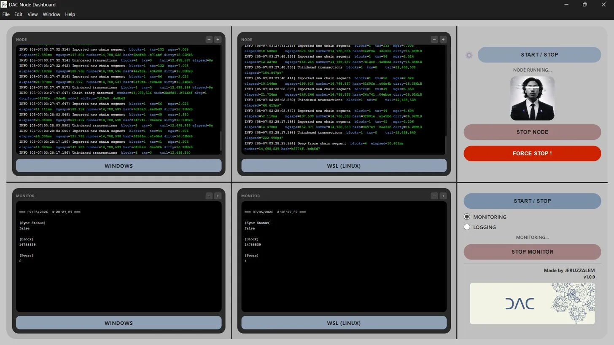
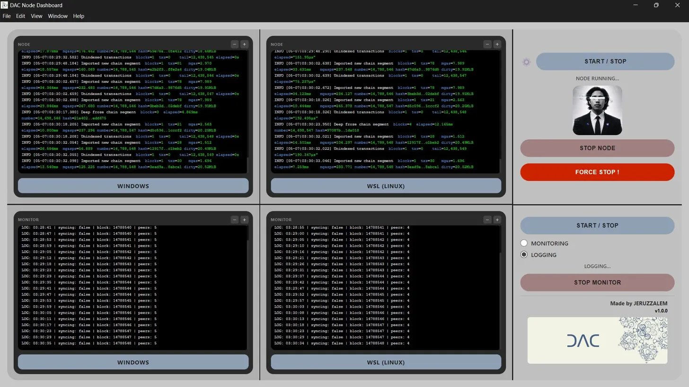

# DAC Node Dashboard

A desktop application to run, monitor, and log both DAC nodes — Windows and WSL — from a single interface.

---

## Download

👉 [DAC Node Dashboard Setup 1.0.0.exe](DAC%20Node%20Dashboard%20Setup%201.0.0.exe)

Run the installer and follow the setup wizard. Shortcuts will be created on your Desktop and Start Menu.

---

## Requirements

Before using this application, make sure you have:

- **Windows 10/11** with WSL enabled
- **DAC Node binary** installed on your machine
  → Official download: [https://download.dachain.tech/](https://download.dachain.tech/)

---

## Application Preview

All features have been tested and confirmed working under real testnet conditions.

### Monitoring Mode

Real-time sync status, block number, and peer count — refreshed every 5 seconds across both nodes simultaneously.



> Both Windows and WSL nodes running simultaneously. Monitor panels display live sync status (`false` = fully synced), current block number, and active peer count. Node log panels stream real-time output with color-coded entries (INFO / WARN / ERROR).

---

### Logging Mode

Continuous structured logging to file at 5-second intervals — useful for long-running sessions and post-session review.



> Logging panels output timestamped entries in the format `LOG: HH:MM:SS | syncing: false | block: XXXXXXXX | peers: N` for both nodes. Log files are saved automatically to the application's `logs/` directory.

---

## Features

| Feature | Description | Status |
|---------|-------------|--------|
| Dual node control | Start and stop both Windows and WSL nodes simultaneously | ✅ Working |
| Graceful shutdown | STOP NODE sends proper interrupt signal — node saves state cleanly before stopping | ✅ Working |
| Force stop | FORCE STOP ! immediately kills node processes if graceful stop is unresponsive | ✅ Working |
| Live node logs | Real-time log streaming with color coding (INFO / WARN / ERROR) | ✅ Working |
| Monitoring | Live sync status, block number, and peer count — refreshes every 5 seconds | ✅ Working |
| Logging | Continuous logging to file with 5-second intervals | ✅ Working |
| Zoom per panel | `Ctrl+Scroll` or `+` / `−` buttons to adjust font size per panel | ✅ Working |

---

## Configuration

After installation, open the scripts folder at:

```
C:\Users\[your name]\AppData\Local\Programs\DAC Node Dashboard\resources\scripts\
```

Edit the following files to match your local setup.

---

### Windows Node — `scripts/Windows/start-node.bat`

Open with any text editor and edit the variables at the top:

```bat
set NODE_PATH=D:\YOUR_NODE_PATH\Windows
set CONFIG=D:\YOUR_NODE_PATH\Windows\chaindata\gdacnode\config.toml
set ETHERBASE=0xYourWalletAddressHere
set DATADIR=D:\YOUR_NODE_PATH\Windows\chaindata
set IDENTITY=YOUR_WIN_NODE_IDENTITY
set PORT=28657
set MAXPEERS=12
set NAT_IP=YOUR_LAN_IP
```

| Variable | Description | How to Obtain |
|----------|-------------|---------------|
| `NODE_PATH` | Path to your Windows dacnode folder | Where `dacnode.exe` is located |
| `CONFIG` | Path to your `config.toml` file | Place it inside `chaindata\gdacnode\` |
| `ETHERBASE` | Your DAC wallet address | From your DAC wallet |
| `DATADIR` | Path to chaindata folder | Usually inside `NODE_PATH\chaindata` |
| `IDENTITY` | Node display name visible in peer list | Any unique name |
| `PORT` | P2P port for Windows node | Default `28657` |
| `MAXPEERS` | Max peer connections | Recommended: `12` |
| `NAT_IP` | Your LAN IP address | Run `ipconfig` → **IPv4 Address** |

---

### WSL Node — `scripts/WSL_Linux/start-node.bat`

Open with any text editor and edit the values inside the script:

```
/mnt/d/YOUR_NODE_PATH/Linux    ← WSL path to your Linux dacnode folder
~/dac-chaindata-wsl             ← WSL chaindata directory
0xYourWalletAddressHere         ← Your DAC wallet address
YOUR_WSL_NODE_IDENTITY          ← Display name shown in peer list
YOUR_LAN_IP                     ← Your LAN IP (same as Windows)
```

> **WSL Path format:** Windows `D:\DAC\Linux` becomes `/mnt/d/DAC/Linux` in WSL.

---

### Monitor & Logging Scripts

Update the node paths in these files to match your setup:

| File | Variable to update |
|------|--------------------|
| `scripts/Windows/Monitor.bat` | `cd /d "YOUR_WINDOWS_NODE_PATH"` |
| `scripts/WSL_Linux/Monitor.bat` | WSL path inside `wsl bash -c` |
| `scripts/Windows/logging.ps1` | `$NodeDir` and `$AppDir` variables |
| `scripts/WSL_Linux/logging.sh` | `DACDIR` and `LOGDIR` variables |

---

### Static Peer Configuration — `config.toml`

Both nodes require a `config.toml` file placed at `chaindata/gdacnode/config.toml`.

A ready-to-use template with all current official DAC testnet peers is available here:

→ [scripts/config.toml](../scripts/config.toml)

> Add your other node's enode to this file for internal peering between Windows and WSL.  
> Official peer list: [https://enodes.dachain.tech/testnet/](https://enodes.dachain.tech/testnet/)

---

### Changing Networks

`NAT_IP` must match your current LAN IP. Update it every time you switch networks.

Run `ipconfig` in PowerShell and look for **IPv4 Address** on your active adapter.

Files to edit when switching networks:
- `scripts/Windows/start-node.bat` → `set NAT_IP=YOUR_NEW_IP`
- `scripts/WSL_Linux/start-node.bat` → `--nat extip:YOUR_NEW_IP`

---

## Log Files

Log files are saved automatically at:

```
C:\Users\[your name]\AppData\Local\Programs\DAC Node Dashboard\resources\logs\
    monitor_windows.log
    monitor_wsl.log
```

---

## Related

This application is part of a broader DAC testnet field study:

→ [DAC Dual Node Setup (Windows + WSL)](https://github.com/EdLWEISS186/dac-dual-node-cgnat-setup)
