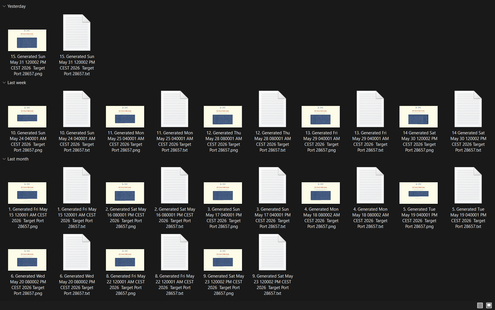

# DAC Enode Intelligence Watcher

Community-built observation tool by **JERUZZALEM — DAC Infra Tester**.

This project monitors the official DAC Testnet public enode page:

https://enodes.dachain.tech/testnet/

It automatically observes the official enode list, captures structured data, analyzes changes, sends email notifications, and stores historical JSON snapshots inside this repository.

---

## Background

This project was created as a continuation of the previous technical report:

[5. Official Enode Evolution Analysis — Infrastructure Rotation & Network Maturation](../../Testnet_%28Inception%29_Technical_Reports/5.%20Official%20Enode%20Evolution%20Analysis%20%E2%80%94%20Infrastructure%20Rotation%20%26%20Network%20Maturation.pdf)

That report analyzed the evolution of DAC official enodes as an infrastructure signal, focusing on peer rotation, network maturation, and bootstrap-node behavior over time.

The original report was based on manual observation and point-in-time analysis.

**DAC Enode Intelligence Watcher** extends that work into a continuous observation system.

Instead of manually checking the official enode page and risking missed updates, this watcher automatically captures each meaningful change and preserves it as structured historical data.

---

Schedule note:

The watcher now runs every 15 minutes to capture shorter enode-list rotation windows more accurately.

GitHub Actions scheduled runs may still experience slight delays depending on platform load, so the project relies on `checked_at_utc`, source generated time, and snapshot timestamps for precise observation ordering.

## Project Architecture / Data Flow Topology

DAC Enode Intelligence Watcher has evolved from a simple watcher into a full observation, intelligence, reporting, and dashboard pipeline.

The current topology is:

    Official DAC Enode Source
    https://enodes.dachain.tech/testnet/
            │
            ▼
    watcher.py
    - fetch official enode page
    - parse current enode list
    - detect added / removed / unchanged enodes
    - detect target port changes
    - classify change severity
    - generate AI-style summary
    - send email notification
    - update latest.json
    - create snapshot when meaningful change is detected
            │
            ▼
    data/latest.json
    data/snapshots/*.json
            │
            ▼
    build_rotation_intelligence.py
    - combine manual backfill snapshots
    - combine automated watcher snapshots
    - calculate observation scope
    - calculate enode count statistics
    - detect persistent enodes
    - detect persistent IPs
    - enrich IPs with provider / ASN hints
    - enrich IPs with DAC Infrastructure Signal
            │
            ├── provider_hints.py
            │   - static provider prefix heuristic
            │   - provider_guess
            │   - asn_hint
            │   - provider_type
            │   - country_hint
            │   - confidence
            │
            ├── dac_signal_hints.py
            │   - DAC Infrastructure Signal heuristic
            │   - registry history signal
            │   - peer identity signal
            │   - persistence signal
            │   - subnet pattern signal
            │   - community inference disclaimer
            │
            ▼
    data/rotation-intelligence-summary.json
            │
            ▼
    build_anomaly_detection.py
    - scan observation timeline
    - detect large count drops
    - detect high removal events
    - detect aggressive rotation
    - detect unexpected target port
    - generate anomaly summary
            │
            ▼
    data/anomaly-detection-summary.json
            │
            ▼
    build_concentration_risk.py
    - read rotation intelligence summary
    - read live ASN concentration
    - read static provider / ASN hints
    - read DAC Infrastructure Signal distribution
    - calculate concentration label
    - generate report-ready risk summary
            │
            ▼
    data/concentration-risk-summary.json
            │
            ├───────────────────────────────┐
            ▼                               ▼
    generate_technical_report.py        dashboard/index.html
    - executive summary                 - visual latest watcher state
    - observation scope                  - provider / ASN summary
    - persistent enodes/IPs              - DAC Infrastructure Signal summary
    - provider / ASN summary             - anomaly summary
    - DAC Infrastructure Signal summary  - persistent IP/enode tables
    - anomaly summary                    - observation timeline
    - technical interpretation
            │
            ▼
    reports/generated/dac-enode-intelligence-report.md

GitHub Actions automation:

    .github/workflows/dac-enode-watcher.yml
            │
            ▼
    Scheduled every 15 minutes + manual run
            │
            ▼
    watcher.py
    build_rotation_intelligence.py
    build_anomaly_detection.py
    build_concentration_risk.py
    generate_technical_report.py
            │
            ▼
    Commit generated outputs only when files change

This topology allows the project to preserve raw observation evidence, enrich it with heuristic interpretation layers, detect anomaly candidates, assess provider / ASN concentration risk, generate report-ready output, and visualize the latest state through a dashboard.

Important interpretation note:

DAC Infrastructure Signal is a community inference layer based on observed registry history, peer identity strings, persistence, subnet patterns, and provider hints. It is not an official DAC classification and should not be treated as confirmed node ownership.

---

## Manual Observation Challenge

Before this watcher was created, the official DAC enode list was observed manually by saving screenshots and text files from the public enode page.

This method worked for point-in-time documentation, but it was difficult to follow up consistently because the official enode page can update over time and previous states are no longer visible once the page changes.

As shown below, some observations were successfully captured, while some days could be missed due to manual workload, timing, or limited availability.

This is the main reason why **DAC Enode Intelligence Watcher** was created.

The watcher turns manual observation into an automated process by continuously checking the official source, extracting structured enode data, comparing it with the previous snapshot, and preserving meaningful changes as JSON evidence.

Instead of relying only on screenshots and manual text files, the project now creates a repeatable observation pipeline:

    Manual observation
            ↓
    Risk of missed updates
            ↓
    Automated watcher
            ↓
    Structured JSON snapshots
            ↓
    Email result and technical evidence

This allows future enode evolution analysis to be based on more consistent historical data.

---

## Purpose

The purpose of this project is not only to send notifications.

The main purpose is to support a technical observation workflow:

    Observe official source
            ↓
    Collect structured enode data
            ↓
    Analyze infrastructure-level changes
            ↓
    Generate result
            ↓
    Store evidence and notify the observer

The watcher helps preserve historical evidence by recording:

- current official enode list
- newly added enodes
- removed enodes
- unchanged enodes
- target P2P port
- target port changes
- change severity
- severity reason
- AI-style summary
- technical impact
- recommended action
- source generated timestamp
- watcher check timestamp
- structured JSON snapshots for later review

This makes the observation process more consistent, repeatable, and useful for future technical reports.

---

## Why This Matters

Official enode changes can reflect infrastructure-level activity such as:

- bootstrap peer rotation
- network maintenance
- public peer refresh
- node replacement
- infrastructure scaling
- testnet maturation
- target port consistency or migration
- abnormal peer-list reduction
- large infrastructure rotation events

A single manual observation may miss these changes.

By storing historical snapshots, this project makes it possible to review how the official enode list evolves over time.

---

## Observation Phases

This project now contains two observation phases.

    Phase 1 — Manual Observation / Pre-Watcher Backfill
    May 15–31, 2026
    data/manual-backfill/

    Phase 2 — Automated Watcher Observation
    June 1, 2026 onward
    data/latest.json
    data/snapshots/

The manual phase preserves historical data collected before the watcher existed.

The automated phase continues the observation process using GitHub Actions, structured JSON snapshots, change classification, AI-style summaries, and email notifications.

This separation makes the dataset clearer and prevents old manual data from interfering with the active watcher state.

---

## Monitoring Target

Target page:

    https://enodes.dachain.tech/testnet/

Observed source format:

    Generated: Mon Jun 1 12:00:01 AM CEST 2026 | Target Port: 28657

    admin.addPeer("enode://...@IP:28657");

---

## Output Files

The watcher stores active automated observation data in:

    data/latest.json
    data/snapshots/

Additional historical/manual data is stored in:

    manual-archive/
    data/manual-backfill/

### `data/latest.json`

Contains the latest observed state from the automated watcher.

This file acts as the comparison baseline for the next scheduled automated check.

The manual backfill data does not replace or modify `latest.json`.

### `data/snapshots/*.json`

Contains automated watcher snapshots created when:

- the watcher runs for the first time
- new enodes are added
- existing enodes are removed
- the target port changes

Automated snapshots also include the current intelligence fields:

- `change_severity`
- `severity_reason`
- `ai_style_summary`
- `technical_impact`
- `recommended_action`

### `manual-archive/`

Contains the original raw manual observation file:

    manual-archive/Old Data Before Intelligence Watcher Created.txt

This file preserves the original pre-watcher data exactly as collected manually.

### `data/manual-backfill/`

Contains structured JSON snapshots generated from the manual archive.

These files are historical backfill data and are intentionally separated from automated watcher snapshots.

### `data/manual-backfill/manual-backfill-summary.json`

Contains a summary of the manual observation period, including:

- total manual snapshots
- first and last manual observation timestamp
- observed target ports
- unique enode count
- minimum and maximum enode count
- list of manual snapshot files

### `data/rotation-intelligence-summary.json`

Contains aggregated enode rotation intelligence generated from both manual backfill snapshots and automated watcher snapshots.

This file provides:

- total observation count
- manual backfill snapshot count
- automated watcher snapshot count
- observed target ports
- enode count minimum, maximum, and average
- unique enode count
- unique IP count
- most persistent enodes
- most persistent IPs
- transition summary
- observation timeline
- report-ready summary

This file is designed as a higher-level analysis layer for future technical reports.

### `data/anomaly-detection-summary.json`

Contains rule-based anomaly detection results generated from the rotation intelligence summary.

This file provides:

- total observations scanned
- anomaly signal count
- highest anomaly severity
- anomaly severity counts
- anomaly type counts
- anomaly rules used
- anomaly event details
- report-ready anomaly summary
- technical interpretation
- recommended action

This file is designed to highlight observations that may require deeper manual review.

### `reports/generated/dac-enode-intelligence-report.md`

Contains an automatically generated Markdown technical observation report.

This report is generated from:

- `data/latest.json`
- `data/manual-backfill/manual-backfill-summary.json`
- `data/rotation-intelligence-summary.json`
- `data/anomaly-detection-summary.json`

The generated report includes:

- executive summary
- observation scope
- manual backfill context
- latest automated watcher state
- enode count statistics
- most persistent enodes
- most persistent IPs
- anomaly detection summary
- detected anomaly events
- observation timeline
- technical interpretation
- conclusion

This file is intended as a report-ready draft that can later be refined into a formal PDF technical report.

---

## Manual Backfill Dataset

Before the automated watcher was created, several official DAC enode snapshots had already been collected manually.

Instead of discarding that historical data, the manual observations were preserved and converted into structured JSON backfill data.

This backfill dataset represents the **pre-watcher manual observation period**.

    Manual observation period:
    May 15–31, 2026

The current manual backfill contains:

- 14 manually captured snapshots
- 28 unique enodes observed
- target port observed: `28657`
- first manual snapshot: `Fri May 15 12:00:01 AM CEST 2026`
- last manual snapshot: `Sun May 31 12:00:02 PM CEST 2026`

This dataset is intentionally labeled as a **partial manual archive**.

Missing dates represent missed observation windows, not confirmed absence of infrastructure changes.

---

## Manual Backfill Parser

The parser used to convert the raw manual archive into structured JSON is stored in:

    parse_manual_backfill.py

The parser reads the raw manual archive, extracts each `Generated:` block, parses enode entries, compares each manual snapshot against the previous manual snapshot, and generates structured JSON files.

It tracks:

- manual snapshot index
- source type
- source file
- observation completeness
- data gap note
- generated timestamp from source
- generated date
- generated time
- generated timezone
- target port
- previous target port
- current target port
- target port change status
- previous enode total
- current enode total
- added enodes
- removed enodes
- unchanged enodes
- parsed enode details
- `admin.addPeer(...)` lines
- snapshot file path

This keeps the old manual data compatible with the newer watcher snapshot format while clearly separating manual historical backfill from automated watcher output.

---

## Change Detection Logic

The watcher compares the current official enode list against the previous `latest.json`.

It tracks:

- `added`
- `removed`
- `unchanged`
- `target_port_changed`
- `previous_target_port`
- `current_target_port`

If no enode or target-port change is detected, no new automated snapshot is created.

This prevents unnecessary noise while preserving meaningful infrastructure changes.

---

## Change Severity Classification

The watcher now includes a deterministic severity classification layer.

Each meaningful change is classified into one of the following categories:

- `INFO` — initial baseline snapshot
- `NONE` — no enode or target-port change detected
- `LOW` — small enode rotation
- `MEDIUM` — moderate enode rotation
- `HIGH` — large enode rotation or target port change
- `CRITICAL` — no enodes detected or sharp enode count drop

The generated snapshot includes:

- `change_severity`
- `severity_reason`

Example:

    {
      "change_severity": "LOW",
      "severity_reason": "Small enode rotation detected: 1 added and 0 removed."
    }

This helps future technical reports distinguish between minor peer refreshes, major bootstrap rotation, target-port changes, and possible abnormal states.

---

## AI-Style Summary Layer

The watcher also generates an AI-style interpretation layer.

This is not a machine learning model.

It is a deterministic summary system that converts raw technical changes into human-readable observation output.

Each changed snapshot includes:

- `ai_style_summary`
- `technical_impact`
- `recommended_action`

The AI-style summary may explain:

- whether the change looks like a small peer refresh
- whether the update may indicate infrastructure rotation
- whether the target port changed
- what the possible technical impact is
- what action a node runner or observer may take

Example output:

    DAC official enode list changed: 1 enodes added, 0 removed, and 12 remained unchanged.
    Current total: 13 enodes.

    Rotation interpretation:
    Small bootstrap peer rotation detected.

    Technical impact:
    This appears to be a minor peer-list refresh.

    Recommended action:
    No urgent action is required, but the snapshot is preserved for history.

This makes the watcher more useful for technical observation because the output is not only raw data, but also structured interpretation.

---

## Enode Rotation Intelligence

The project now includes an aggregated rotation intelligence layer.

This layer is generated by:

    build_rotation_intelligence.py

The script reads:

- `data/manual-backfill/*.json`
- `data/snapshots/*.json`
- `data/latest.json`

It then generates:

    data/rotation-intelligence-summary.json

The rotation intelligence summary combines manual and automated observation periods into one structured analysis file.

Current generated summary includes:

- total observations: 16
- manual backfill snapshots: 14
- automated watcher snapshots: 2
- unique enodes observed: 28
- unique IPs observed: 28
- target ports observed: `28657`
- enode count minimum: 7
- enode count maximum: 15
- enode count average: 12.31

This makes it possible to identify persistent official enodes, recurring IPs, enode count patterns, and infrastructure rotation signals across the full observation dataset.

---

## Anomaly Detection Layer

The project now includes a deterministic anomaly detection layer.

This layer is generated by:

    build_anomaly_detection.py

The script reads:

- `data/rotation-intelligence-summary.json`

It then generates:

    data/anomaly-detection-summary.json

The anomaly detection layer scans the full observation timeline and highlights events that may indicate abnormal or high-impact infrastructure behavior.

Current anomaly rules include:

- `NO_ENODES_DETECTED`
- `UNEXPECTED_TARGET_PORT`
- `SHARP_ENODE_COUNT_DROP`
- `LARGE_ENODE_COUNT_DROP`
- `HIGH_REMOVAL_EVENT`
- `AGGRESSIVE_ROTATION`
- `MODERATE_ROTATION_SPIKE`
- `LOW_CONTINUITY_RATIO`
- `WATCHER_HIGH_SEVERITY_SIGNAL`

Current generated summary includes:

- total observations scanned: 16
- anomaly signals detected: 5
- highest severity: `HIGH`
- high severity signals: 5
- detected anomaly types:
  - `LARGE_ENODE_COUNT_DROP`
  - `HIGH_REMOVAL_EVENT`
  - `AGGRESSIVE_ROTATION`

This layer does not automatically conclude that the network is unhealthy.

Instead, it marks selected observations as candidates for deeper manual review and future technical reporting.

---

## Automated Technical Report Generator

The project now includes an automated Markdown technical report generator.

This layer is generated by:

    generate_technical_report.py

The script reads:

- `data/latest.json`
- `data/manual-backfill/manual-backfill-summary.json`
- `data/rotation-intelligence-summary.json`
- `data/anomaly-detection-summary.json`

It then generates:

    reports/generated/dac-enode-intelligence-report.md

The generated report is designed as a reusable draft for future DAC Testnet infrastructure technical reports.

It includes:

- executive summary
- observation scope
- manual backfill context
- latest automated watcher state
- enode count statistics
- most persistent enodes
- most persistent IPs
- anomaly detection summary
- detected anomaly events
- observation timeline
- technical interpretation
- conclusion

This turns the watcher from a monitoring and analysis tool into a report preparation pipeline.

---

## Dashboard Chart Layer

The dashboard now includes a lightweight chart layer.

The initial v1.8.0 implementation uses native HTML, CSS, JavaScript, and inline SVG.

No external chart dependency is required.

Current charts:

- Enode Count Over Time
- Added vs Removed Per Observation
- Live ASN Distribution
- DAC Infrastructure Signal Distribution

Core chart controls:

- `7D`
- `30D`
- `ALL TIME`

Data sources:

    data/rotation-intelligence-summary.json
    data/concentration-risk-summary.json

Chart input:

    observation_timeline

Fields used:

- `observation_index`
- `generated_at_source`
- `current_total`
- `added_count`
- `removed_count`
- `phase`
- `status`

Chart purpose:

- show enode count movement over time
- show rotation intensity per observation
- separate total enode count from added / removed activity
- show live ASN concentration visually
- show DAC Infrastructure Signal distribution visually
- improve visual inspection before deeper technical reporting

Core chart readability:

- x-axis labels now use observation time instead of raw observation index
- chart range controls support 7D, 30D, and ALL TIME views
- Added / Removed legend now explicitly uses Added enodes and Removed enodes
- Added / Removed values compare each observation against the previous observed enode list

Future chart layers:

- Anomaly Severity Count
- Manual vs Automated Observation Count

---

## Provider Concentration / Decentralization Risk Summary

The project now includes a Provider Concentration / Decentralization Risk Summary layer.

This layer provides an observation-based heuristic for checking whether observed enode IPs appear concentrated across a small number of ASNs, provider hints, country codes, or DAC Infrastructure Signal categories.

Helper file:

    build_concentration_risk.py

Generated output:

    data/concentration-risk-summary.json

The current model uses:

- Live ASN concentration
- Live ASN name concentration
- Live country concentration
- Static provider hint concentration
- Static ASN hint concentration
- DAC Infrastructure Signal concentration

Risk labels:

- `LOW`
- `MODERATE`
- `ELEVATED`
- `HIGH`
- `INCONCLUSIVE`

Current generated assessment:

- Overall label: `ELEVATED`
- Top live ASN: `AS51167`
- Top live ASN share: `15 / 29 unique IPs` or `51.72%`
- Top live ASN country: `DE`
- Top country share: `18 / 29 unique IPs` or `62.07%`
- Static provider hint remains limited because `Unknown` still dominates static hints.

Dashboard note:

The Observation Timeline now adds a 24-hour hint beside the original source timestamp, for example:

    Tue Jun 2 12:00:01 PM CEST (12:00 CEST)
    Tue Jun 2 10:00:02 PM CEST (22:00 CEST)

This avoids confusion between 12-hour AM/PM formatting and technical observation order.

Important note:

Provider concentration and decentralization risk summary is an observation-based heuristic. It is based on currently available watcher data, live ASN enrichment, static provider hints, and DAC Infrastructure Signal labels. It should not be treated as an official DAC classification or as a definitive decentralization measurement.

---

## Live ASN Lookup Layer

The project now includes an optional Live ASN Lookup Layer.

This layer enriches observed enode IPs with live routing data from Team Cymru WHOIS lookup.

Helper file:

    asn_lookup.py

Cache file:

    data/asn-cache.json

The lookup layer is designed to be workflow-safe:

- static provider hints remain available
- live ASN lookup is enrichment only
- lookup results are cached
- workflow does not fail if live lookup fails
- failed lookups fall back to safe Unknown-style output
- ASN data is not treated as official DAC node ownership

Generated live ASN fields include:

- `live_asn`
- `live_asn_name`
- `live_bgp_prefix`
- `live_country_code`
- `live_registry`
- `live_allocated`
- `live_asn_lookup_success`
- `live_asn_lookup_cached`
- `live_asn_lookup_error`

Generated summary outputs include:

- `live_asn_lookup`
- `live_asn_counts`
- `live_asn_name_counts`
- `live_asn_country_counts`
- `live_asn_success_counts`
- `live_asn_summary`

The current implementation uses:

    Team Cymru WHOIS live lookup

Environment control:

    DAC_LIVE_ASN_LOOKUP=1    enable live lookup
    DAC_LIVE_ASN_LOOKUP=0    disable live lookup and use safe fallback/cache behavior

Important note:

Live ASN lookup is used as an enrichment layer only. ASN and provider names are based on external routing data and should be treated as operational context, not official DAC node ownership.

---

## DAC Infrastructure Signal Layer

The project now includes a DAC Infrastructure Signal Layer.

This layer enriches observed enode IPs with community inference labels derived from:

- observed registry history
- peer identity strings from prior `admin.peers` evidence
- persistence / survivorship across observations
- recurring subnet patterns
- provider hints
- manual technical report evidence

Helper file:

    dac_signal_hints.py

Generated signal fields include:

- `dac_infrastructure_signal`
- `signal_category`
- `signal_confidence`
- `peer_identity_hint`
- `historical_registry_status`
- `signal_basis`
- `official_ownership_claim`
- `signal_detection_method`
- `signal_source_reference`
- `signal_disclaimer`

Important note:

DAC Infrastructure Signal is a community inference layer based on observed registry history, peer identity strings, persistence, subnet patterns, and provider hints. It is not an official DAC classification and should not be treated as confirmed node ownership.

Current generated DAC Infrastructure Signal examples include:

- `Authority-like Core Signal`
- `Relay-like DAC Node Signal`
- `Internal RPC-like Signal`
- `Community VPS-like Signal`
- `Community Node Signal`
- `Legacy Relay-like Signal`
- `Unlisted Active Peer Signal`
- `Retained Infrastructure Signal`
- `Core Subnet Historical Signal`
- `Unknown / No Signal`

The layer is designed to improve infrastructure readability without claiming official node ownership.

---

## Provider / ASN Hint Layer

The project now includes a heuristic Provider / ASN Hint Layer.

This layer enriches observed enode IPs with static provider and ASN hints.

Helper file:

    provider_hints.py

The provider hint layer is used by:

- `build_rotation_intelligence.py`
- `data/rotation-intelligence-summary.json`
- `dashboard/index.html`
- `generate_technical_report.py`
- `reports/generated/dac-enode-intelligence-report.md`

Generated provider fields include:

- `provider_guess`
- `asn_hint`
- `provider_type`
- `country_hint`
- `provider_confidence`
- `provider_detection_method`
- `matched_prefix`
- `provider_notes`

The current implementation uses static IP prefix heuristics.

It does not perform live ASN lookup.

Current generated provider summary includes:

- `Contabo / AS51167`
- `DigitalOcean / AS14061`
- `Hetzner / AS24940`
- `OVHcloud / AS16276`
- `Unknown`

Important note:

Provider and ASN values are enrichment hints, not final verified ASN truth.

Unknown values are intentionally preserved when no static prefix matches. This prevents the system from guessing provider identity without enough evidence.

---

## Dashboard Layer

The project now includes a static HTML dashboard for visual inspection.

Dashboard file:

    dashboard/index.html

The dashboard reads local JSON outputs from:

- `data/latest.json`
- `data/manual-backfill/manual-backfill-summary.json`
- `data/rotation-intelligence-summary.json`
- `data/anomaly-detection-summary.json`

It displays:

- latest watcher state
- AI-style summary
- manual vs automated observation scope
- total observations
- unique enodes
- unique IPs
- target port
- anomaly summary
- report-ready summary
- most persistent enodes
- most persistent IPs
- detected anomaly events
- observation timeline

The dashboard also includes the independent DAC Infra Tester identity card from:

    assets/DAC-CARD.png

This image is used as a community contributor identity element and does not represent official DAC branding.

To preview locally, run:

    python3 -m http.server 8090

Then open:

    http://localhost:8090/dashboard/

The dashboard should be opened through a local HTTP server or GitHub Pages, not directly through `file://`, because it loads JSON data using `fetch()`.

---

## GitHub Actions Schedule

The watcher is executed by GitHub Actions every 15 minutes:

    cron: "*/15 * * * *"

It can also be triggered manually from the GitHub Actions tab.

The workflow now runs the full watcher intelligence pipeline:

    watcher.py
        ↓
    build_rotation_intelligence.py
        ↓
    build_anomaly_detection.py
        ↓
    generate_technical_report.py

This means that when the official enode data changes, the workflow can automatically update:

- `data/latest.json`
- `data/snapshots/`
- `data/rotation-intelligence-summary.json`
- `data/anomaly-detection-summary.json`
- `reports/generated/dac-enode-intelligence-report.md`

The generated technical report uses the latest watcher timestamp instead of the workflow runtime timestamp.

This keeps the report output deterministic when the watcher data does not change and prevents unnecessary scheduled commits.

---

## Email Notification

When a meaningful change is detected, the watcher sends an email notification containing:

- source URL
- generated time from the official source page
- checked timestamp in UTC
- previous total enode count
- current total enode count
- added enodes
- removed enodes
- unchanged enodes
- target port status
- change severity
- severity reason
- AI-style summary
- rotation interpretation
- technical impact
- recommended action
- snapshot file path

Email credentials are stored securely using GitHub Actions repository secrets.

Required secrets:

- `SMTP_HOST`
- `SMTP_PORT`
- `SMTP_USER`
- `SMTP_PASS`
- `EMAIL_FROM`
- `EMAIL_TO`

---

## Current Intelligence Layer

The current intelligence layer is deterministic and rule-based.

It does not rely on a machine learning model.

The watcher performs structured infrastructure observation by:

- extracting official enode data
- parsing node ID, IP, and port
- comparing the current state with the previous snapshot
- classifying enodes as added, removed, or unchanged
- detecting target port changes
- classifying change severity
- generating severity reasons
- generating AI-style summaries
- generating technical impact notes
- generating recommended actions
- producing structured output for technical reporting

This makes the system suitable for infrastructure monitoring, evidence preservation, and future report preparation.

---

## Current Status

The current version already supports:

- official DAC enode page monitoring
- scheduled GitHub Actions execution every 15 minutes
- manual workflow execution
- email notification
- JSON snapshot generation
- latest state tracking
- historical automated snapshot preservation
- manual pre-watcher backfill preservation
- added, removed, and unchanged enode classification
- target port change detection
- raw manual archive preservation
- manual archive parsing into structured JSON
- change severity classification
- severity reason generation
- AI-style summary generation
- technical impact generation
- recommended action generation
- enode rotation intelligence summary generation
- persistent enode analysis
- persistent IP analysis
- manual + automated observation aggregation
- report-ready rotation summary output
- anomaly detection summary generation
- large enode count drop detection
- high removal event detection
- aggressive rotation detection
- report-ready anomaly interpretation
- automated Markdown technical report generation
- report-ready observation scope generation
- report-ready timeline generation
- report-ready technical interpretation generation
- static HTML dashboard generation
- dashboard-based latest watcher inspection
- dashboard-based anomaly summary inspection
- dashboard-based persistent enode/IP inspection
- heuristic provider / ASN hint enrichment
- provider summary generation
- ASN summary generation
- provider confidence labeling
- provider / ASN dashboard visualization
- provider / ASN report section generation
- automated GitHub Actions intelligence pipeline rebuild
- deterministic generated report timestamp
- scheduled output commit only when generated files change
- DAC Infrastructure Signal enrichment
- DAC signal summary generation
- DAC signal dashboard visualization
- DAC signal technical report section generation
- community inference disclaimer for non-official role signals
- optional Live ASN lookup enrichment
- Team Cymru WHOIS ASN lookup support
- ASN cache generation
- Live ASN dashboard visualization
- Live ASN report section generation
- provider concentration risk generation
- concentration-risk-summary.json generation
- concentration summary dashboard visualization
- concentration section in generated technical report
- dashboard core chart layer
- Enode Count Over Time chart
- Added vs Removed Per Observation chart
- Live ASN Distribution chart
- DAC Infrastructure Signal Distribution chart
- 7D / 30D / ALL TIME chart range controls
- readable observation-time x-axis labels
- clarified Added enodes / Removed enodes legend
- 24-hour timestamp hint for dashboard timeline readability

---

## Version Notes

### v1.0 — Automated Enode Watcher

Initial working version.

Features:

- monitor official DAC enode page
- detect added, removed, and unchanged enodes
- detect target port changes
- send email notification
- generate JSON snapshots
- commit snapshot data through GitHub Actions

### v1.1 — Change Severity Classification

Added deterministic classification for enode changes.

New fields:

- `change_severity`
- `severity_reason`

Severity levels:

- `INFO`
- `NONE`
- `LOW`
- `MEDIUM`
- `HIGH`
- `CRITICAL`

### v1.2 — AI-Style Summary Layer

Added human-readable interpretation output for each meaningful change.

New fields:

- `ai_style_summary`
- `technical_impact`
- `recommended_action`

This improves the watcher from a raw monitoring bot into a more useful infrastructure observation assistant.

### v1.3 — Enode Rotation Intelligence

Added aggregated rotation intelligence across manual backfill and automated watcher snapshots.

New files:

- `build_rotation_intelligence.py`
- `data/rotation-intelligence-summary.json`

New analysis output:

- total observation count
- manual and automated snapshot count
- unique enode count
- unique IP count
- target port history
- enode count min, max, and average
- most persistent enodes
- most persistent IPs
- transition summary
- report-ready summary

This adds a higher-level infrastructure intelligence layer for future technical reporting.

### v1.4 — Anomaly Detection Layer

Added deterministic anomaly detection over the rotation intelligence timeline.

New files:

- `build_anomaly_detection.py`
- `data/anomaly-detection-summary.json`

New analysis output:

- anomaly signal count
- highest anomaly severity
- anomaly severity counts
- anomaly type counts
- anomaly event details
- anomaly rules
- report-ready anomaly summary
- technical interpretation
- recommended action

Initial generated result:

- total observations scanned: 16
- anomaly signals detected: 5
- highest severity: `HIGH`
- detected anomaly types:
  - `LARGE_ENODE_COUNT_DROP`
  - `HIGH_REMOVAL_EVENT`
  - `AGGRESSIVE_ROTATION`

This adds a review layer for identifying unusual enode rotation behavior without automatically assuming network failure.

### v1.5 — Automated Technical Report Generator

Added a Markdown technical report generator.

New files:

- `generate_technical_report.py`
- `reports/generated/dac-enode-intelligence-report.md`

New report output:

- executive summary
- observation scope
- manual backfill context
- latest automated watcher state
- enode count statistics
- persistent enode table
- persistent IP table
- anomaly detection summary
- detected anomaly events
- observation timeline
- technical interpretation
- conclusion

This turns the project into a report preparation pipeline for future DAC Testnet infrastructure reports.

---

### v1.6 — Dashboard Layer

Added a static HTML dashboard for visual inspection of watcher outputs.

New files:

- `dashboard/index.html`

Dashboard data sources:

- `data/latest.json`
- `data/manual-backfill/manual-backfill-summary.json`
- `data/rotation-intelligence-summary.json`
- `data/anomaly-detection-summary.json`

Dashboard output includes:

- latest watcher state
- AI-style summary
- anomaly summary
- report-ready summary
- most persistent enodes
- most persistent IPs
- detected anomaly events
- observation timeline

The dashboard also uses:

- `assets/DAC-CARD.png`

This image represents the independent DAC Infra Tester contributor identity and avoids using official DAC branding.

### v1.6.1 — Provider / ASN Hint Layer

Added heuristic provider and ASN enrichment for observed enode IPs.

New file:

- `provider_hints.py`

Updated files:

- `build_rotation_intelligence.py`
- `generate_technical_report.py`
- `dashboard/index.html`
- `data/rotation-intelligence-summary.json`
- `reports/generated/dac-enode-intelligence-report.md`

New output fields:

- `provider_guess`
- `asn_hint`
- `provider_type`
- `country_hint`
- `provider_confidence`
- `provider_detection_method`
- `matched_prefix`
- `provider_notes`

New summary output:

- `provider_counts`
- `asn_counts`
- `provider_type_counts`
- `provider_confidence_counts`
- `provider_summary`
- `asn_summary`
- `provider_asn_summary`

Initial generated result:

- `Contabo / AS51167`: 3 unique IPs
- `DigitalOcean / AS14061`: 1 unique IP
- `Hetzner / AS24940`: 1 unique IP
- `OVHcloud / AS16276`: 1 unique IP
- `Unknown`: 22 unique IPs

This layer improves infrastructure readability while keeping the result honest by labeling unmatched IPs as `Unknown`.

### v1.6.2 — DAC Infrastructure Signal Layer

Added community inference labels for observed enode IPs.

New file:

- `dac_signal_hints.py`

Updated files:

- `build_rotation_intelligence.py`
- `generate_technical_report.py`
- `dashboard/index.html`
- `data/rotation-intelligence-summary.json`
- `reports/generated/dac-enode-intelligence-report.md`
- `README.md`

New output fields:

- `dac_infrastructure_signal`
- `signal_category`
- `signal_confidence`
- `peer_identity_hint`
- `historical_registry_status`
- `signal_basis`
- `official_ownership_claim`
- `signal_detection_method`
- `signal_source_reference`
- `signal_disclaimer`

New summary output:

- `dac_infrastructure_signal_counts`
- `signal_category_counts`
- `signal_confidence_counts`
- `dac_infrastructure_signal_summary`

Initial generated result includes:

- `Authority-like Core Signal`: 3 unique IPs
- `Community VPS-like Signal`: 4 unique IPs
- `Relay-like DAC Node Signal`: 1 unique IP
- `Internal RPC-like Signal`: 1 unique IP
- `Unlisted Active Peer Signal`: 1 unique IP
- `Unknown / No Signal`: 12 unique IPs

Important interpretation:

DAC Infrastructure Signal is a community inference layer based on observed registry history, peer identity strings, persistence, subnet patterns, and provider hints. It is not an official DAC classification and should not be treated as confirmed node ownership.

This layer improves node-role readability without claiming official ownership.

### v1.6.3 — Live ASN Lookup Option

Added optional live ASN lookup enrichment for observed enode IPs.

New file:

- `asn_lookup.py`

New cache file:

- `data/asn-cache.json`

Updated files:

- `build_rotation_intelligence.py`
- `generate_technical_report.py`
- `dashboard/index.html`
- `data/rotation-intelligence-summary.json`
- `reports/generated/dac-enode-intelligence-report.md`
- `README.md`

New output fields:

- `live_asn`
- `live_asn_name`
- `live_bgp_prefix`
- `live_country_code`
- `live_registry`
- `live_allocated`
- `live_asn_lookup_success`
- `live_asn_lookup_cached`
- `live_asn_lookup_error`

New summary outputs:

- `live_asn_lookup`
- `live_asn_counts`
- `live_asn_name_counts`
- `live_asn_country_counts`
- `live_asn_success_counts`
- `live_asn_summary`

Initial generated result includes:

- `AS51167`: 15 unique IPs
- `AS14061`: 4 unique IPs
- `AS24940`: 2 unique IPs
- `AS18403`: 2 unique IPs
- `AS141995`: 2 unique IPs
- `AS45899`: 1 unique IP
- `AS16276`: 1 unique IP
- `AS47583`: 1 unique IP
- `AS26832`: 1 unique IP

Live lookup validation:

- all 29 unique IPs returned successful live ASN lookup results
- `live_asn_success_counts`: `True = 29`

Important interpretation:

Live ASN lookup improves routing/provider visibility, but it does not represent official DAC node ownership.

It should be read together with:

- static Provider / ASN Hint Layer
- DAC Infrastructure Signal Layer
- registry observation history
- manual technical report evidence

### v1.8.1 — Distribution Dashboard Chart Layer

Added distribution charts and improved core chart readability.

Updated file:

- `dashboard/index.html`

Updated documentation:

- `README.md`

New dashboard section:

- `Distribution Charts`

New charts:

- `Live ASN Distribution`
- `DAC Infrastructure Signal Distribution`

Data source:

- `data/concentration-risk-summary.json`

Distribution fields used:

- `live_asn_concentration.distribution`
- `dac_signal_concentration.distribution`

Core chart improvements:

- added `7D`, `30D`, and `ALL TIME` range controls
- replaced raw observation index x-axis labels with readable observation-time labels
- moved `Observation time` into a cleaner chart caption
- clarified rotation legend as `Added enodes` and `Removed enodes`
- added explanatory note that added / removed values compare each observation against the previous observed enode list

Why this matters:

v1.8.1 makes the dashboard more useful for fast visual interpretation of provider concentration and DAC Infrastructure Signal spread.

It also makes the core rotation charts easier to read when observation history grows under the new 15-minute watcher schedule.

Future chart work:

- v1.8.2 — Anomaly severity and manual-vs-automated observation charts

---

### v1.8.0 — Core Dashboard Chart Layer

Added the first dashboard chart layer.

Updated file:

- `dashboard/index.html`

New dashboard section:

- `Core Charts`

New charts:

- `Enode Count Over Time`
- `Added vs Removed Per Observation`

Implementation details:

- native SVG chart rendering
- no external chart dependency
- charts read from `rotation.observation_timeline`
- tooltips use original source timestamp with 24-hour hint where available

Why this matters:

The dashboard can now visually show both total enode count movement and per-observation rotation intensity.

This makes the watcher more useful for quick infrastructure observation before preparing deeper technical reports.

Future chart work:

- v1.8.1 — Live ASN and DAC Infrastructure Signal distribution charts
- v1.8.2 — Anomaly severity and manual-vs-automated observation charts

---

### v1.7 — Provider Concentration / Decentralization Risk Summary

Added an observation-based concentration summary layer.

New file:

- `build_concentration_risk.py`

New generated output:

- `data/concentration-risk-summary.json`

Updated files:

- `.github/workflows/dac-enode-watcher.yml`
- `generate_technical_report.py`
- `dashboard/index.html`
- `reports/generated/dac-enode-intelligence-report.md`
- `README.md`

New report section:

- `Provider Concentration / Decentralization Risk Summary`

New dashboard section:

- `Provider Concentration / Decentralization Risk Summary`

Dashboard readability improvement:

- Observation Timeline now shows a 24-hour hint after original source timestamps.
- Example: `Tue Jun 2 10:00:02 PM CEST (22:00 CEST)`

Initial generated result:

- Overall concentration label: `ELEVATED`
- Top live ASN: `AS51167`
- Top live ASN share: `15 / 29 unique IPs` or `51.72%`
- Top live country: `DE`
- Top live country share: `18 / 29 unique IPs` or `62.07%`
- Static provider hint top value: `Unknown`, showing why live ASN enrichment is useful.

Important interpretation:

This layer does not make a final decentralization claim. It provides a cautious observation-based heuristic for report preparation.

---

### Production Automation Polish

Improved GitHub Actions automation so scheduled watcher runs now rebuild the full intelligence pipeline automatically.

Updated workflow:

- runs `watcher.py`
- rebuilds rotation intelligence
- rebuilds anomaly detection summary
- regenerates the Markdown technical report
- commits generated outputs only when they change

Updated report generator behavior:

- `generate_technical_report.py` now uses the latest watcher timestamp
- runtime timestamp is no longer used when watcher data exists
- this prevents unnecessary report changes when no enode data changes

This completes the production automation layer for the current watcher pipeline.

---

## Future Upgrade Direction

Future versions may extend this watcher into a broader infrastructure intelligence system.

Possible upgrades include:

- public RPC health monitoring
- explorer availability monitoring
- infrastructure status dashboard
- multi-source DAC Testnet infrastructure watcher

These upgrades are optional and will depend on future observation needs.

---

## Security Notes

Do not commit email passwords, SMTP credentials, `.env` files, or tokens.

The project `.gitignore` excludes:

- `venv/`
- `__pycache__/`
- `*.pyc`
- `.env`

Watcher-generated JSON files under `data/` are intentionally tracked for technical observation history.

Manual backfill JSON files under `data/manual-backfill/` are also intentionally tracked because they preserve historical pre-watcher observations.

---

## Disclaimer

This is an independent community-built observation tool.

It is not an official DAC Labs tool and does not represent official DAC infrastructure policy.

The watcher only observes publicly available enode data and stores snapshots for technical reporting purposes.

---

## Maintainer

**JERUZZALEM — DAC Infra Tester**
