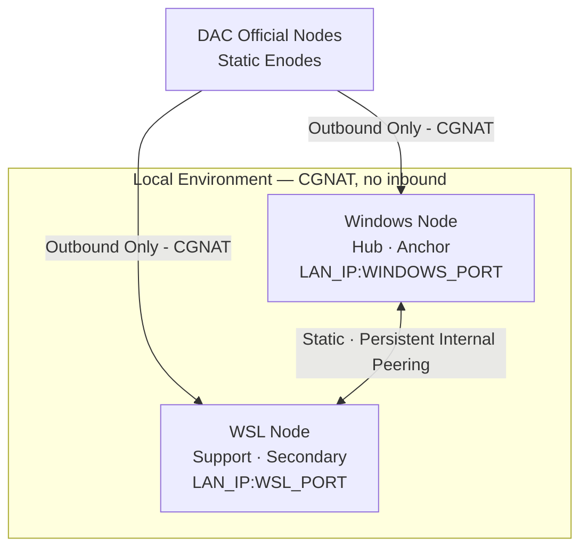
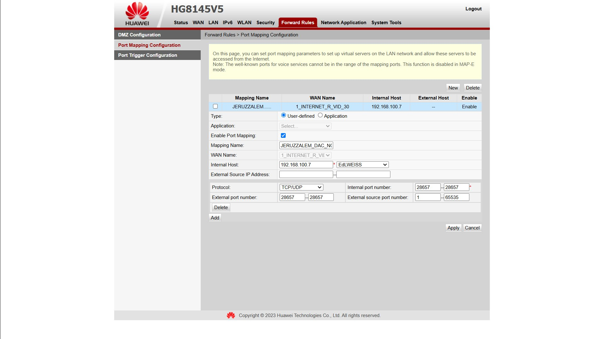
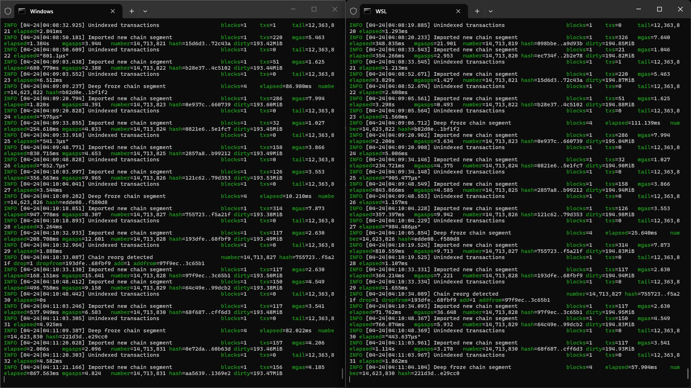
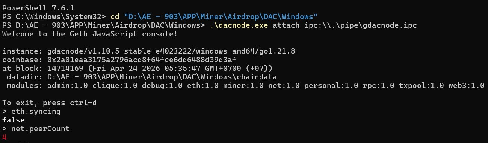
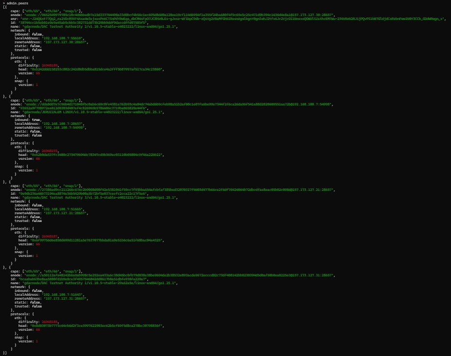
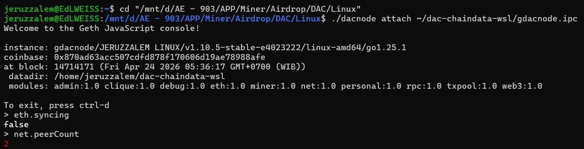
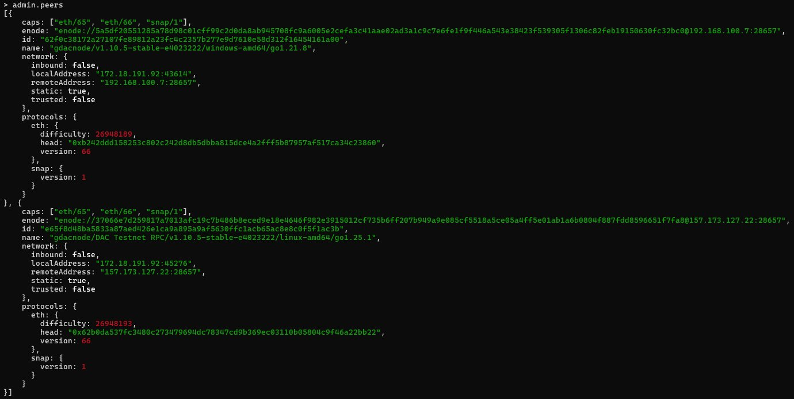
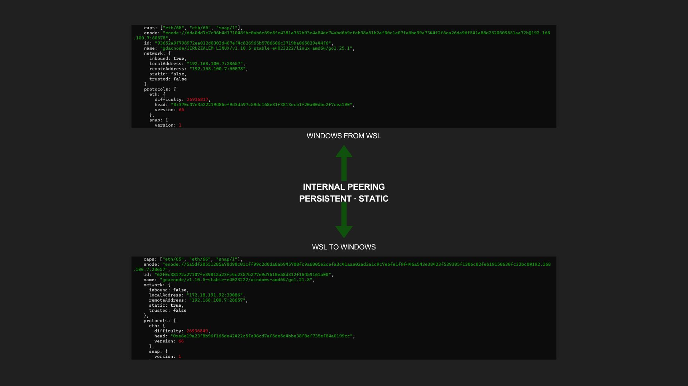
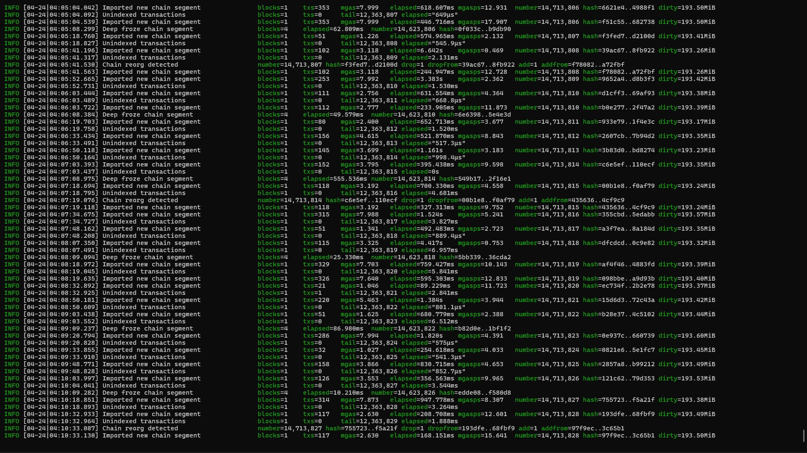
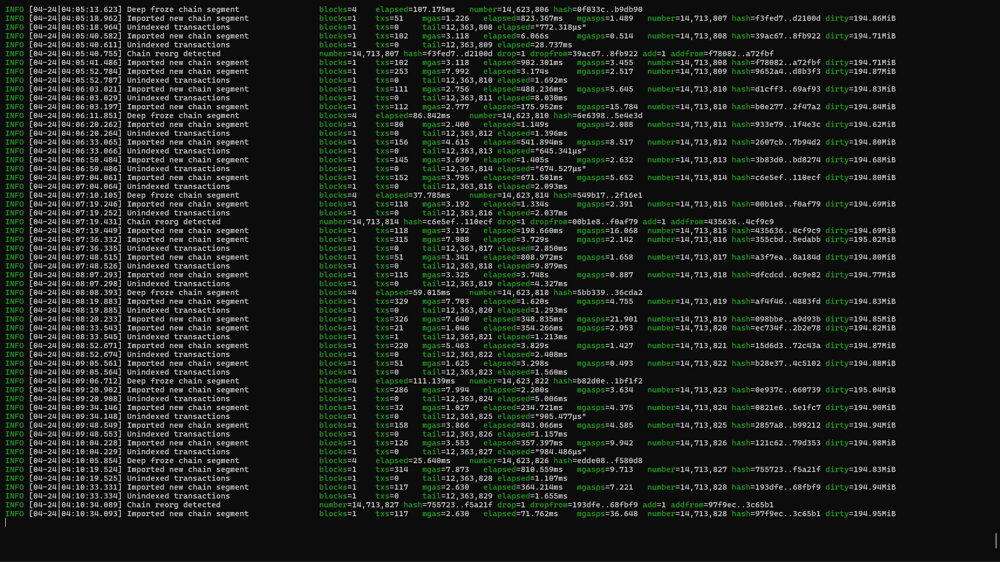

# DAC Dual Node Setup (Windows + WSL)


Dual node setup (Windows + WSL) for DAC testnet — operating under CGNAT with static peering, internal LAN routing, and verified stability.

---

## Table of Contents

- [Overview](#overview)
- [🧪 What This Repo Demonstrates](#-what-this-repo-demonstrates)
- [🧠 Key Insights](#-key-insights)
- [📚 Documentation](#-documentation)
- [Network Topology](#network-topology)
- [Node Configuration](#node-configuration)
- [Startup Commands](#startup-commands)
- [CGNAT Constraints](#cgnat-constraints)
- [Why This Setup Matters](#why-this-setup-matters)
- [Observations](#observations)
- [Future Improvements](#future-improvements)

---

## Overview

**DAC (Dual Asset Chain)** is a fork of the Quadrans technology developed by the Quadrans Foundation — a blockchain initiative focused on decentralization, scientific progress, and ethical responsibility, aimed at delivering sustainable and innovative infrastructure for real-world applications. This repository documents a dual-node DAC testnet setup running simultaneously on a **Windows host** and **WSL (Linux)** — both operating under a **CGNAT-constrained network** where inbound connectivity is unavailable.

The architecture is designed around a fundamental constraint: the ISP operates Carrier-Grade NAT, making traditional inbound peer discovery impossible. Every design decision in this setup — static peers, internal LAN routing, dual-node redundancy — exists as a direct response to that constraint.

| Node         | Platform     | Role          | Port             | Address             |
|--------------|--------------|---------------|------------------|---------------------|
| Windows Node | Windows Host | Hub / Anchor  | e.g. `28657`     | Your LAN IP         |
| WSL Node     | WSL (Linux)  | Support Node  | e.g. `30304`     | via Windows host    |

---

## 🧪 What This Repo Demonstrates

This setup validates DAC node behavior under **constrained network conditions (CGNAT)**, focusing on peer stability, redundancy, and real-world sync reliability — without VPS, tunneling, or inbound access.

> This is not just a setup guide — it is a field report on running a minimal P2P cluster under residential network constraints.

---

## 🧠 Key Insights

- Under CGNAT, **peer quality > peer quantity** — 2 stable static peers outperform 10 unstable discovered peers
- **Static peers significantly improve stability** over relying on dynamic peer discovery
- **Internal node peering** between Windows and WSL improves block propagation consistency
- Port forwarding at the router level is **insufficient** when CGNAT is active at the ISP level

---

## 📚 Documentation

Full setup details and deep-dive explanations are available in the Wiki:

- [🏠 Home](https://github.com/EdLWEISS186/dac-dual-node-cgnat-setup/wiki)
- [🗺️ Network Topology](https://github.com/EdLWEISS186/dac-dual-node-cgnat-setup/wiki/Network-Topology)
- [🔌 Static Peer Configuration](https://github.com/EdLWEISS186/dac-dual-node-cgnat-setup/wiki/Static-Peer-Configuration)

---

## Network Topology

```
                                     ┌─────────────────────────┐
                                     │      Official Nodes      │
                                     │  DAC Testnet · Static    │
                                     │      Enode Set           │
                                     └────────────┬────────────┘
                                                  │
                                            outbound only
                                        (CGNAT — no inbound)
                                                  │
               ┌──────────────────────────────────┴───────────────────────────────────┐
               │                                                                      │
    ┌──────────▼──────────┐                                            ┌──────────────▼──────────┐
    │    Windows Node      │                                           │          WSL Node        │
    │    Hub · Anchor      │◄─────────────────────────────────────────►│    Support · Secondary   │
    │    .bat scripts      │               static · persist            │       shell scripts      │
    │ 192.168.100.7:28657  │                                           │    192.168.100.7:30304   │
    └──────────────────────┘                                           └──────────────────────────┘

               ── outbound peer       ◄──► internal peering       • junction point
```

> For a detailed architectural diagram, see [`topology-architectural.png`](assets/topology-architectural.png).

---

## Network Topology (Mermaid)



---

## Node Configuration

| Component      | Address                        | Role                          |
|----------------|--------------------------------|-------------------------------|
| Windows Node   | `YOUR_LAN_IP:WINDOWS_PORT`     | Primary anchor, hub node      |
| WSL Node       | `YOUR_LAN_IP:WSL_PORT`         | Secondary, routed via host    |
| Official Nodes | Public enodes                  | Static peers (authority)      |

---

## Startup Commands

### Why `--syncmode fast`?

This setup uses `fast` sync mode — a deliberate choice based on the network constraints of this environment.

| Mode | Behavior | Suitability |
|------|----------|-------------|
| `snap` | Faster but depends heavily on peers that support snap protocol | ❌ Unreliable under limited peers |
| `fast` | Downloads block headers + state, less peer-dependent | ✅ Stable under CGNAT + static peers |
| `full` | Full block verification from genesis | ❌ Too heavy for this setup |

> Stability improved after switching from `snap` to `fast` — under CGNAT with limited static peers, `fast` is the practical sweet spot.

---

### Windows Node

```powershell
.\dacnode.exe `
  --testnet `
  --syncmode fast `
  --miner.etherbase 0xYourWalletAddressHere `
  --datadir "D:\DAC\chaindata" `
  --port 28657 `
  --nat extip:YOUR_LOCAL_IP
```

### WSL Node

```bash
cd "/mnt/d/DAC/Linux" && \
./dacnode \
  --testnet \
  --syncmode fast \
  --miner.etherbase 0xYourWalletAddressHere \
  --datadir ~/dac-chaindata-wsl \
  --port 30304 \
  --nat extip:YOUR_LOCAL_IP
```

### Parameter Reference

| Parameter | Description | How to Obtain |
|-----------|-------------|---------------|
| `--miner.etherbase` | Your wallet address | From your DAC wallet |
| `--datadir` | Path where chain data is stored | Choose any local directory |
| `--port` | P2P port for this node | Any available port — must be unique per node |
| `--nat extip` | IP advertised to peers | Run `ipconfig` (Windows) or `ip addr` (WSL) → use your LAN IP |

---

## CGNAT Constraints

This setup operates under **Carrier-Grade NAT (CGNAT)** — a network condition imposed at the ISP level where multiple subscribers share a single public IP. The consequence is that **no inbound connections are possible**, regardless of local router configuration.

### Evidence

Port forwarding was configured on the router (Huawei HG8145V5) — mapping external port `28657` to internal host `192.168.100.7` — yet inbound peer connections remain unreachable. This confirms CGNAT is active at the ISP level, upstream of the local router.



### Implications

| Constraint | Impact | Workaround Applied |
|------------|--------|--------------------|
| No inbound connections | Peer discovery fails | Static peers only |
| Shared public IP | Port forwarding ineffective | Internal LAN routing |
| Dynamic peer reliance | Unstable connections | `--nat extip` + static nodes |

### Key Rules

- Do **not** use `localhost` or loopback address for inter-node peering — WSL and Windows are on different network interfaces
- Both nodes must advertise the same LAN IP using `--nat extip:YOUR_LOCAL_IP`
- WSL routes all external traffic through the Windows host — use the Windows host LAN IP for both nodes
- To find your LAN IP: run `ipconfig` on Windows and look for **IPv4 Address** under your active network adapter

---

## Why This Setup Matters

Most node documentation assumes a clean network environment with inbound connectivity. This setup proves that **stable, productive DAC testnet participation is achievable under CGNAT** — without a VPS, without port tunneling, and without any inbound access.

The dual-node architecture also goes beyond basic participation. By running two nodes on the same machine — one as anchor, one as support — this setup creates a **minimal P2P cluster** that demonstrates:

- Redundant sync paths under constrained conditions
- Persistent internal peering without relying on discovery
- Stable block propagation with quality-over-quantity peer selection

This is directly applicable to anyone running nodes on residential ISPs, mobile broadband, or shared infrastructure where CGNAT is common.

---

## Observations

All observations recorded on **April 24, 2026**, with both nodes running simultaneously.

---

### Both Nodes Running Simultaneously



Windows and WSL nodes running in parallel, importing chain segments and processing transactions concurrently. Both terminals show consistent block numbers and hash progression — confirming synchronized operation.

---

### Windows Node — Sync & Peer Status



```
eth.syncing   → false
net.peerCount → 4
```

Windows node fully synced with **4 active peers** — 3 official DAC authority nodes and 1 internal WSL peer.

---

### Windows Node — Active Peers (admin.peers)



Confirmed connections to:
- `157.173.127.30:28657` — DAC Testnet Authority 2
- `157.173.127.21:28657` — DAC Testnet Authority 3
- `157.173.127.31:28657` — DAC Testnet Authority 1
- `192.168.100.7`        — WSL Node (internal, static)

---

### WSL Node — Sync & Peer Status



```
eth.syncing   → false
net.peerCount → 2
```

WSL node fully synced with **2 active peers** — the Windows host node and 1 official DAC authority node.

---

### WSL Node — Active Peers (admin.peers)



Confirmed connections to:
- `192.168.100.7:28657`  — Windows Node (internal, static)
- `157.173.127.22:28657` — DAC Testnet RPC Node (official)

---

### Internal Peering — Persistent & Static



WSL ↔ Windows bidirectional connection confirmed active. Both nodes show each other in `admin.peers` with `static: true` on the WSL side — confirming the internal peer connection is persistent and does not depend on discovery.

---

### Windows Node — Live Log



Continuous block imports with consistent `mgas`, `elapsed`, and `dirty` values — indicating stable chain processing with no sync interruptions.

---

### WSL Node — Live Log



WSL node mirrors Windows block progression within seconds — confirming that internal peering is actively propagating blocks between both nodes.

---

### Summary

| Metric              | Windows Node | WSL Node    |
|---------------------|-------------|-------------|
| `eth.syncing`       | `false`     | `false`     |
| `net.peerCount`     | 4           | 2           |
| Official peers      | 3           | 1           |
| Internal peers      | 1 (WSL)     | 1 (Win)     |
| Internal peer type  | —           | `static`    |
| Sync status         | ✅ Complete | ✅ Complete  |

This asymmetry suggests that under CGNAT, the anchor node (Windows) naturally attracts more outbound peer connections, while the support node (WSL) behaves as a stabilized follower relying on fewer, higher-quality peers.

---

## Future Improvements

| Item | Description |
|------|-------------|
| Startup automation | `.bat` / shell scripts to launch both nodes with one command |
| Auto-restart | Service wrapper (NSSM / systemd) for node recovery on crash |
| Monitoring | Basic peer count and sync status logging over time |
| WSL peer count | Investigate increasing WSL peer connections beyond 2 |

---

## Closing Note

Not here to prove the theory — that belongs at the protocol layer.
What I'm testing is whether it holds under real-world conditions.

If DAC is built to be quantum-ready, resilience should also hold at the network edge.

**Testing that assumption — at the edges.**
