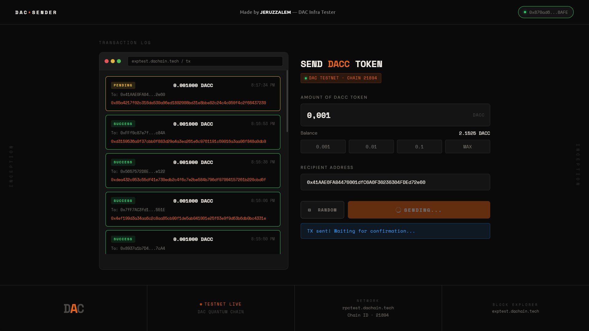
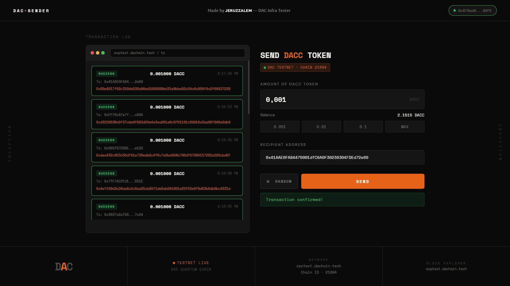

# DAC Sender — Testnet Transaction Interface

A client-side web interface for submitting native DACC token transactions on the DAC Quantum Chain Testnet. Built as part of an ongoing infrastructure testing effort to evaluate network behavior under realistic transaction load prior to mainnet deployment.

**Live:**
> `https://EdLWEISS186.github.io/dac-dual-node-cgnat-setup/Sender-Web/`

---

## Table of Contents

- [Overview](#overview)
- [Screenshots](#screenshots)
- [Why Transaction Volume Matters on Testnet](#why-transaction-volume-matters-on-testnet)
  - [1. Network Throughput and Stability](#1-network-throughput-and-stability)
  - [2. RPC Infrastructure Resilience](#2-rpc-infrastructure-resilience)
  - [3. Consensus Under Pressure](#3-consensus-under-pressure)
  - [4. Block Propagation and Network Latency](#4-block-propagation-and-network-latency)
  - [5. Smart Contract and dApp Ecosystem Validation](#5-smart-contract-and-dapp-ecosystem-validation)
  - [6. Mainnet Simulation](#6-mainnet-simulation)
  - [7. Bug Discovery Beyond Internal Testing](#7-bug-discovery-beyond-internal-testing)
  - [8. Telemetry Collection](#8-telemetry-collection)
  - [9. Geographic Distribution Testing](#9-geographic-distribution-testing)
  - [10. Tokenomics and UX Verification](#10-tokenomics-and-ux-verification)
- [Why Multi-Wallet Traffic Specifically](#why-multi-wallet-traffic-specifically)
- [What This Gives the Development Team](#what-this-gives-the-development-team)
- [Network Configuration](#network-configuration)
- [Features](#features)
- [Local Usage](#local-usage)
- [Technical Notes](#technical-notes)
- [Repository Context](#repository-context)

---

## Overview

The DAC Testnet is not just a staging environment — it is an active stress-testing ground. A blockchain behaves fundamentally differently under real multi-user traffic compared to isolated internal testing. The goal of this tool is to make it easy for community members to contribute genuine transaction activity, which directly supports pre-mainnet engineering validation objectives.

---

## Screenshots

**Transaction in progress — PENDING state with live confirmation waiting:**



**Transaction confirmed — SUCCESS state with hash logged:**



---

## Why Transaction Volume Matters on Testnet

### 1. Network Throughput and Stability
High transaction volume puts real pressure on validator nodes. Key metrics that only become visible under load:
- **TPS** (Transactions Per Second)
- **Finalization time**
- **Mempool behavior**
- **Block propagation latency**
- **Gas handling accuracy**

A network that performs cleanly with ten transactions may exhibit degradation at a thousand.

### 2. RPC Infrastructure Resilience
Every transaction submitted through a wallet touches the RPC layer. Under concurrent load, common failure modes include:
- RPC timeout / connection drops
- `"Still connecting..."` stalls
- Dropped transactions
- Nonce mismatch errors

This tool helps surface those failures in a controlled testnet context before they affect mainnet users.

### 3. Consensus Under Pressure
Each transaction forces the validator set to:
1. Receive and validate the transaction
2. Agree on transaction ordering
3. Commit the transaction to a block
4. Propagate the block to all peers

Testing with real traffic from multiple wallets exposes edge cases such as fork/reorg events, missed blocks, bad blocks, validator downtime, and peer instability.

### 4. Block Propagation and Network Latency
As block size grows with transaction volume, the cost of propagating blocks across the peer network increases. This helps measure:
- Block delay under load
- Network latency between nodes
- Peer-to-peer connection stability

### 5. Smart Contract and dApp Ecosystem Validation
Transaction activity is not limited to token transfers. Testnet traffic validates the full application layer — DEX swaps, NFT minting, staking contracts, governance interactions — ensuring the entire ecosystem functions correctly on top of the chain.

### 6. Mainnet Simulation
On mainnet, thousands of users will interact with the network simultaneously from different wallets, regions, and devices. The testnet must replicate that usage pattern as closely as possible before launch.

### 7. Bug Discovery Beyond Internal Testing
Certain classes of bugs only manifest under real multi-user conditions:
- Race conditions
- Memory leaks
- RPC bottlenecks
- Database corruption
- Sync lag
- Chain reorganization

Internal testing with a single developer and a few wallets will not surface these.

### 8. Telemetry Collection
Active transaction load generates the data that infrastructure operators need:
- CPU, RAM, and disk I/O under stress
- Network bandwidth consumption
- Error log frequency and patterns
- Block time consistency

### 9. Geographic Distribution Testing
Transactions submitted from users across different regions test:
- Global latency
- Peer discovery quality
- Cross-region connectivity

### 10. Tokenomics and UX Verification
Even with no economic value, testnet transactions validate:
- Fee calculation accuracy
- Wallet UX and edge cases
- Block explorer indexing
- Balance update propagation

---

> **Analogy:** A blockchain is like a highway. Internal testing is a few cars on an empty road. Community testnet is thousands of vehicles from different cities. Mainnet is production traffic. If congestion appears at the testnet stage, it can be resolved before it affects real users.

---

## Why Multi-Wallet Traffic Specifically

Sending repeated transactions from a single developer wallet does not produce representative results. Real traffic requires:
- **Different wallets** — different nonce sequences and state paths
- **High transaction count** — sustained mempool pressure
- **Non-uniform timing** — irregular block fill patterns
- **Geographic spread** — latency variation across peers

This tool enables community members to contribute that traffic without requiring technical setup beyond a browser and a wallet.

---

## What This Gives the Development Team

| Signal | What It Reveals |
|---|---|
| RPC response time under load | Infrastructure capacity |
| Validator sync consistency | Consensus stability |
| Block time variance | Network reliability |
| Chain reorganization events | Fork resistance |
| Explorer data accuracy | Indexing pipeline health |

---

## Network Configuration

| Parameter | Value |
|---|---|
| Network Name | DAC Testnet |
| Chain ID | `21894` |
| RPC Endpoint | `https://rpctest.dachain.tech` |
| Currency Symbol | `DACC` |
| Block Explorer | `https://exptest.dachain.tech` |

The wallet is automatically prompted to switch to or register the DAC Testnet network upon connection. Users operating a local full node may override the RPC endpoint within their wallet settings — the application operates against whichever endpoint the wallet uses, provided the Chain ID is `21894`.

---

## Features

- **EVM Wallet Integration** — Connects to any `window.ethereum`-compatible wallet via the standard provider API
- **Live Balance Display** — Fetches and displays the connected account's native DACC balance
- **Quick Amount Presets** — One-click shortcuts for `0.001`, `0.01`, `0.1`, and `MAX`
- **Random Recipient Selection** — Picks a recipient from a curated address pool on demand, enabling varied transaction destinations across sessions
- **Transaction Log Panel** — Real-time status tracking (`PENDING` → `SUCCESS` / `FAILED`) with per-hash block explorer links
- **Auto Network Switch** — Issues `wallet_switchEthereumChain` / `wallet_addEthereumChain` automatically on connect

---

## Local Usage

This is a static single-file application. Serve over HTTP — do not open via `file://` protocol, as wallet extensions do not inject `window.ethereum` into file-scheme pages.

```bash
# Node.js
npx serve .

# Python
python -m http.server 8080
```

---

## Technical Notes

- Single `index.html` — no build step, no npm dependencies at runtime
- Transaction signing delegated entirely to the connected wallet via `ethers.js v6` (`BrowserProvider` + `Signer`)
- Gas estimation handled by the wallet and RPC node — no manual configuration exposed
- Amount parsing uses `ethers.parseEther()` — correct handling of 18-decimal EVM precision
- Hosted on GitHub Pages — HTTPS enforced, no server-side logic

---

## Repository Context

This tool is part of a broader infrastructure testing setup documented in the parent repository, covering dual-node single-machine deployment under CGNAT, automated node management with process monitoring and logging, and a Prometheus + Grafana observability stack for the DAC Quantum Chain Testnet.

---

*Authored by **JERUZZALEM** — DAC Infra Tester*
