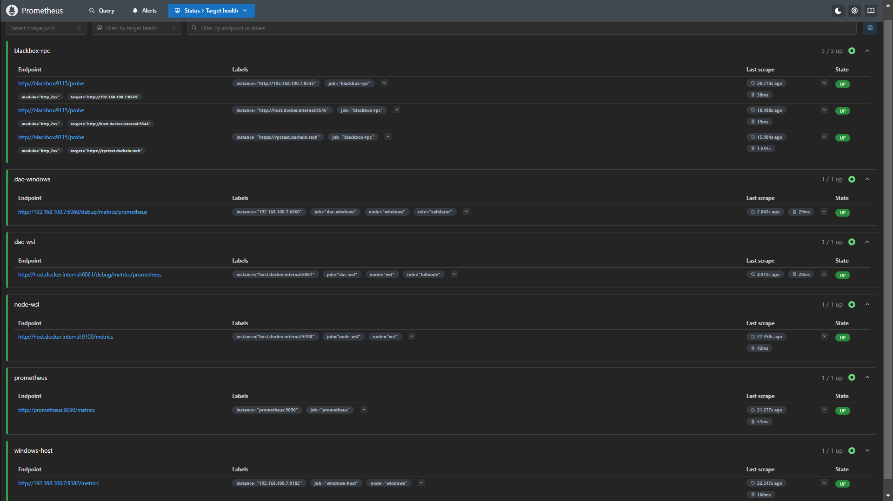
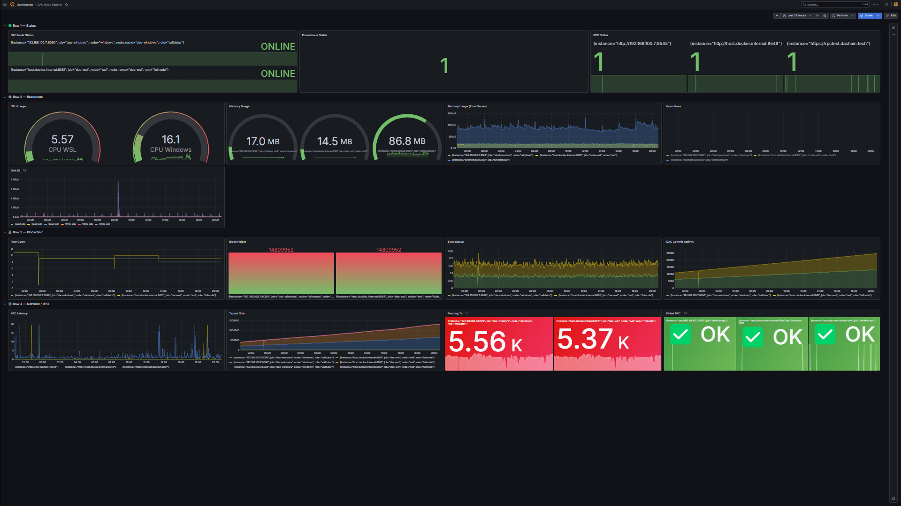

# Monitoring Stack — DAC Dual Node (Windows + WSL)


A locally hosted infrastructure monitoring stack built with **Prometheus**, **Grafana**, and **Blackbox Exporter** to observe the real-time operational status of a dual-node single machine DAC Quantum Chain testnet deployment — both nodes running on a single machine, with the validator node hosted natively on Windows and the full node running on WSL2 (Ubuntu), operating under **CGNAT** without a dedicated public IP.

---

## Table of Contents

- [Architecture](#architecture)
- [Stack Components](#stack-components)
- [Scrape Targets](#scrape-targets)
- [Dashboard Overview](#dashboard-overview)
- [Prerequisites](#prerequisites)
- [Setup](#setup)
- [Preview](#preview)

---

## Architecture

```
┌─────────────────────────────────────────────────────────┐
│  Windows Host (192.168.100.7)                            │
│  ├── dacnode.exe        → metrics :6060 | rpc :8545      │
│  └── windows_exporter  → system metrics :9182            │
│                                                          │
│  WSL2 / Ubuntu                                           │
│  ├── dacnode            → metrics :6061 | rpc :8546      │
│  ├── node_exporter      → system metrics :9100           │
│  └── Docker                                              │
│      ├── Prometheus     → :9090                          │
│      ├── Grafana        → :3000                          │
│      ├── Blackbox Exp.  → :9115                          │
│      └── Loki           → :3100                          │
└─────────────────────────────────────────────────────────┘
```

---

## Stack Components

| Component | Role | Port |
|---|---|---|
| **Prometheus** | Metrics collection & storage | 9090 |
| **Grafana** | Visualization & dashboard | 3000 |
| **Blackbox Exporter** | RPC endpoint HTTP probing | 9115 |
| **Loki** | Log aggregation | 3100 |
| **Node Exporter** | WSL2 system metrics (binary) | 9100 |
| **Windows Exporter** | Windows host system metrics | 9182 |

---

## Scrape Targets

All 6 targets maintained at **6/6 UP** status:

| Job | Endpoint | Role |
|---|---|---|
| `dac-windows` | `192.168.100.7:6060` | DAC Windows validator metrics |
| `dac-wsl` | `host.docker.internal:6061` | DAC WSL full node metrics |
| `blackbox-rpc` | `:8545` · `:8546` · `rpctest.dachain.tech` | RPC endpoint probing |
| `node-wsl` | `host.docker.internal:9100` | WSL2 system metrics |
| `windows-host` | `192.168.100.7:9182` | Windows host system metrics |
| `prometheus` | `prometheus:9090` | Self-monitoring |

---

## Dashboard Overview

The Grafana dashboard is structured across **4 rows / 16 panels**:

### 🟢 Row 1 — Status
| Panel | Metric | Normal |
|---|---|---|
| DAC Node Status | Node liveness | ONLINE |
| Prometheus Status | Scrape health | 1 |
| RPC Status | HTTP probe result | 1 (all 3 endpoints) |

### ⚙️ Row 2 — Resources
| Panel | Metric | Normal |
|---|---|---|
| CPU Usage | `node_cpu_seconds_total` / `windows_cpu_time_total` | 0–70% |
| Memory Usage | Process heap consumption | Stable / flat trend |
| Goroutines | Active Prometheus threads | 40–60 |
| Disk IO | WSL2 read/write throughput | Low when synced |

### ⛓️ Row 3 — Blockchain
| Panel | Metric | Normal |
|---|---|---|
| Peer Count | Connected peers per node | ≥ 5 |
| Block Height | Latest processed block | Both nodes equal |
| Sync Status | Blocks per second | Actively fluctuating |
| Commit Activity | Cumulative chain commits | Steady upward trend |

### 🌐 Row 4 — Network / RPC
| Panel | Metric | Normal |
|---|---|---|
| RPC Latency | `probe_duration_seconds` | < 1s |
| Txpool Size | Total mempool transactions | Fluctuating |
| Pending Tx | `txpool_pending` | Drops after new block |
| Failed RPC | `1 - probe_success` | ✅ OK (all 3) |

---

## Prerequisites

- Docker + Docker Compose (running inside WSL2)
- Node Exporter binary installed in WSL2
- Windows Exporter installed on Windows host
- Both DAC nodes running with `--metrics` and `--http` flags enabled

---

## Setup

### 1. Clone and enter the monitoring folder

```bash
cd monitoring/
```

### 2. Start the Docker stack

```bash
docker compose up -d
```

### 3. Install Node Exporter (WSL2)

```bash
wget https://github.com/prometheus/node_exporter/releases/download/v1.8.2/node_exporter-1.8.2.linux-amd64.tar.gz
tar xvf node_exporter-1.8.2.linux-amd64.tar.gz
sudo mv node_exporter-1.8.2.linux-amd64/node_exporter /usr/local/bin/
```

Enable as systemd service:

```bash
sudo cp node_exporter.service /etc/systemd/system/
sudo systemctl daemon-reload
sudo systemctl enable node_exporter
sudo systemctl start node_exporter
```

### 4. Install Windows Exporter (PowerShell — Run as Administrator)

```powershell
Invoke-WebRequest -Uri "https://github.com/prometheus-community/windows_exporter/releases/download/v0.30.7/windows_exporter-0.30.7-amd64.msi" -OutFile "$env:TEMP\windows_exporter.msi"
Start-Process msiexec.exe -ArgumentList "/i $env:TEMP\windows_exporter.msi /quiet" -Wait
New-NetFirewallRule -DisplayName "Windows Exporter" -Direction Inbound -Protocol TCP -LocalPort 9182 -Action Allow
```

### 5. Access Grafana

```
http://localhost:3000
```

Default credentials: `admin / admin`

Import `dac-dashboard-final.json` via **Dashboards → Import**.

---

## Preview

### Prometheus Target Health


### Grafana Dashboard

